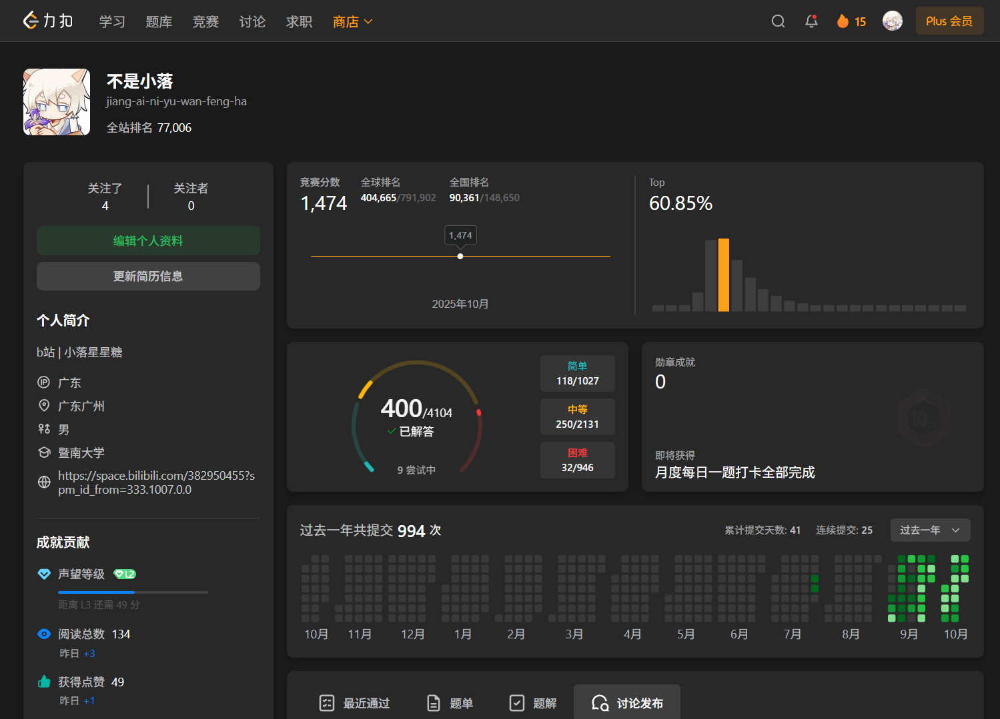

# 序章 Opening

自我介绍：22届 jnu 计科专业 目标岗位unity客户端

7年资深第五人格牢玩家 39赛季巅峰113星 人榜57，曾是b站不知名小主播

小落的学习日记 算是一个*随笔*？track一下自己的来时路
目前更新**算法日记 设计模式笔记 unity项目 面试/笔试经验** 等等

- b站主页：[@小落星星糖](https://space.bilibili.com/382950455?spm_id_from=333.1007.0.0)
- Leetcode主页：[@不是小落](https://leetcode.cn/u/jiang-ai-ni-yu-wan-feng-ha/)
- qq群642836518，游戏/技术交流/日常闲聊都可以~

与君共勉~

------

## **# 2025.10.15更新** Leetcode400题纪念

大四，想走unity客户端，最近在恶补八股文以及代码

数据结构与算法没啥办法，得自己敲代码才有感觉，冲游戏排行榜玩了一个暑假...... 9月初开学那会觉醒了，刚开始啥也不会，一个半月时间准备秋招一直坚持刷题，跟着灵神题单走确实有不少收获

二分 滑动窗口 前缀和 链表 dfs bfs Dijsktra 栈 优先队列 背包 LCS 数位dp 位运算技巧......等等

前面刷的比较零散，什么题都写，最近专心写二分，链表和树的题单了

写完以后然后继续去练图和dp了，想ak笔试这俩必须得下大功夫

目标年底1000题，hard100+，周赛也会全勤，就当模拟笔试了，锻炼一下思路和手速

每次笔试之前acm模式也会专门去newker练习

坚持边刷题边写题解和笔记，希望早日拿下offer

------

