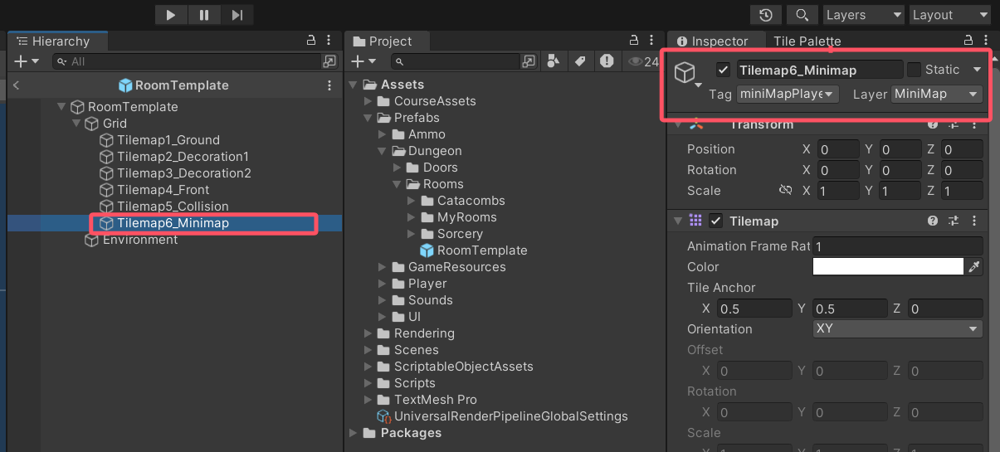
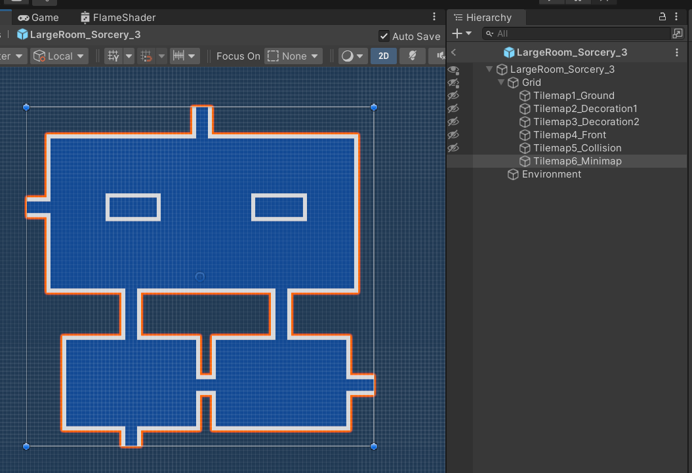
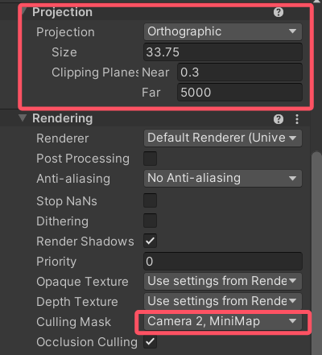

# 1. minimap

**25.10.16**
如何在游戏中展示小地图？
之前在做房间预制体的时候，我们在Tilemap中加了一个MiniMap Layer，现在是伏笔回收的时刻了：

  

想让游戏右上角渲染出minimap？可以增加一个camera，让它只渲染Minimap Layer就可以了

设置camera的模式为Orthographic（正交投影），并且增加size（越大相机拉的越远）
设置Culling Mask，确保只渲染对应layer     