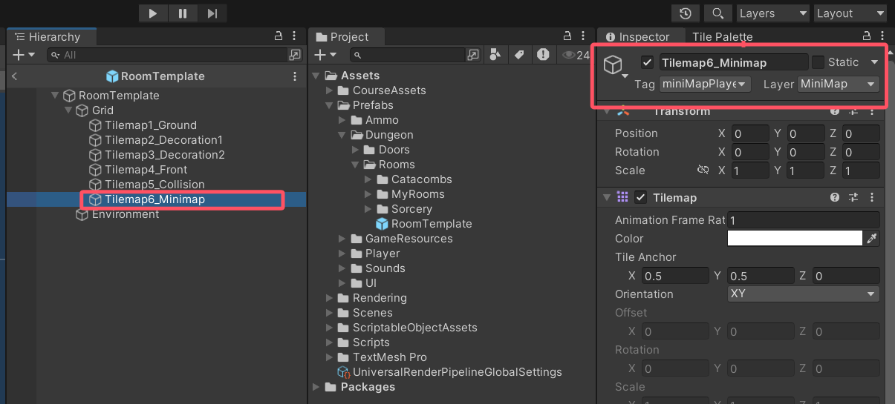
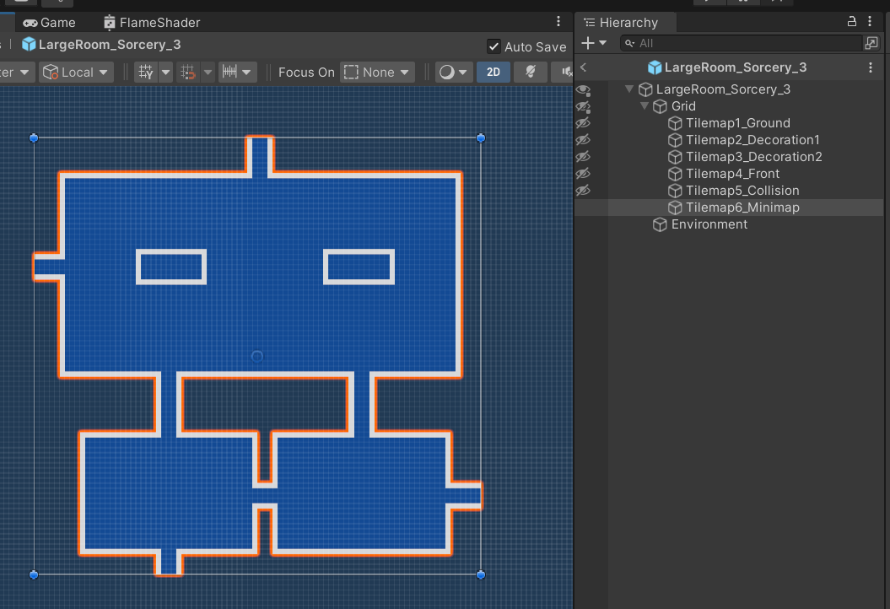
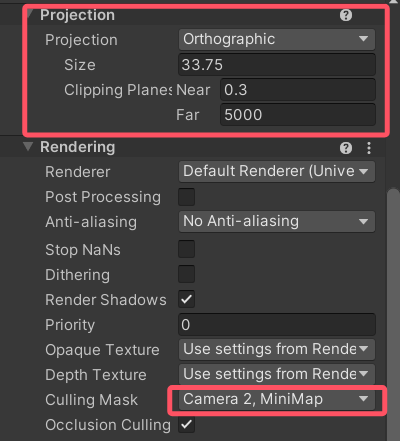
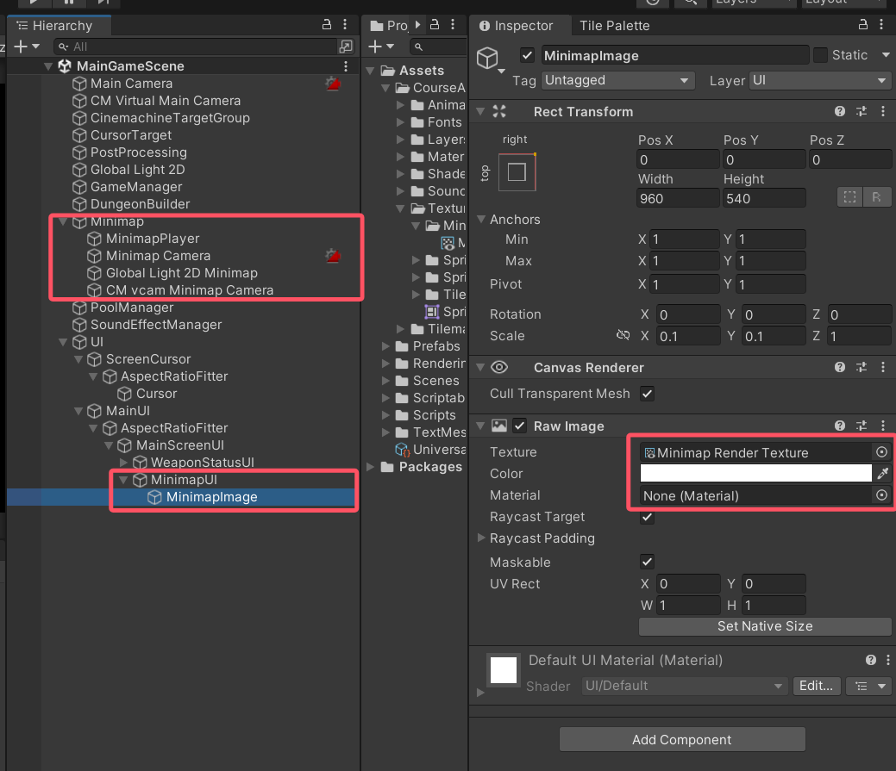

# 1. Minimap

**25.10.17**
如何在游戏中展示小地图？
之前在做房间预制体的时候，我们在Tilemap中加了一个MiniMap Layer，现在是伏笔回收的时刻了：

  

想让游戏右上角渲染出minimap？可以增加一个camera，让它只渲染Minimap Layer就可以了

设置camera的模式为Orthographic（正交投影），并且增加size（越大相机拉的越远）
设置Culling Mask，确保只渲染对应layer     

但是我们不想让minimap渲染到整个屏幕上，所以在minimap camera的output属性，设置output texture，这样就会输出到指定纹理上

最终项目结构：

# 2. Weapon & Ammo Effects

**25.10.19**

Partical System 粒子系统

（1）创建prefab （2）加入对象池  减少new和GC（3）暴露一些参数给代码

一些常用参数介绍