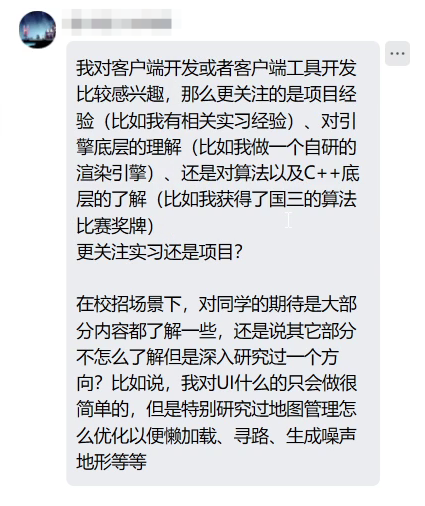

# 序 前言

> 种一棵树最好的时间是10年前，其次是现在

/image-20251021151215391.png)

**Day0 10.20**

20号晚上去听了米哈游的线上宣讲会，确实有点破防

本人是打算走c#，unity客户端校招，感受了一下，发现自己差距还是很多

会上我问了几个问题，给大家分享一下（仅关于客户端）：

Q1： 

A1：操作系统，计网，数据库等这些东西，都是计算机最基础的知识，笔试/面试会着重考察这些基础，反映你大学4年的计算机功底

Q2：

A2：因为是校招生，所以项目经验缺少很正常，不做硬性要求，当然有的话还是加分项。最重要的还是看重基础能力：编程基础（数据结构与算法），计算机基础知识（八股文），因为是开发岗，所以更希望你在课外之余，去主动了解一些==底层==的东西（c++/c#底层实现，比如STL具体怎么实现的？）

Q3：对实习生的招聘要求是什么？

A3：不怎么招实习生，或者说招的实习生都是希望能转正，一起加入我们的人。所以实习生的要求和校招生差不多~

Q4：招聘更看重学历还是能力？

A4：我们公司向来都不是以出身来论英雄，只要你能展示并证明你有能力，胸怀大志，我们当然非常欢迎和期待你的加入呢（听哭了）

ok，讲来讲去都是车轱辘话，总结起来就三点：

0. ~~学历~~
1. 编程能力
2. 计算机基础
3. 项目能力

俗话说得好，上有政策下有对策，对于我们这些26届的老东西，如何解决这燃眉之急呢？

0. ~~听天由命~~
1. 有规律地长期进行刷题，保持手感
2. 扪心自问，大学的这些专业课好好学了吗？没有就趁现在赶紧补，背一些面试喜欢问的问题
3. 没有实习过，基本=0，对我来说就是自己跟着学几个unity学习项目，但是都学的不太深。那几门计算机基础课实在不太行，所以先放一放了

目前来说，我从9月初到现在，Leetcode刷了快500题了，刷题速度可以适当放慢一点，开始补计算机基础了
我的Leetcode主页：[@不是小落](https://leetcode.cn/u/jiang-ai-ni-yu-wan-feng-ha/)

个人计划：从10月21号到年底，补齐计算机面试必备八股文知识
每天5小时左右八股文，5小时左右算法，周赛/双周赛照常参加+补题，计划不变，灵神题单日记继续更新（指路 [小落的算法日记](./小落的算法日记.md)）

学习顺序：计组 -> 计网 -> 操作系统 -> 数据库

对了在c#/unity面试笔试篇，我会根据每天的学习内容，同步更新并回答3个常见问题，来检验自己的学习成果
因为不是系统学习比较零散，而且是面向面试的问题，所以就不放在本篇赘述了
（指路 [unity_c#_笔试\_面试](./unity_c#_笔试_面试.md)）

那么就开始吧！

（评论区偷的，我觉得可以一试）计组
自用 
如果想10天内通过一遍，可以按照这个进度表：
P1 - 4是开胃菜，可以正式开始前观看
Day 1:  P5 - 12 (186 mins)
Day 2:  P13 - 24 (189 mins)
Day 3:  P25 - 32 (171 mins)
Day 4:  P33 - 39 (186 mins)
Day 5:  P40 - 48 (177 mins)
Day 6:  P49 - 61 (179 mins)
Day 7:  P62 - 66 (178 mins)
Day 8:  P67 - 72 (174 mins)
Day 9:  P73 - 79 (182 mins)
Day10: p80 - 87 (214 mins)
每天学习时长 3小时左右，最后一天需要加点班

------

# 计算机组成原理

[王道计算机考研 计算机组成原理](https://www.bilibili.com/video/BV1ps4y1d73V?p=7&vd_source=33dddd4ef8f1605f35cb00074e1a60e5)

**Day1 10.21** 用时4h8min 

## ch1

**P4 计算机软件**

计算机软件：系统软件和应用软件

编译程序：源程序 -> 汇编语言 -> 机器语言（通过编译器，汇编器，或者直接翻译成机器语言）
一次性把源程序全部翻译成机器语言，然后执行机器语言程序
c/c++等

解释程序：源程序 -> 机器语言（通过解释器）
一次翻译一句，效率低
JS，python，Shell等

编译器、汇编器、解释器：高级语言 -> 低级语言，统称翻译程序

指令集体系结构（ISA）：软硬件之间的界面，定义一台计算机可以支持哪些指令，以及每条指令的作用，用法

**P5 计算机系统的多级层级结构**

硬件

微程序机器M0 微程序指令：硬件直接执行，实现机器指令

传统机器M1 机器指令：010101...... 二进制指令

------

软件

虚拟机器M2 操作系统：系统调用，向上提供广义指令

虚拟机器M3 汇编语言：每条汇编语言有对应的机器语言（汇编程序）

虚拟机器M4 高级语言：高级语言用编译程序，翻译成汇编语言

> 下层是上层的基础，上层是下层的扩展

计算机体系结构：如何设计软硬件之间的接口（有无乘法指令）

计算机组成原理：如何用硬件实现定义的接口（如何实现乘法指令）

**P6 计算机系统的工作原理**

**P7 计算机的性能指标**

描述存储容量、文件大小：K: $2^{10}$  M: $2^{20}$  G: $2^{30}$  T: $2^{40}$
频率、速率：10^3, 10^6, 10^9, 10^12

*存储器的性能指标*

MAR 内存地址寄存器：存储单元的个数
MDR 内存数据寄存器：每个存储单元的大小
总容量 = 存储单元个数 * 存储字长 bit （/8 Byte）

eg. MAR32位，MDR8位，存储容量 = 2^32 * 8 bit = 2^32 Byte = 4 GB

*CPU的性能指标*

CPU主频 (HZ)：CPU内数字脉冲信号振荡的频率 主频 = 1 / CPU时钟周期 (ns，μs)
CPI：执行一条指令所需时钟周期数
执行一条指令的耗时：CPI * CPU时钟周期
CPU执行时间 (整个程序的耗时)：指令条数 * CPI * CPU时钟周期
IPS：每秒执行多少条指令 IPS = 主频 / 平均CPI
FLOPS：每秒执行多少次浮点运算

*系统整体性能指标*

数据通路带宽：数据总线一次能并行传送信息的位数
吞吐量：系统在单位时间内处理请求的数量
响应时间：相当于rtt，用户向计算机发出请求，到收到回复的时间
基准程序：用来测量计算机处理速度的实用程序

## ch2

**P8 进位计数制**

十进制 -> r进制
整数部分：除基取余  小数部分：乘基取整（或者拼凑法 ）

真值和机器数
真值：符合人类习惯的数字  机器数：存在机器里的数字

**P9 定点数的表示**

定点数：小数点的位置固定
浮点数：小数点的位置不固定

无符号数：整个机器字长的全部二进制位均为数值位，没有符号位
n位无符号数范围：$[0,2^n-1]$

有符号数

1. 原码$[x]_\text{原}$：用尾数表示真值的绝对值，符号位0/1对应正/负
   以8位机器字长为例：
   $[+19D]_原=0,0010011$，$[-19D]_原=1,0010011$
   $[+0.75D]_原=0,1100000$，$[+0.75D]_原=1,1100000$
   n+1位原码整数范围：$[-(2^n-1),2^n-1]$
   n+1位原码小数范围：$[-(1-2^n),1-2^n]$

2. 反码$[x]_反$：若符号位为0，反码与原码相同，否则数值位全部取反
   $[+19D]_原=0,0010011$，$[-19D]_原=1,1101100$
   $[+0.75D]_原=0,1100000$，$[+0.75D]_原=1,0011111$
   范围与原码相同，实用意义不大
3. 补码$[x]_补$：正数补码=原码，负数补码=反码末位+1
   $[+19D]_补=0,0010011$，$[-19D]_补=1,1101101$
   $[+0.75D]_补=0,1100000$，$[+0.75D]_补=1,0100000$
   特别的，+0和-0合并成了一种表达形式，$1,0000000$在定点整数表示$-2^7$，定点小数表示$-1$
   n+1位补码整数范围：$[-2^n,2^n-1]$
   n+1位补码小数范围：$[-1,1-2^n]$
4. 移码：补码的基础上，符号位取反 (只能表示整数) 

技巧 由$[x]_补$快速求$[-x]_补$的方法：按位取反，末位+1

**P10 各种码的作用**

原码：直观把整数转为二进制数
反码：原码转补码的中间态
补码：减法操作转换为加法操作，节省硬件成本

> 对于有符号数，原码 - 原码 = 原码 + 补码

移码：移码增大和真值增大的方向一致，方便硬件实现比较大小

**P11 c语言中的强制类型转换**

无符号数与有符号数：不改变数据内容，改变解释方式
长整数变短整数：高位截断，保留低位
短整数变长整数：符号扩展 (无符号数补0，有符号数补和符号位相同的数)

**P12 零扩展&符号扩展**

对数据进行长度扩展，为什么？
硬件：ALU和通用寄存器位数固定，运算 / 数据放入可能需要长度扩展
软件：赋值的变量可能会出现强制类型转换

------

# 计算机网络

------

# 操作系统

------

# 数据库

------

# c++/c#底层

