# 序 前言

> 种一棵树最好的时间是10年前，其次是现在

PS：中间出了一次bug，我本来题目是c#最强八股文的，但是好像因为标题里有#，导致github上不能被其他文件链接，以及md文件中访问对应图片文件夹失败（因为我markdown的图片保存路径设置的是./images/${filename}/），所以干脆一不做二不休，把所有标题里的c#都改成csharp了。。。。。。大家不要学我


==**Day0 10.20**==

20号晚上去听了米哈游的线上宣讲会，确实有点破防

本人是打算走c#，unity客户端校招，感受了一下，发现自己差距还是很多

会上我问了几个问题，给大家分享一下（仅关于客户端）：

Q1： 

A1：操作系统，计网，数据库等这些东西，都是计算机最基础的知识，笔试/面试会着重考察这些基础，反映你大学4年的计算机功底

Q2：

A2：因为是校招生，所以项目经验缺少很正常，不做硬性要求，当然有的话还是加分项。最重要的还是看重基础能力：编程基础（数据结构与算法），计算机基础知识（八股文），因为是开发岗，所以更希望你在课外之余，去主动了解一些==底层==的东西（c++/c#底层实现，比如STL具体怎么实现的？）

Q3：对实习生的招聘要求是什么？

A3：不怎么招实习生，或者说招的实习生都是希望能转正，一起加入我们的人。所以实习生的要求和校招生差不多~

Q4：招聘更看重学历还是能力？

A4：我们公司向来都不是以出身来论英雄，只要你能展示并证明你有能力，胸怀大志，我们当然非常欢迎和期待你的加入呢（听哭了）


ok，讲来讲去都是车轱辘话，总结起来就三点：

0. ~~学历~~
1. 编程能力
2. 计算机基础
3. 项目能力

俗话说得好，上有政策下有对策，对于我们这些26届的老东西，如何解决这燃眉之急呢？

0. ~~听天由命~~
1. 有规律地长期进行刷题，保持手感
2. 扪心自问，大学的这些专业课好好学了吗？没有就趁现在赶紧补，背一些面试喜欢问的问题
3. 没有实习过，基本=0，对我来说就是自己跟着学几个unity学习项目，但是都学的不太深。那几门计算机基础课实在不太行，所以先放一放了


目前来说，我从9月初到现在，Leetcode刷了快500题了，刷题速度可以适当放慢一点，开始补计算机基础了
我的Leetcode主页：[@不是小落](https://leetcode.cn/u/jiang-ai-ni-yu-wan-feng-ha/)

个人计划：从10月21号到年底，补齐计算机面试必备八股文知识
每天5小时左右八股文，5小时左右算法，周赛/双周赛照常参加+补题，计划不变，灵神题单日记继续更新（指路 [小落的算法日记](./小落的算法日记.md)）

学习顺序：计组 -> 计网 -> 操作系统 -> 数据库

对了在c#/unity面试笔试篇，我会根据每天的学习内容，同步更新并回答至少1个常见问题，来检验自己的学习成果
因为不是系统学习比较零散，而且是面向面试的问题，所以就不放在本篇赘述了
（指路 [unity_csharp_笔试\_面试](./unity_csharp_笔试_面试.md)）

那么就开始吧！


（评论区偷的，我觉得可以一试）计组
自用 
如果想10天内通过一遍，可以按照这个进度表：
P1 - 4是开胃菜，可以正式开始前观看
Day 1:  P5 - 12 (186 mins)
Day 2:  P13 - 24 (189 mins)
Day 3:  P25 - 32 (171 mins)
Day 4:  P33 - 39 (186 mins)
Day 5:  P40 - 48 (177 mins)
Day 6:  P49 - 61 (179 mins)
Day 7:  P62 - 66 (178 mins)
Day 8:  P67 - 72 (174 mins)
Day 9:  P73 - 79 (182 mins)
Day10: p80 - 87 (214 mins)
每天学习时长 3小时左右，最后一天需要加点班

------

# 计算机组成原理

[王道计算机考研 计算机组成原理](https://www.bilibili.com/video/BV1ps4y1d73V?p=7&vd_source=33dddd4ef8f1605f35cb00074e1a60e5)

==**Day1 10.21**== 用时4h8min 

## ch1

**P4 计算机软件**

计算机软件：系统软件和应用软件

编译程序：源程序 -> 汇编语言 -> 机器语言（通过编译器，汇编器，或者直接翻译成机器语言）
一次性把源程序全部翻译成机器语言，然后执行机器语言程序
c/c++等

解释程序：源程序 -> 机器语言（通过解释器）
一次翻译一句，效率低
JS，python，Shell等

编译器、汇编器、解释器：高级语言 -> 低级语言，统称翻译程序

指令集体系结构（ISA）：软硬件之间的界面，定义一台计算机可以支持哪些指令，以及每条指令的作用，用法


**P5 计算机系统的多级层级结构**

硬件

微程序机器M0 微程序指令：硬件直接执行，实现机器指令

传统机器M1 机器指令：010101...... 二进制指令

------

软件

虚拟机器M2 操作系统：系统调用，向上提供广义指令

虚拟机器M3 汇编语言：每条汇编语言有对应的机器语言（汇编程序）

虚拟机器M4 高级语言：高级语言用编译程序，翻译成汇编语言

> 下层是上层的基础，上层是下层的扩展

计算机体系结构：如何设计软硬件之间的接口（有无乘法指令）

计算机组成原理：如何用硬件实现定义的接口（如何实现乘法指令）


**P6 计算机系统的工作原理**

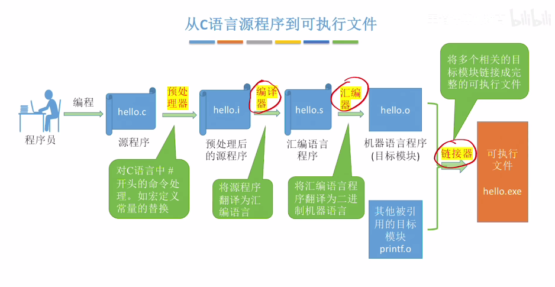

**P7 计算机的性能指标**

描述存储容量、文件大小：K: $2^{10}$  M: $2^{20}$  G: $2^{30}$  T: $2^{40}$
频率、速率：10^3, 10^6, 10^9, 10^12

*存储器的性能指标*

MAR 内存地址寄存器：存储单元的个数
MDR 内存数据寄存器：每个存储单元的大小
总容量 = 存储单元个数 * 存储字长 bit （/8 Byte）

eg. MAR32位，MDR8位，存储容量 = 2^32 * 8 bit = 2^32 Byte = 4 GB

*CPU的性能指标*

CPU主频 (HZ)：CPU内数字脉冲信号振荡的频率 主频 = 1 / CPU时钟周期 (ns，μs)
CPI：执行一条指令所需时钟周期数
执行一条指令的耗时：CPI * CPU时钟周期
CPU执行时间 (整个程序的耗时)：指令条数 * CPI * CPU时钟周期
IPS：每秒执行多少条指令 IPS = 主频 / 平均CPI
FLOPS：每秒执行多少次浮点运算

*系统整体性能指标*

数据通路带宽：数据总线一次能并行传送信息的位数
吞吐量：系统在单位时间内处理请求的数量
响应时间：相当于rtt，用户向计算机发出请求，到收到回复的时间
基准程序：用来测量计算机处理速度的实用程序


## ch2

**P8 进位计数制**

十进制 -> r进制
整数部分：除基取余  小数部分：乘基取整（或者拼凑法 ）

真值和机器数
真值：符合人类习惯的数字  机器数：存在机器里的数字


**P9 定点数的表示**

定点数：小数点的位置固定
浮点数：小数点的位置不固定

无符号数：整个机器字长的全部二进制位均为数值位，没有符号位
n位无符号数范围：$[0,2^n-1]$

有符号数

1. 原码$[x]_\text{原}$：用尾数表示真值的绝对值，符号位0/1对应正/负
   以8位机器字长为例：
   $[+19D]_原=0,0010011$，$[-19D]_原=1,0010011$
   $[+0.75D]_原=0,1100000$，$[+0.75D]_原=1,1100000$
   n+1位原码整数范围：$[-(2^n-1),2^n-1]$
   n+1位原码小数范围：$[-(1-2^n),1-2^n]$

2. 反码$[x]_反$：若符号位为0，反码与原码相同，否则数值位全部取反
   $[+19D]_反=0,0010011$，$[-19D]_反=1,1101100$
   $[+0.75D]_反=0,1100000$，$[+0.75D]_反=1,0011111$
   范围与原码相同，实用意义不大

3. 补码$[x]_补$：正数补码=原码，负数补码=反码末位+1
   $[+19D]_补=0,0010011$，$[-19D]_补=1,1101101$
   $[+0.75D]_补=0,1100000$，$[+0.75D]_补=1,0100000$
   特别的，+0和-0合并成了一种表达形式，$1,0000000$在定点整数表示$-2^7$，定点小数表示$-1$
   n+1位补码整数范围：$[-2^n,2^n-1]$
   n+1位补码小数范围：$[-1,1-2^n]$

   > 技巧 由$[x]_补$快速求$[-x]_补$的方法：==按位取反，末位+1==

4. 移码：补码的基础上，符号位取反 (只能表示整数) 


**P10 各种码的作用**

原码：直观把整数转为二进制数
反码：原码转补码的中间态
补码：减法操作转换为加法操作，节省硬件成本

> 对于有符号数，原码 - 原码 = 原码 + 补码

移码：移码增大和真值增大的方向一致，方便硬件实现比较大小


**P11 c语言中的强制类型转换**

无符号数与有符号数：不改变数据内容，改变解释方式
长整数变短整数：高位截断，保留低位
短整数变长整数：符号扩展 (无符号数补0，有符号数补和符号位相同的数)


**P12 零扩展&符号扩展**

对数据进行长度扩展，为什么？
硬件：ALU和通用寄存器位数固定，运算 / 数据放入可能需要长度扩展
软件：赋值的变量可能会出现强制类型转换


==**Day2 10.22**== 用时4h

> ps：我没有数电基础，基本都是看一会视频自己写一会，一天同时学完加减和乘除有点吃不消
> 所以这部分学的慢一点
> 到后面存储系统的时候可以学快一点（操作系统里学过）

**P13 逻辑门电路**

基本逻辑运算

与门
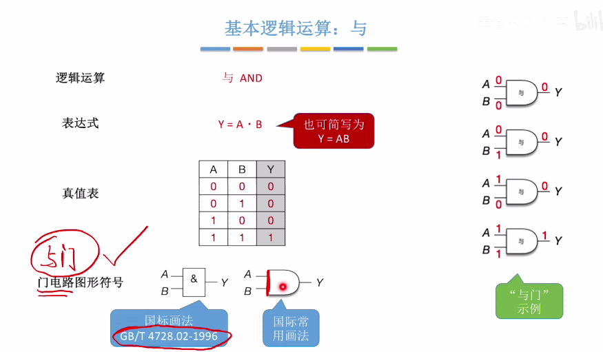


或门
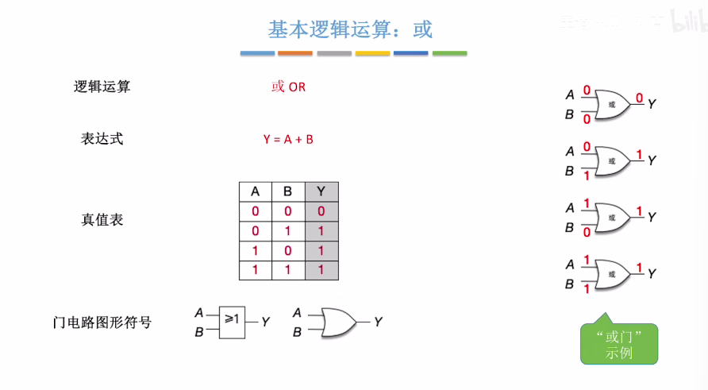

非门
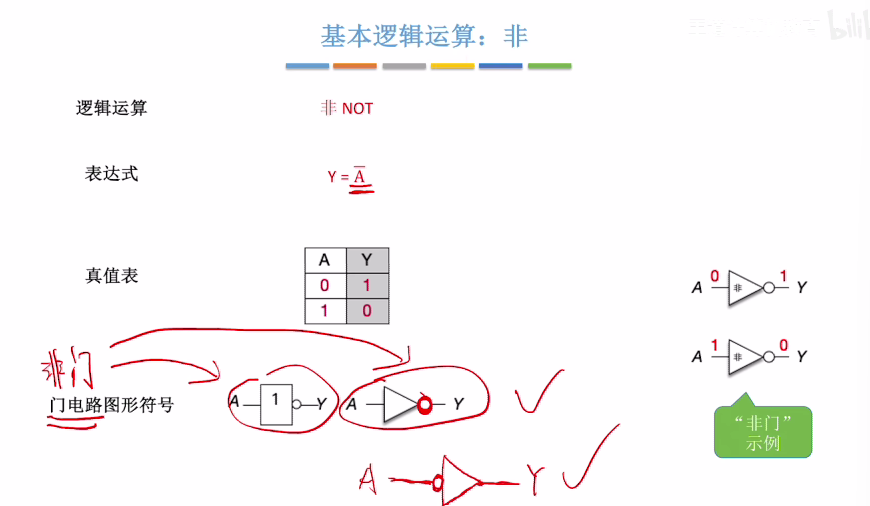

复合逻辑运算

与非 和与相反

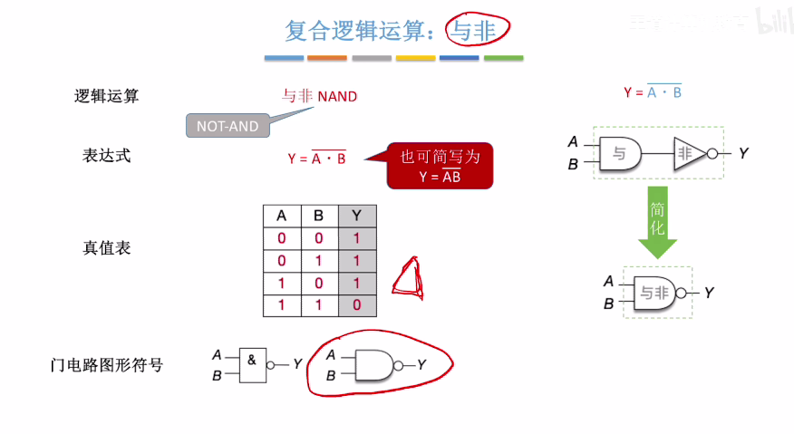

或非 和或相反
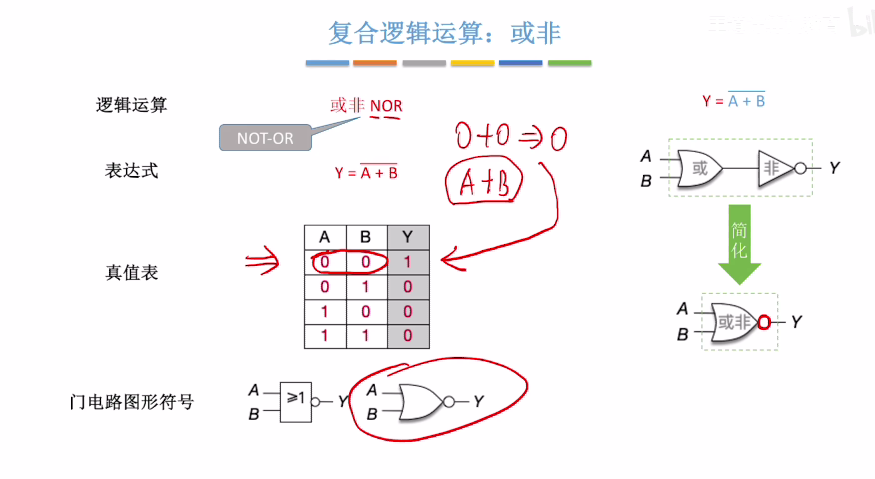

异或 相同为0不同为1
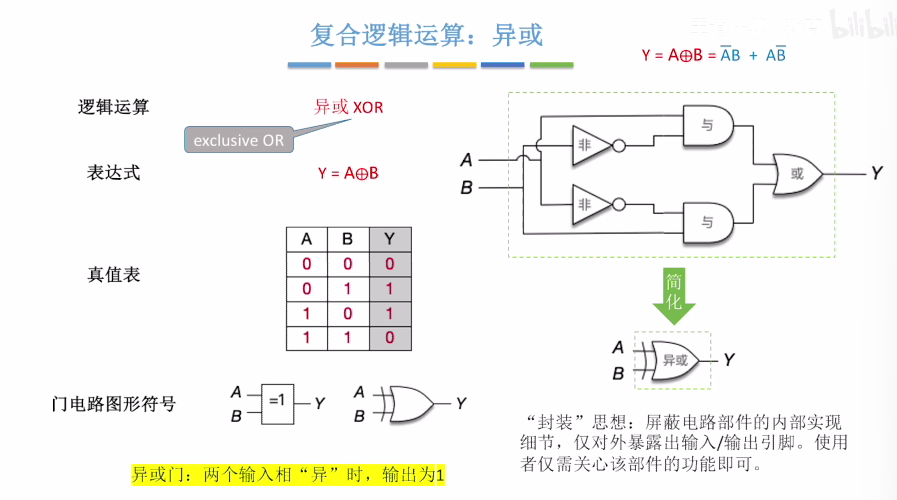

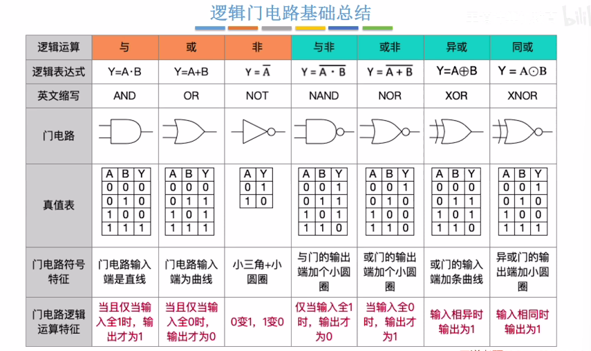

优先级：非 > 与 > 或
异或：奇数个1异或和为1，偶数个1异或和为0


**P14 多路选择器&三态门**

多路选择器 (MUX)：在多个输入数据中，只允许其中一个数据通过MUX
k个输入 控制信号位数 $m\ge[log_2k]$ bit

三态门：根据控制信号op (1bit) 决定是否让输入数据通过


**P15 加法器**

一位全加器 (FA)：只能支持1bit加
$A_i:被加数的本位\ B_i:加数的本位\ C_{i-1}:来自低位的进位\ S_i:本位和$

$S_i:输入中有奇数个1时输出1$
$S_i = A_i \bigoplus B_i \bigoplus C_i$

$C_i:输入中有至少2个1时输出1$
$C_i = A_iB_i + (A_i \bigoplus B_i)C_{i-1}$

n bit加法器：把n个一位全加器串接起来 (串行)
优化：增加CLA部件 (并行)

带标志位的加法器：OF，SF，ZF，CF
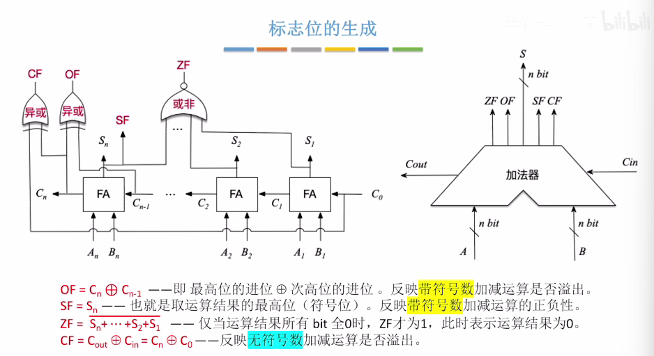


**P16 算术逻辑单元ALU**

CPU：控制器 + 运算器
ALU是运算器的核心，加法器是ALU的核心

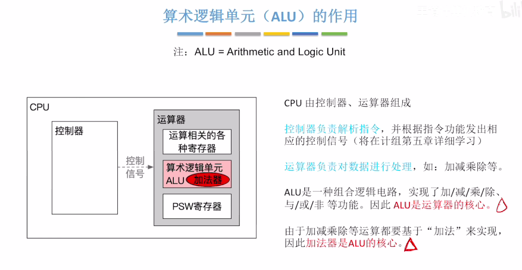

ALU的功能

算术运算：加减乘除等
逻辑运算：与，或，非，异或，移位等
其他：求补码，直送等


**P17 定点数的移位运算**

逻辑移位：常用于处理无符号整数

逻辑左移：高位移出丢弃，低位补0 (丢弃的位=1，会发生溢出)
左移n位，相当于乘$2^n$
逻辑右移：低位移出丢弃，高位补0 (丢弃的位=1，会丢失精度)
右移n位，相当于除以$2^n$

算数移位：常用于处理有符号整数
算数左移同上
溢出判断：算数左移前后的符号位不同
算数右移：低位移出丢弃，高位补符号位 (丢弃的位=1，会丢失精度)


**P18 定点数的加减运算**

补码的加减运算 (无需考虑符号位)：
$C=A+B,\ [C]_补=[A]_补+[B]_补,\ 求[C]_原$
$C=A-B,\ [C]_补=[A]_补+[-B]_补,\ 求[C]_原$

> 技巧 由$[x]_补$快速求$[-x]_补$的方法：==按位取反，末位+1==

负数补码 -> 原码：数值位从后往前第一个1，之前的全部按位取反
eg：$B=-24,\ [B]_原=1,0011000,\ [B]_补=1,1101000$

溢出判断：

正数 + 正数可能会上溢 (正 + 正 = 负)
负数 + 负数可能会下溢 (负 + 负 = 正)

方法一：采用一位符号位
$设A的符号为A_S，B的符号为B_S，运算结果的符号为S_S，则溢出逻辑表达式$
$V=A_S B_S \overline{S_S} + \overline{A_S} \overline{B_S} S_S$
$V=0:无溢出，V=1:有溢出$

方法二：采用一位符号位，根据数据位进位情况判断溢出
$符号位的进位C_S，最高数值位的进位C_1，C_S与C_1不同时有溢出$
$V = C_S \bigoplus C_1$
$V=0:无溢出，V=1:有溢出$

方法三：采用双符号位 (实际存储时只存储一个符号位，运算时复制符号位)
$记两个符号位为S_{S1}S_{S2}，则V = S_{S1} \bigoplus S_{S2}$
01：上溢，10：下溢


**P19 无符号数的加减运算**

加法同有符号数
减法：被减数不变，减数全部为==按位取反，末位+1== (求补数)，减法变加法

判断溢出
加法：最高位进位 = 1时发生溢出
减法：最高位进位 = 0时发生溢出


**P20 补码加减运算电路**

有符号数、无符号数均可实现

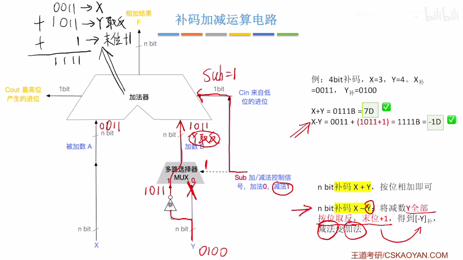


==**Day3 10.25**== 3h

**P21 无符号整数的乘法运算原理**

逐位相乘，错位相加

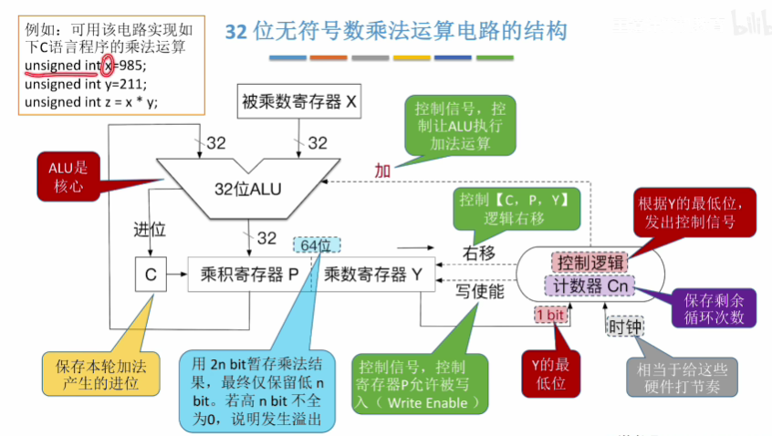

进位C 乘积寄存器P 乘数寄存器Y 计数器Cn

进行n轮处理，移位运算，直到Cn = 0

1. 将乘数寄存器Y的最低位，送入“控制逻辑”进行判断
2. 若Y的最低位为1，则执行加法，运算结果写回P，如果产生进位把C置为1
   若Y的最低位为0，什么都不做
3. 将【C，P，Y】视为整体，==逻辑右移==一位
4. $C_n = C_n - 1$

判断溢出：计算结束后，如果P不全为0，说明发生溢出，并将OF = 1


**P22 带符号整数的乘法运算原理**

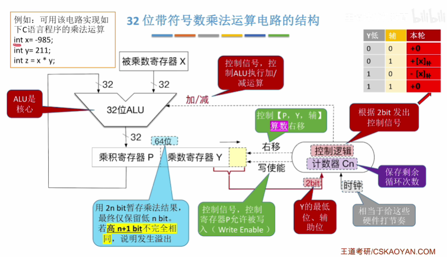

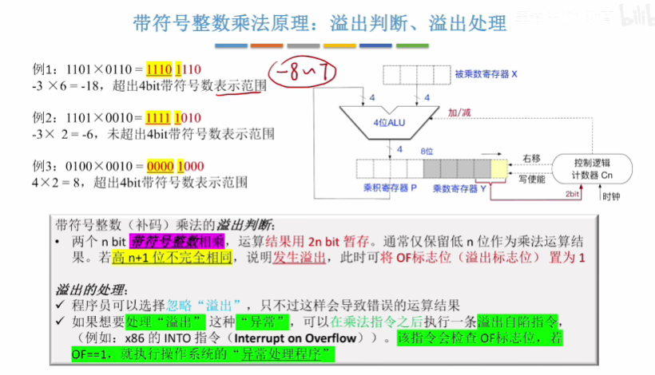


**P23 计算机实现乘法运算的三种方式**

1. ALU、移位器、寄存器、控制逻辑组成的乘法电路 (较快)
2. 阵列乘法器 (快速乘法器)：在一个时钟内完成乘法运算 (最快)
3. 用软件实现，逻辑运算、加减运算等效实现乘法 (最慢)


**P24 无符号整数的除法运算原理**

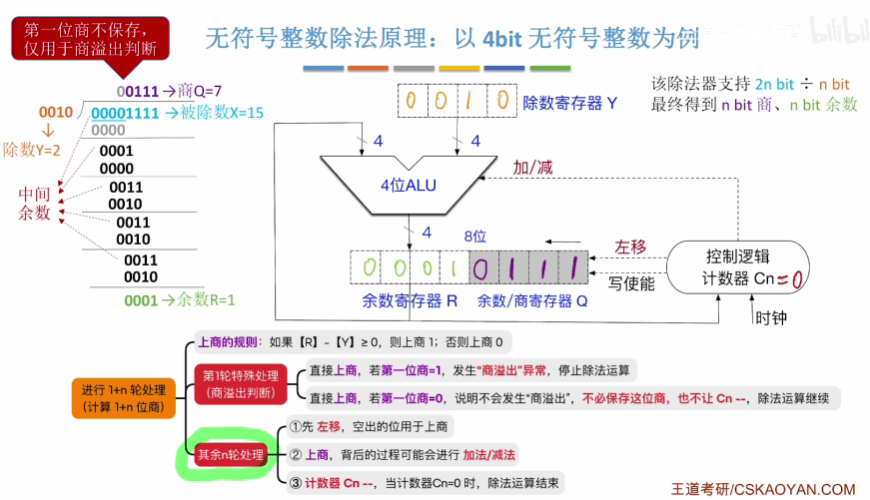

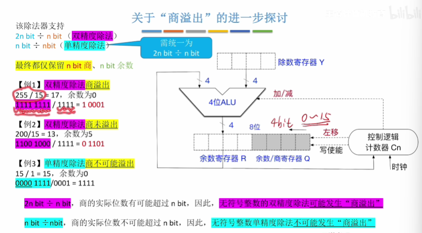


**P25 IEEE 754 浮点数的表示**


# 计算机网络


------

# 操作系统


------

# 数据库


------

# c++

## **1. c++移动语义和完美转发是什么**

**移动语义**：一种优化资源管理的机制。常规的资源管理是拷贝别人的资源，而移动语义是转移所有权，转移资源而不是拷贝资源，性能会更好

移动语义通常用于那些比较大的对象，搭配移动构造函数或者移动赋值运算符来使用

如果不使用std::move，会有很大的拷贝代价，使用移动语义可以避免很多无用的拷贝，提高程序性能。==C++所有的STL都实现了移动语义==

```c++
// 移动语义
class A {
public:
    // 构造函数
    A(int size) : size_(size) {
        data_ = new int[size];
    }
    A(){}
    // 拷贝构造
    A(const A& a) {
        size_ = a.size_;
        data_ = new int[size_];
        cout << "copy " << endl;
    }
    // 移动构造
    A(A&& a) {
        this->data_ = a.data_;
        a.data_ = nullptr;  // 常数时间内完成，把原来数据偷走
        cout << "move " << endl;
    }
    // 析构
    ~A() {
        if (data_ != nullptr) {
            delete[] data_;
        }
    }
    int *data_;
    int size_;
};
int main() {
    A a(10);
    A b = a;
    A c = std::move(a); // 调用移动构造函数
    return 0;
}
```


**完美转发**：指可以写一个接收任意实参的函数模板，并转发到其他函数，目标函数会收到与转发函数完全相同的实参(左值或者右值)

如何实现完美转发？**std::forward**

```c++
void PrintV(int &t) {
    cout << "lvalue" << endl;
}

void PrintV(int &&t) {
    cout << "rvalue" << endl;
}

template<typename T>
void Test(T &&t) {
    PrintV(t);						
    PrintV(std::forward<T>(t));		
    PrintV(std::move(t));			
}
// 以Test(1)为例
// t作为形参 是左值
// 1是右值 forward把t恢复成1 变成右值
// move把t强行转换为右值
// 以Test(std::forward<int&>(a))为例
// t作为形参 是左值
// a是int& 是左值 forward把t恢复成a 还是左值
// move把t强行转换为右值
int main() {
    Test(1); // lvalue rvalue rvalue
    int a = 1;
    Test(a); // lvalue lvalue rvalue
    Test(std::forward<int>(a)); // lvalue rvalue rvalue
    Test(std::forward<int&>(a)); // lvalue lvalue rvalue
    Test(std::forward<int&&>(a)); // lvalue rvalue rvalue
    return 0;
}
```


## 2. 介绍c++中三种智能指针的使用场景？

c++中的智能指针主要用于管理动态分配的内存，避免内存泄漏

c++11引入了三种主要的智能指针：std::unique_ptr、std::shared_ptr、std::weak_ptr

**(1) std::unique_ptr**

一种独占所有权的智能指针，意味着同一时间内只能有一个 unique_ptr 指向一个特定的对象。当 unique_ptr 被销毁时，它所指向的对象也会被销毁。

使用场景：

- 当你需要确保一个对象只被一个指针所拥有时
- 当你需要自动管理资源，如文件句柄或互斥锁时

```c++
class Test {
public:
    Test() { std::cout << "Test::Test()\n"; }
    ~Test() { std::cout << "Test::~Test()\n"; }
    void test() { std::cout << "Test::test()\n"; }
};

int main() {
    std::unique_ptr<Test> ptr(new Test());
    ptr->test();
    // 当ptr离开作用域时，它指向的对象会被自动销毁
    return 0;
}
// 输出
// Test::Test() ——创建指针，指向新的的Test对象
// Test::test()	——调用test方法
// Test::~Test() ——ptr离开作用域时，它指向的对象会被自动销毁，调用析构函数
```

**(2) std::shared_ptr**

一种共享所有权的智能指针，多个 shared_ptr 可以指向同一个对象。内部使用==引用计数==来确保只有当最后一个指向对象的 shared_ptr 被销毁时，对象才会销毁。

使用场景：

- 当你需要在多个所有者之间共享对象时
- 当你需要通过复制构造函数，或赋值操作符来复制智能指针时

```c++
class Test {
public:
    Test() { std::cout << "Test::Test()\n"; }
    ~Test() { std::cout << "Test::~Test()\n"; }
    void test() { std::cout << "Test::test()\n"; }
};

int main() {
    std::shared_ptr<Test> ptr1(new Test());
    std::shared_ptr<Test> ptr2 = ptr1;
    ptr1->test();
    // 当ptr1和ptr2离开作用域时，它们指向的对象会被自动销毁
    return 0;
}
// 输出
// Test::Test() ——创建指针，指向新的的Test对象
// Test::test()	——调用test方法
// Test::~Test() ——ptr1和ptr2离开作用域时，它们指向的对象会被自动销毁，调用析构函数
```

**(3) std::weak_ptr**

一种不拥有对象所有权的智能指针，它指向一个由 shared_ptr 管理的对象，weak_ptr 用于解决 shared_ptr 之间的循环引用的问题。

使用场景

- 当你需要访问但不拥有 shared_ptr 管理的对象时
- 当你需要解决 shared_ptr 之间的循环引用的问题时
- weak_ptr 肯定要和 shared_ptr 搭配使用

```c++
class Test {
public:
    Test() { std::cout << "Test::Test()\n"; }
    ~Test() { std::cout << "Test::~Test()\n"; }
    void test() { std::cout << "Test::test()\n"; }
};

int main() {
    std::shared_ptr<Test> sharedPtr(new Test());
    std::weak_ptr<Test> weakPtr = sharedPtr;
    
    // lock() 返回一个 shared_ptr<Test>
	// 如果对象还存在（引用计数 > 0），返回非空 shared_ptr，引用计数 +1
	// 如果对象已被销毁，返回 空 shared_ptr
	// 这里对象还在，所以升级成功，调用 test()
    if (auto lockedSharedPtr = weakPtr.lock()) {
        lockedSharedPtr->test();
    }
    // 当sharedPtr离开作用域时，它指向的对象会被自动销毁
    return 0;
}
// Test::Test()   ← shared_ptr 创建
// Test::test()   ← weak_ptr 升级成功并调用
// Test::~Test()  ← shared_ptr 离开作用域，对象销毁
```


## 3. c++11中有哪些常用的新特性？


# c#

## 1. 什么是Linq，如何在c#中使用？


## 2. 什么是c#的委托？基本用法？

c#中的委托 (delegate) 是一个类型安全的对象，它定义了一种方法的签名并可以指向该签名的任何方法。
这意味着委托可以存储对具有**相同参数**和**相同返回类型**的方法的引用。委托在某种程度上类似于函数指针，但他是类型安全的。

```c#
class DelegateTest
{
    // 1.定义委托类型，指向一个参数为string，无返回值的方法
    private delegate void MyDelegate(string message);
    
    // 定义一个委托，指向一个参数为2个int，返回值为int的方法
    private delegate int MathOperationDelegate(int a, int b);

    public static void Test1()
    {
        // 2.创建委托实例并赋值
        MyDelegate del1 = new MyDelegate(MyMethod);
        MathOperationDelegate del2 = new MathOperationDelegate(Add);
        MathOperationDelegate del3 = (a, b) => a * b;
        
        // 3.调用委托
        Console.WriteLine(typeof(MyDelegate));
        Console.WriteLine(typeof(MathOperationDelegate));
        del1("Hello World!");
        Console.WriteLine(del2(114514, 1919810));
        Console.WriteLine(del3(114, 514));
    }

    private static int Add(int a, int b)
    {
        return a + b;
    }

    // 4.方法匹配委托签名
    private static void MyMethod(string message)
    {
        Console.WriteLine(message);
    }
    
    // 5.多播委托
    public static void Test2()
    {
        MyDelegate del1 = new MyDelegate(Method1);
        MyDelegate del2 = new MyDelegate(Method2);
        MyDelegate multiDel = del1 + del2 + del2;
        multiDel("Hello from 多播委托 ");
        // multiDel -= del1;
        // multiDel -= del2;
        // multiDel -= del2;
        multiDel = null;
        multiDel?.Invoke("Hello from 多播委托 ");
        
        // 6.匿名方法
        MyDelegate del3 = delegate(string msg)
        {
            Console.WriteLine(msg);
        };
        del3("Hello from 匿名方法");
        
        // 7.Lambda表达式
        // MyDelegate del4 = (msg) =>
        // {
        //     Console.WriteLine(msg);
        // };        
        MyDelegate del4 = Console.WriteLine;
        del4("Hello from Lambda表达式");
    }

    private static void Method2(string message)
    {
        Console.WriteLine(message + nameof(Method2));
    }

    private static void Method1(string message)
    {
        Console.WriteLine(message + nameof(Method1));
    }

    // 疑问：以下两种有什么区别(del1和MyAdd)
    // 委托 = 可传递、可组合、略带开销的“方法对象”；本地函数 = 零开销的“静态方法”语法糖。
	// 能本地就本地，要当参数、要多播、要存集合时才用委托。
    public static void Test3()
    {
        MathOperationDelegate del1 = (a, b) => a + b;
        MathOperationDelegate del2 = (a, b) => a * b;
        MathOperationDelegate multiDel = del1 + del2 + del1;
        
        // int MyAdd(int a, int b) => a + b;
        
        Console.WriteLine(del1(1, 2));
        Console.WriteLine(del2(1, 2));
        Console.WriteLine(multiDel(1, 2));
        // Console.WriteLine(MyAdd(1, 2));
    }
    
 	// private delegate void MyDelegate(string message);
    // 事件是基于委托的
    private event MyDelegate MyEvent;    
    private int cnt = 0;

    private void TriggerEvent()
    {
        MyEvent?.Invoke("Event triggered! For the " + cnt++ + " time"); 
    }
    
    public static void Test4() 
    {
        DelegateTest test = new DelegateTest();
        test.MyEvent += Console.WriteLine;
        test.MyEvent += Console.WriteLine;
        test.MyEvent += Console.WriteLine;
        test.TriggerEvent();
        test.MyEvent -= Console.WriteLine;
        test.TriggerEvent();
    }

}
```

为什么委托被认为是安全的？

1. 类型安全：强类型，编译时会进行类型检查
2. 封装性：委托可以封装方法，并且可以通过**多播委托**将各个方法组合在一起，更好地组织代码
3. 匿名方法和Lambda表达式的安全
4. 内存管理：委托在c#中是托管的，不容易导致内存泄漏或悬空引用
5. 不可修改：一旦一个委托实例被创建，它的指向就不会改变

委托类型：

1. 自定义委托

   ```c#
   // 定义一个委托类型，指向一个无参数、无返回值的方法
   public delegate void MyDelegate();
   
   // 定义一个委托类型，指向一个接收两个int参数并返回int的方法
   public delegate int MathOperation(int a, int b);
   ```

2. Action委托（无返回值）

   ```c#
   // Action (无参数)
   Action simpleAction = () => Console.WriteLine("无参数Action");
   
   // Action<T> (1个参数)
   Action<string> stringAction = msg => Console.WriteLine(msg);
   
   // Action<T1, T2> (2个参数)
   Action<int, string> multiAction = (id, name) => 
   Console.WriteLine($"ID: {id}, Name: {name}");
   
   // 最多支持16个参数
   Action<int, string, bool, decimal> complexAction = 
   (a, b, c, d) => { /* 处理多个参数 */ };
   ```

3. Func委托（有返回值）

   ```c#
   // Func<TResult> (无参数，有返回值)
   Func<int> getRandom = () => new Random().Next();
   
   // Func<T, TResult> (1个参数，有返回值)
   Func<string, int> stringLength = s => s.Length;
   
   // Func<T1, T2, TResult> (2个参数，有返回值)
   Func<int, int, int> add = (a, b) => a + b;
   
   // 最后一个泛型参数是返回值类型
   Func<int, string, bool, decimal> complexFunc = 
   (a, b, c) => c ? a : decimal.Parse(b);
   ```

4. Predicate委托（返回bool）

   ```c#
   Predicate<int> isEven = num => num % 2 == 0;
   Predicate<string> isNullOrEmpty = string.IsNullOrEmpty;
   
   List<int> numbers = new List<int> { 1, 2, 3, 4, 5 };
   var evenNumbers = numbers.FindAll(isEven);  // 返回 [2, 4]
   ```

   


## 3. 描述c#中的事件机制如何实现的？

事件和委托的区别

委托：任何拿到委托实例的代码都能 `Invoke`，外部权限 +=，-=，=，Invoke

事件：只有**定义事件的类内部**才能 `Invoke`，外部权限 +=，-=

- 基于事件的**发布-订阅模型**：供类型向外界“通知”某事发生，但不让外界控制通知过程

> **“要给别人‘随便调’的能力 → 用委托；**
> **只想让别人‘等着被通知’ → 用事件。”**

```c#
public class Button
{
    // 1. 普通委托字段——外部可为所欲为
    public Action OnClickDelegate;

    // 2. 事件——外部只能 += / -=
    public event Action OnClickEvent;

    private void Fire()
    {
        // 内部都能触发
        OnClickDelegate?.Invoke();
        OnClickEvent?.Invoke();
    }
}

class Program
{
    static void Main()
    {
        var btn = new Button();

        // 委托：啥都能干
        btn.OnClickDelegate = () => Console.Write("A"); // 覆盖整个列表
        btn.OnClickDelegate();                          // 自己触发

        // 事件：只能订阅/取消
        btn.OnClickEvent += () => Console.Write("B");
        // btn.OnClickEvent = null;   // ❌ 编译错误
        // btn.OnClickEvent();        // ❌ 编译错误
    }
}
```


EventHandler类

```c#
public delegate void EventHandler(object? sender, EventArgs e);
```

为什么EventHandler的返回值为void？

- 因为 **事件的本质是“通知”而不是“请求”**——发布者只管“把事情说出来”，并不关心、也不应该依赖订阅者 **返回什么** 或 **是否成功**。返回 `void` 强制做到了：
  **单向通知**：发布者 → 订阅者：只发消息，不收回信，避免反向依赖。


## 4. 什么是c#中的反射？底层实现原理是什么？

