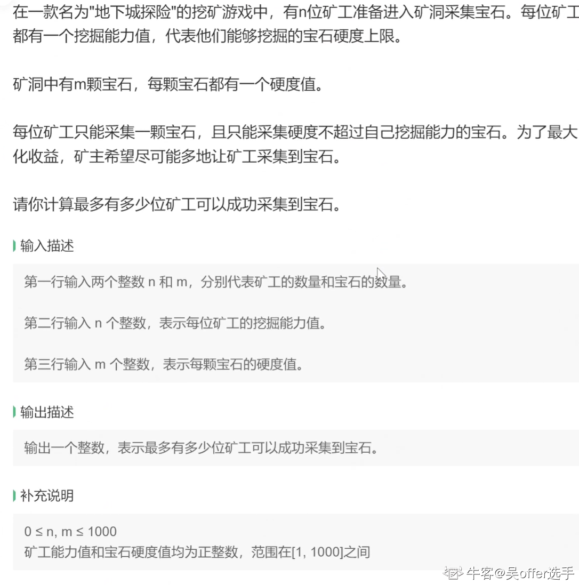
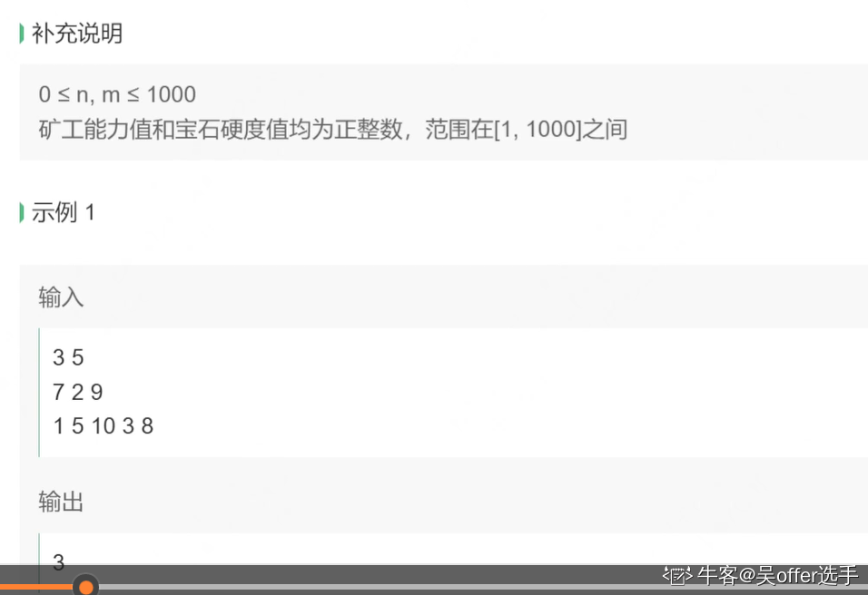
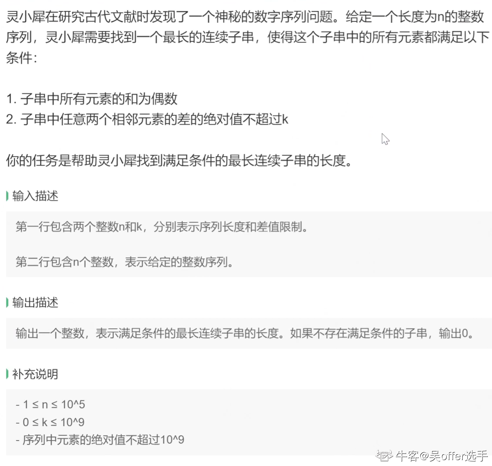
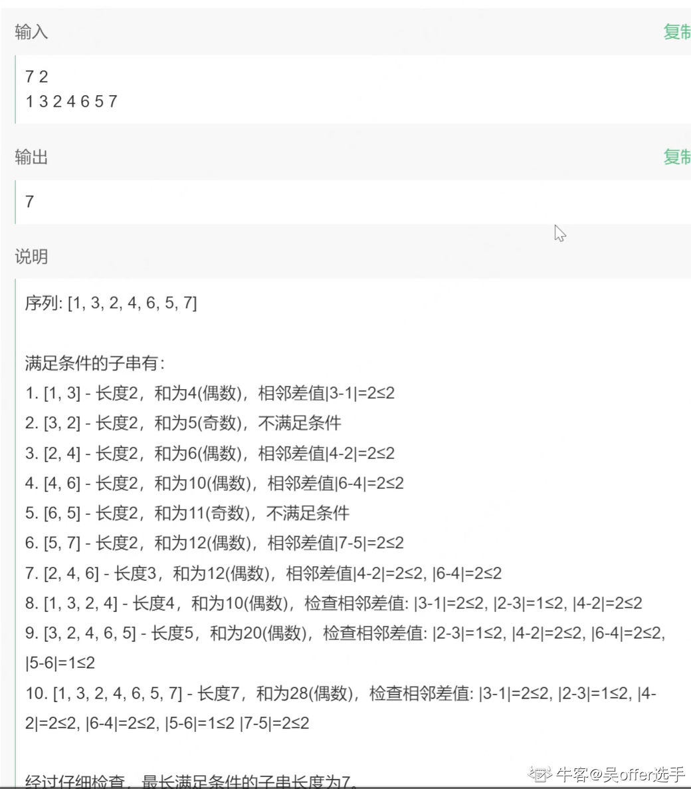
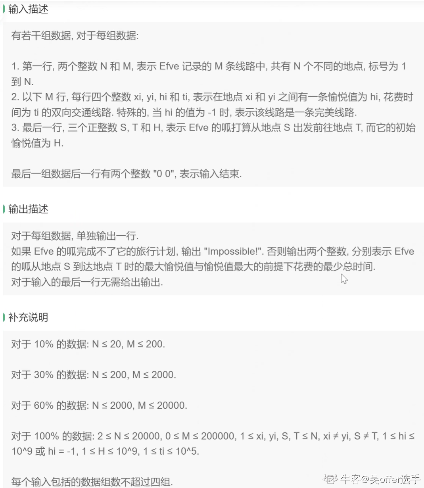
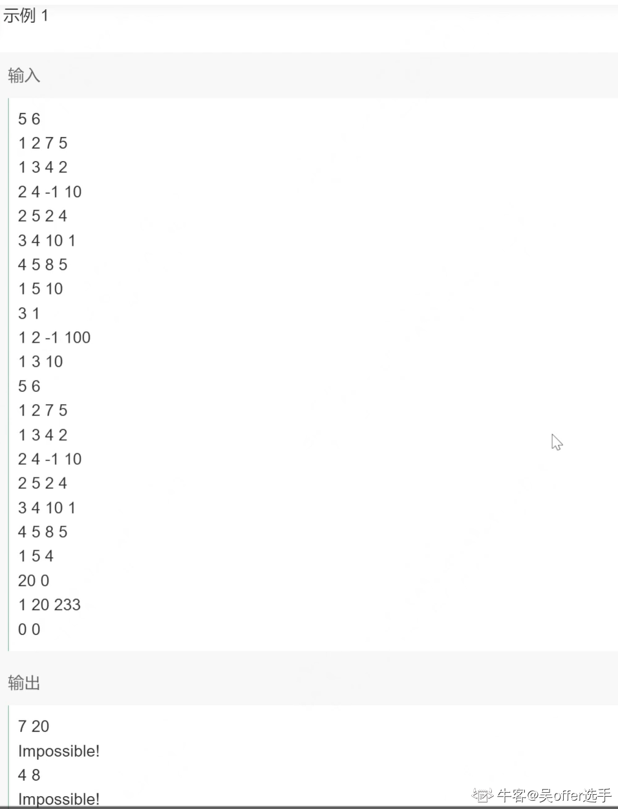

# **历史战绩**

1. 9.20 4399 笔试
2. 9.28 网易雷火 笔试
3. 10.11 星辉 面试
4. 10.11 灵感 笔试
5. 10.12 阿里灵犀 笔试
6. 10.13 途游 笔试


## 1）9.20 4399 笔试

10道选择+3道编程+2道问答 2h

选择：操作系统+计网+计组+数据结构等等 计算机八股文

编程：

1. 滑动窗口+字符串处理
2. bfs/dfs
3. 01背包 二维

问答：

1. 你想成为什么样的人？
2. 回顾大学四年生活，你有哪些收获和遗憾？


## 2）9.28 网易雷火 笔试

牛客 双机位 4道编程题 3h

1. 滑动窗口
2. 完全背包
3. 模拟+大量IO
4. bfs（会TLE） Dijsktra优先队列优化


## 3）10.11 星辉面试

1. A*
2. 对象池如何性能优化？可以优化哪些对象
3. 哈希表底层 如何解决哈希冲突
4. 讲讲平常怎么学习的 看过哪些书


## 4）10.11 灵感笔试

3道选择（程序的结果是什么）3道简答 3道编程 1h

简答：

1. 单链表和数组的区别
2. 改程序
3. 点乘和叉乘的几何意义

编程：

1. 6*6乘法表
2. 斐波那契数列
3. 用两个栈实现队列


## 5）10.12 阿里灵犀 笔试

450分 2h

考试题型：

1. 单选 15 道（45分）

2. 不定项选择 5 道（15分）

3. 填空 5 道（10分）
   ‘0’和'a'的ascii码
   信号量的原子操作（PV）
   无向连通图图 E = V - 1是什么图 E > V - 1会怎么样
   网络编程 3个概念（不太记得 不会写）
   还有一题忘了 反正客观题操作系统 计组 计网 数据结构 算法 数据库啥的都考 很杂

4. 编程 4 道（360分）
   (1). 贪心 ac

             
   参考代码：

   ```c#
   public class Gem
   {
       public static void Main()
       {
           var nm = Console.ReadLine().Split();
           int n = int.Parse(nm[0]);
           int m = int.Parse(nm[1]);
           
           List<int> abilities = Console.ReadLine().Split().Select(int.Parse).ToList();
           List<int> hardness = Console.ReadLine().Split().Select(int.Parse).ToList();
   
           int ans = 0;
           
           // 把能力和宝石硬度分别降序排序
           abilities.Sort((a, b) => b - a);        
           hardness.Sort((a, b) => b - a);
   
           foreach (int ability in abilities)
           {
               for (int i=0 ; i < hardness.Count ; i++)
               {
                   int hard = hardness[i];
                   if (ability >= hard)
                   {
                       hardness.Remove(hard);
                       ans++;
                       break;
                   }
               }
           }
           
           Console.WriteLine(ans);
       }
   }
   ```

   

   (2). 贪心 ac 没找到图
   和第一题差不多 钻石变成宝箱 区别是每个勇士可以开多个宝箱
   如果每个勇士至少开了一个箱子 且所有箱子都被开启 输出Yes 否则输出No
   参考代码：

   ```c#
   public class ChestHunter
   {
       public static void Main()
       {
           var nm = Console.ReadLine().Split();
           int n = int.Parse(nm[0]);
           int m = int.Parse(nm[1]);
           
           // 提前判断
           if (n > m)
           {
               Console.WriteLine("No");
               return;
           }
           
           List<int> abilities = Console.ReadLine().Split().Select(int.Parse).ToList();
           List<int> chests = Console.ReadLine().Split().Select(int.Parse).ToList();
   
           // 贪心 从能力值最低的开始分配 每次让最低能力值的先选
           // 如果n > m 直接return false
           // 如果最后宝箱还有剩余 返回false
           
           bool ans = false;
           
           // 能力值 宝箱价值 分别升序排序
           abilities.Sort();
           chests.Sort();
   
           for (int i = 0; i < n - 1; i++)
           {
               int ability = abilities[i];
               for (int j = 0; j < chests.Count; j++)
               {
                   int value = chests[j];
                   if (ability >= value)
                   {
                       chests.RemoveAt(j);
                       break;
                   }
                   
                   // 该勇士没有打开箱子
                   Console.WriteLine("No");
                   return;
               }
           }
           
           ans = abilities[^1] >= chests[^1];
           Console.WriteLine(ans ? "Yes" : "No");
       }
   }
   ```

   

   (3). 不太会写这种 O(n^2)估计TLE了 33%
        
   有没有大神能帮我改改
   参考代码：

   ```c#
   public class MaxSubSequence
   {
       public static void Main3()
       {
           var nk = Console.ReadLine().Split();
           int n = int.Parse(nk[0]);
           int k = int.Parse(nk[1]);
           
           // 找到子串 满足
           // 1. 所有元素和为偶数
           // 2. 任意两个相邻元素绝对值 <= k
           // 变长滑动窗口 + 前缀和
           int[] seq = Regex.Replace(Console.ReadLine(), @"\s{2,}", " ").Split().Select(int.Parse).ToArray();
   
           int maxLen = 0, len = 0, left = 0;
           
           int[] pre1 = new int[n+1];
           int[] pre2 = new int[n+1];
           int[] diff = new int[n];
           diff[0] = 0;
   
           for (int i = 1; i < n; i++)
           {
               diff[i] = Math.Abs(seq[i] - seq[i-1]) <= k ? 0 : 1;
           }
           
           for (int i = 1; i <= n; i++)
           {
               pre1[i] = pre1[i-1] + seq[i-1];
               pre2[i] = pre2[i-1] + diff[i-1];
           }
           
           // 窗口长度 从n开始
           int size = n;
           for (int i = size; i > 0; i--)
           {
               for (int right = size - 1; right < n; right++)
               {
                   left = right - i + 1;
                   if (pre2[right+1] - pre2[left] > 0 || (pre1[right+1] - pre1[left])% 2 != 0) continue;
                   
                   // result
                   maxLen = i;
                   Console.WriteLine(maxLen);
                   return;
               }
               
           }
           Console.WriteLine(maxLen);
       }
   
   }
   ```

   

   (4). Dijsktra（应该是) 没写出来 面向case编程 ac10%
     

5. 问答 2 道（20分） 简要思路或代码（送分的）
   (1). 无序数组求第k大 （小顶堆/优先队列 求第k小用大顶堆）
   (2). 反转单链表 （LeetCode有原题 多写几次就会了）

2个小时有点紧张啊 隔壁雷火4道编程题3个小时
我脑子抽了先写的编程 导致后面写问答题和主观题的时间不太够 下次应该放最后写


## 6）10.13 途游 笔试

30不定项（60分） + 3编程（40分）

90min（根本写不完）

1. 模拟
2. 模拟
3. 图


# c#/unity八股文

## 1. OS 操作系统

## 2. 计组

## 3. 计网圣子

## 4. 设计模式

有专题 指路 [设计模式.md](./设计模式.md )
