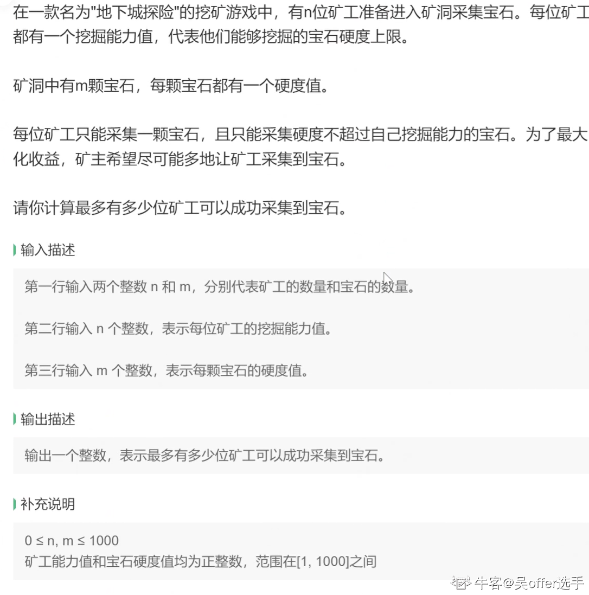
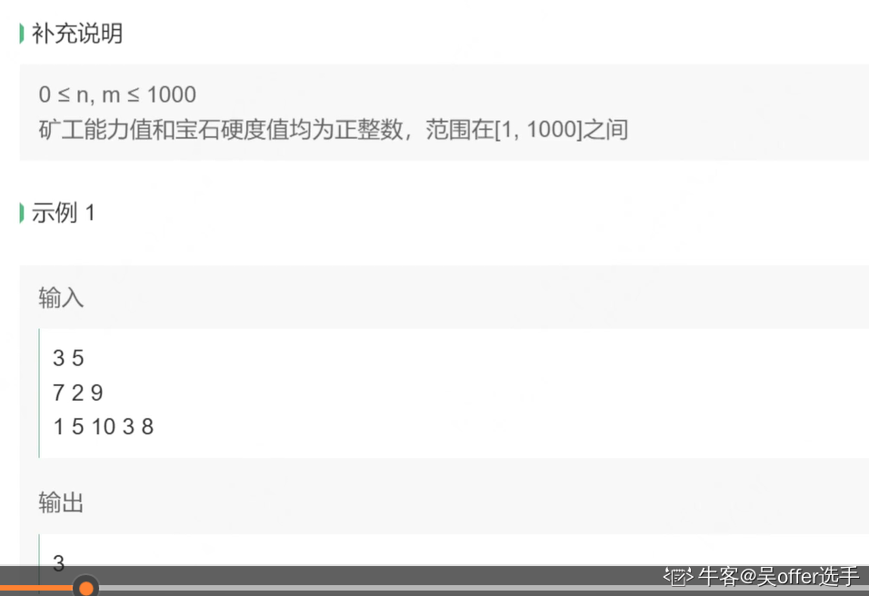
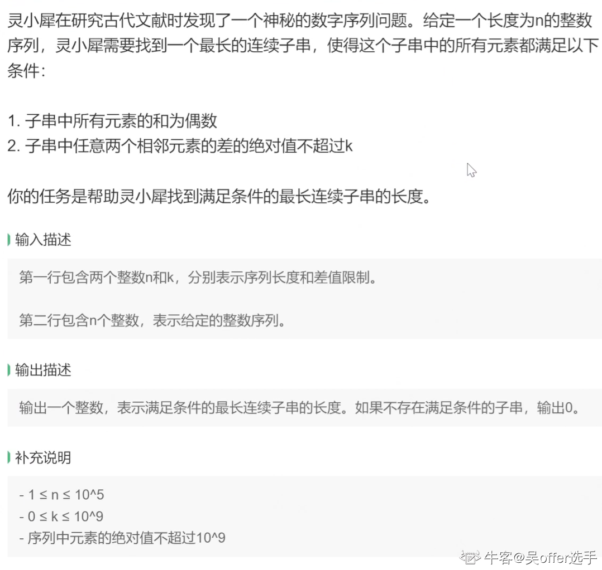
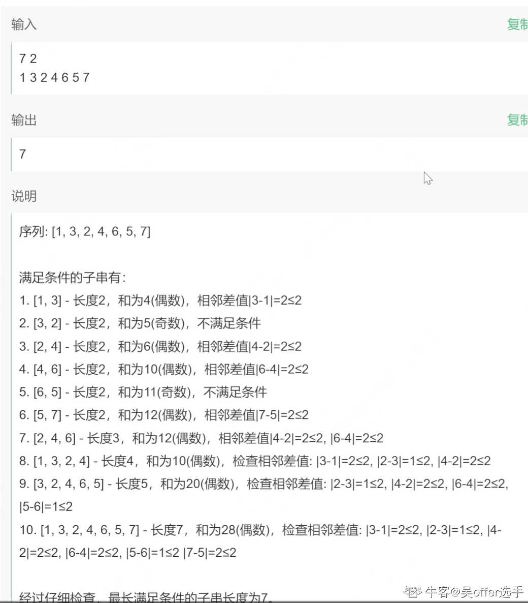
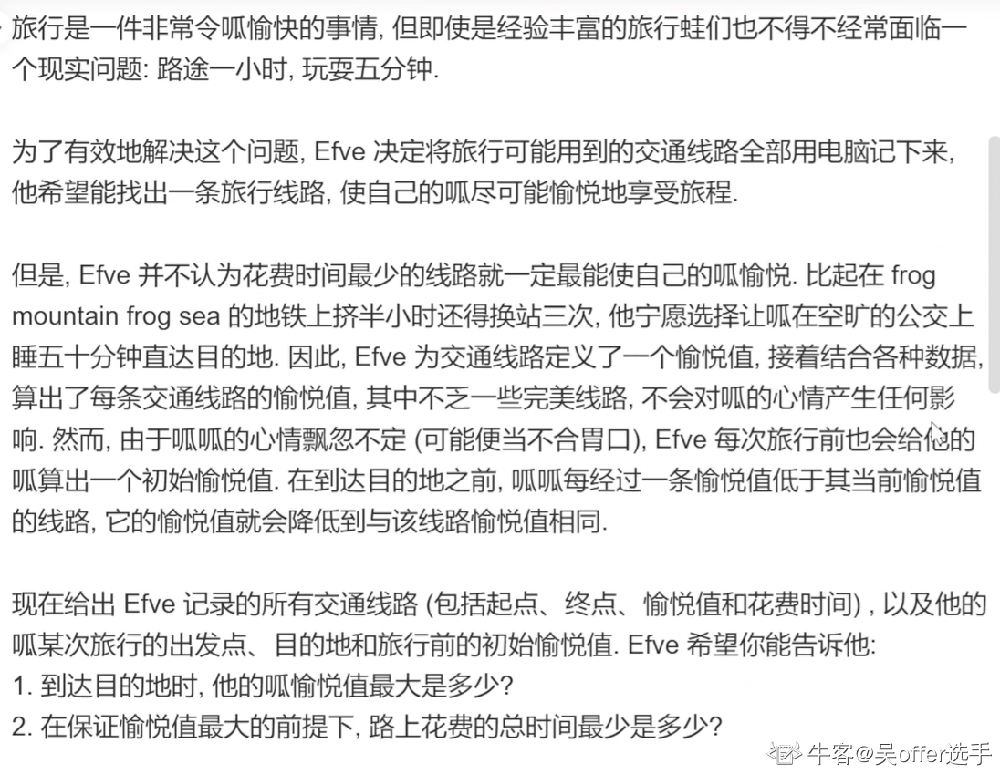
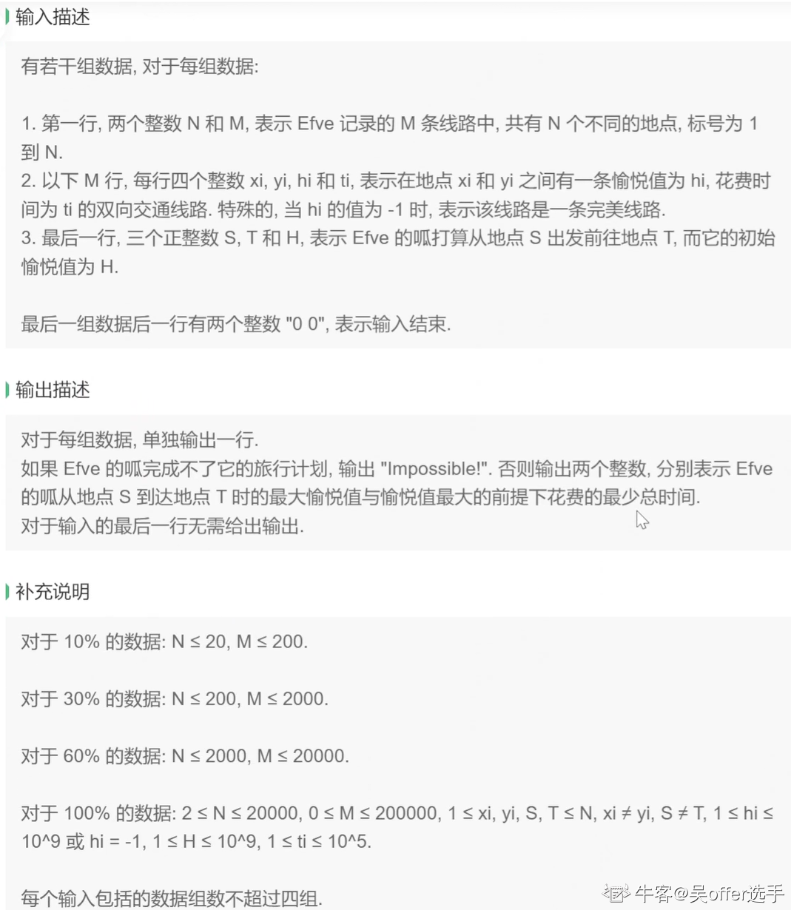
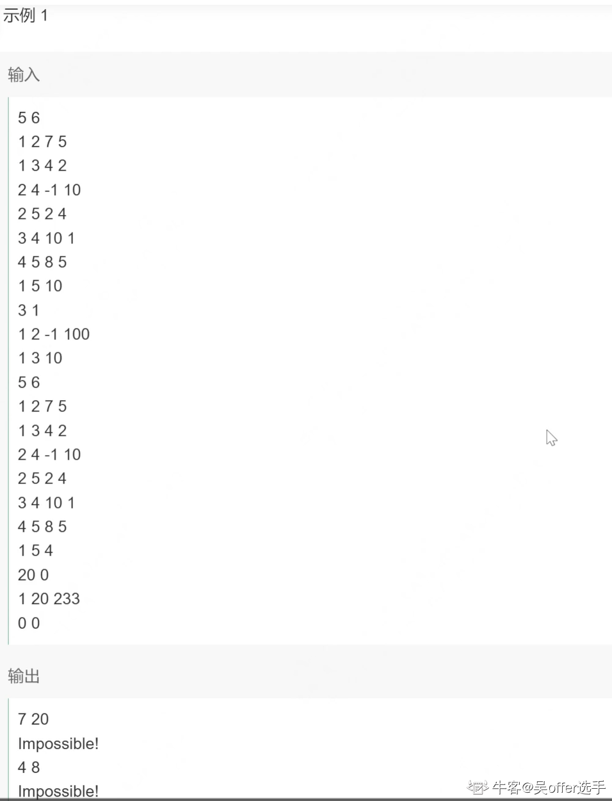
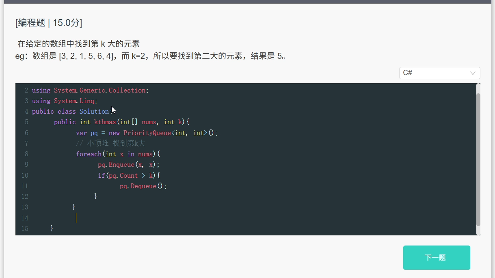
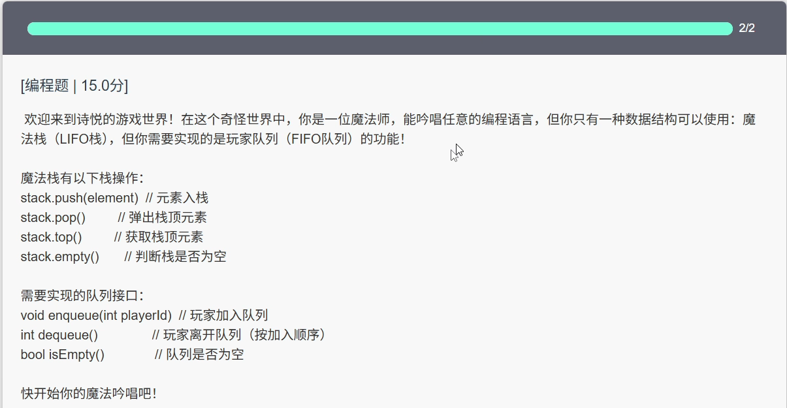

# **历史战绩**

1. 9.20 4399 笔试
2. 9.28 网易雷火 笔试
3. 10.11 星辉 面试
4. 10.11 灵感 笔试
5. 10.12 阿里灵犀 笔试
6. 10.13 途游 笔试
7. 10.23 诗悦 笔试
8. 10.25 乐牛 笔试
9. 10.26 米哈游 笔试


## 1）9.20 4399 笔试

10道选择+3道编程+2道问答 2h

选择：操作系统+计网+计组+数据结构等等 计算机八股文

编程：

1. 滑动窗口+字符串处理
2. bfs/dfs
3. 01背包 二维

问答：

1. 你想成为什么样的人？
2. 回顾大学四年生活，你有哪些收获和遗憾？


## 2）9.28 网易雷火 笔试

牛客 双机位 4道编程题 3h

1. 滑动窗口
2. 完全背包
3. 模拟+大量IO
4. bfs（会TLE） Dijsktra优先队列优化


## 3）10.11 星辉面试

1. A*
2. 对象池如何性能优化？可以优化哪些对象
3. 哈希表底层 如何解决哈希冲突
4. 讲讲平常怎么学习的 看过哪些书


## 4）10.11 灵感笔试

3道选择（程序的结果是什么）3道简答 3道编程 1h

简答：

1. 单链表和数组的区别
2. 改程序
3. 点乘和叉乘的几何意义

编程：

1. 6*6乘法表
2. 斐波那契数列
3. 用两个栈实现队列


## 5）10.12 阿里灵犀 笔试

450分 2h

考试题型：

1. 单选 15 道（45分）

2. 不定项选择 5 道（15分）

3. 填空 5 道（10分）
   ‘0’和'a'的ascii码
   信号量的原子操作（PV）
   无向连通图图 E = V - 1是什么图 E > V - 1会怎么样
   网络编程 3个概念（不太记得 不会写）
   还有一题忘了 反正客观题操作系统 计组 计网 数据结构 算法 数据库啥的都考 很杂

4. 编程 4 道（360分）
   (1). 贪心 ac

             
   参考代码：

   ```c#
   public class Gem
   {
       public static void Main()
       {
           var nm = Console.ReadLine().Split();
           int n = int.Parse(nm[0]);
           int m = int.Parse(nm[1]);
           
           List<int> abilities = Console.ReadLine().Split().Select(int.Parse).ToList();
           List<int> hardness = Console.ReadLine().Split().Select(int.Parse).ToList();
   
           int ans = 0;
           
           // 把能力和宝石硬度分别降序排序
           abilities.Sort((a, b) => b - a);        
           hardness.Sort((a, b) => b - a);
   
           foreach (int ability in abilities)
           {
               for (int i=0 ; i < hardness.Count ; i++)
               {
                   int hard = hardness[i];
                   if (ability >= hard)
                   {
                       hardness.Remove(hard);
                       ans++;
                       break;
                   }
               }
           }
           
           Console.WriteLine(ans);
       }
   }
   ```

   

   (2). 贪心 ac 没找到图
   和第一题差不多 钻石变成宝箱 区别是每个勇士可以开多个宝箱
   如果每个勇士至少开了一个箱子 且所有箱子都被开启 输出Yes 否则输出No
   参考代码：

   ```c#
   public class ChestHunter
   {
       public static void Main()
       {
           var nm = Console.ReadLine().Split();
           int n = int.Parse(nm[0]);
           int m = int.Parse(nm[1]);
           
           // 提前判断
           if (n > m)
           {
               Console.WriteLine("No");
               return;
           }
           
           List<int> abilities = Console.ReadLine().Split().Select(int.Parse).ToList();
           List<int> chests = Console.ReadLine().Split().Select(int.Parse).ToList();
   
           // 贪心 从能力值最低的开始分配 每次让最低能力值的先选
           // 如果n > m 直接return false
           // 如果最后宝箱还有剩余 返回false
           
           bool ans = false;
           
           // 能力值 宝箱价值 分别升序排序
           abilities.Sort();
           chests.Sort();
   
           for (int i = 0; i < n - 1; i++)
           {
               int ability = abilities[i];
               for (int j = 0; j < chests.Count; j++)
               {
                   int value = chests[j];
                   if (ability >= value)
                   {
                       chests.RemoveAt(j);
                       break;
                   }
                   
                   // 该勇士没有打开箱子
                   Console.WriteLine("No");
                   return;
               }
           }
           
           ans = abilities[^1] >= chests[^1];
           Console.WriteLine(ans ? "Yes" : "No");
       }
   }
   ```

   

   (3). 不太会写这种 O(n^2)估计TLE了 33%
        
   有没有大神能帮我改改
   参考代码：

   ```c#
   public class MaxSubSequence
   {
       public static void Main3()
       {
           var nk = Console.ReadLine().Split();
           int n = int.Parse(nk[0]);
           int k = int.Parse(nk[1]);
           
           // 找到子串 满足
           // 1. 所有元素和为偶数
           // 2. 任意两个相邻元素绝对值 <= k
           // 变长滑动窗口 + 前缀和
           int[] seq = Regex.Replace(Console.ReadLine(), @"\s{2,}", " ").Split().Select(int.Parse).ToArray();
   
           int maxLen = 0, len = 0, left = 0;
           
           int[] pre1 = new int[n+1];
           int[] pre2 = new int[n+1];
           int[] diff = new int[n];
           diff[0] = 0;
   
           for (int i = 1; i < n; i++)
           {
               diff[i] = Math.Abs(seq[i] - seq[i-1]) <= k ? 0 : 1;
           }
           
           for (int i = 1; i <= n; i++)
           {
               pre1[i] = pre1[i-1] + seq[i-1];
               pre2[i] = pre2[i-1] + diff[i-1];
           }
           
           // 窗口长度 从n开始
           int size = n;
           for (int i = size; i > 0; i--)
           {
               for (int right = size - 1; right < n; right++)
               {
                   left = right - i + 1;
                   if (pre2[right+1] - pre2[left] > 0 || (pre1[right+1] - pre1[left])% 2 != 0) continue;
                   
                   // result
                   maxLen = i;
                   Console.WriteLine(maxLen);
                   return;
               }
               
           }
           Console.WriteLine(maxLen);
       }
   
   }
   ```

   

   (4). Dijsktra（应该是) 没写出来 面向case编程 ac10%
     

5. 问答 2 道（20分） 简要思路或代码（送分的）
   (1). 无序数组求第k大 （小顶堆/优先队列 求第k小用大顶堆）
   (2). 反转单链表 （LeetCode有原题 多写几次就会了）

2个小时有点紧张啊 隔壁雷火4道编程题3个小时
我脑子抽了先写的编程 导致后面写问答题和主观题的时间不太够 下次应该放最后写


## 6）10.13 途游 笔试

30不定项（60分） + 3编程（40分）

90min（根本写不完）

不定项

1. unicode / utf-8 的区别？
2. 1000 0001 补码 反码
3. int，float（具体忘了）
4. stack，queue（具体忘了）
5. avl树 插入 / 删除 / 查找 $O(logn)$
6. 最快的通用排序
7. 栈输入序列为12345，求一个合法输出？
8. 执行一次快速排序后能得到的序列
   快速排序：选定基准pivot，执行一次快速排序后pivot的位置已经确定，pivot左边<pivot，右边>pivot
9. 二叉树先序遍历与层序遍历的值相同，什么树？——一条链
10. 树高为6的avl树，节点数可能是？—— $[2^5, 2^6-1]=[32,63]$
11. 递归算法分析
12. 进程 / 线程区别？
    进程：操作系统资源分配的最小单位，各自独立（虚拟地址空间隔离）
    线程：CPU调度的最小单位，共享同一进程的虚拟地址空间
13. 进程 / 线程间的通信方式？
    进程：需 IPC：管道、消息队列、共享内存、套接字等
    线程：直接读写共享内存（需同步原语：互斥锁、读写锁、原子操作等）
14. 堆区和栈区的区别？
15. 深拷贝和浅拷贝
16. 一段程序，变量abcd分别在内存的哪个区域
    静态存储区：全局变量，static关键字
    堆区：malloc / new出来的变量
    栈区：局部变量，参数，返回地址
17. 程序输出题
18. 同上
19. 同上
20. Http响应状态码
    2：Success 成功
    3：Redirection 重定向
    4：Client Error 客户端错误
    5：Server Error 服务端错误
21. TCP
22. TCP / IP
23. Linux操作
24. 设计模式三大类：创建型、结构型、行为型
25. 正则表达式
26. 事务 ACID（原子性，一致性，隔离性，持久性）

27-30：计数原理，概率论

27比较有意思，25匹马，5条赛道，每场比赛最多知道5匹马的相对快慢，最少几场比赛可以找到最快的3匹马？


编程题

1. 模拟
2. 模拟
3. 图


## 7）10.23 诗悦 笔试

15选择 4问答 2编程 60min

最幽默的笔试 没有之一



## 8）10.25 乐牛 笔试


## 9）10.26 米哈游 笔试

难哭了

10单选 + 15不定项 + 3编程 100分 2h

------

单选 10分

1. 在死锁预防机制中，哪一策略直接针对“不可抢占”条件进行破坏?
   ==A. 允许系统在进程等待时剥夺(抢占)其已占用的资源==
   B. 进程在执行前需静态分配所有所需资源
   C. 强制进程遵循统一的资源请求顺序
   D. 限制进程每次只能申请一类资源

2. 在某操作系统中，线程上下文切换的开销为5微秒(us)，CPU 的时间片长度为 10毫秒(ms)。有一个进程包含5个线程，调度器在一个时间片内让这 5个线程依次各运行一次。假设时间片开始时 CPU 已在该进程的第一个线程上运行，不计算时间片开始或结束与其他进程/线程的切换，仅计算时间片内部线程之间的切换开销。问:线程上下文切换的总开销占该时间片的百分比是多少?
   ==A. 0.2%==
   B. 0.15%
   C. 0.25%
   D. 0.5%

3. HTTPS通信中使用的数字证书主要用于验证
   A. 客户端身份真实性
   ==B. 服务器身份真实性==
   C. 数据传输完整性
   D. 加密算法兼容性

4. 关于C++中友元(friend)机制的描述，哪一项是正确的()
   ==A. 友元类可以访问另一个类的所有成员，包括私有成员==
   B. 友元函数只能是全局函数，不能是类的成员函数
   C. 友元关系是双向的，如果A是B的友元，则B一定是A的友元
   D. 友元机制会破坏类的封装性，因此开发中不应使用

5. 游戏语音聊天服务通常使用哪种传输层协议?
   ==A. UDP==
   B. TCP
   C. SCTP
   D. TLS

6. 在采用DMA进行纹理数据传输的游戏引擎中，下列哪个过程在执行时不需要CPU参与?
   A. 高分辨率纹理数据块通过 DMA 从存储设备搬运到显存
   B. 设置 DMA 通道的内存起始地址和传输长度
   C. 数据传输完成后通过中断通知主程序
   ==D. 在 CPU 上进行的压缩纹理数据包解压与完整性校验==

7. 以下关于C++异常处理的说法，哪一项是正确的()
   A. C++异常处理通过tny-catch语句块实现异常捕获
   B. C++的异常只能捕获由操作系统抛出的异常
   C. 异常处理机制会显著降低程序性能，因此不建议使用
   D. 只能捕获标准库异常类型，不能捕获自定义异常

8. 下面 C++ 代码的运行结果为()

   ```c++ 
   #include <iostream>
   using namespace std;
   void foo(int *p){
       if(p) *p = 7;
   }
   
   int main(){
       int *ptr = nullptr;
       foo(ptr);
       cout << (ptr == nullptr) << endl;
   }
   ```

   A. 0
   ==B. 1==
   C. 编译错误
   D. 运行错误

9. 下面 C++ 代码的运行结果为()

   ```c++
   #include <iostream>
   class A{
   public :
   	A(){ std::cout << "A"; }
       virtual ~A(){ std::cout << "~A"; }
   };
   class B: public A{
   public:
   	B(){ std::cout << "B"; }
       ~B(){ std::cout << "~B"; }
   };
   int main(){
       A* obj = new B():
       delete obj;
       return 0:
   }
   ```

   A. AB~A~A
   B. AB~B~A
   C. AB~B
   ==D. AB~A==

10. 一个被称为「优」方阵的结构满足:下三角全为同一常量，上三角全为另一常量，主对角线元素任意。现用长度为n+2的数组b压缩存储，b[0...n-1]为对角线元素，b[n]保存上三角常量，b[n+1]保存下三角常量。访问函数如下，应补充的条件为:
    ```c++
    int visit(int i, int j){
        if(①) return b[i];
        else if(②) return b[n];
    	else return b[n+1];
    }
    ```

    ==A. ① i \== j，② i < j==
    B. ① i \== j，② i > j
    C. ① i != j，② i < j
    D. ① i != j，② i > j

------

不定项 30分

1. 关于C++中的类型转换运算符，以下说法正确的有()
   A. dynamic_cast<T>主要用于多态类型的安全向下转型，失败时返回nullptr或抛出异常
   B. static_cast<T>主要用于相关类型间的转换，如整数类型之间、有继承关系的类指针之间
   C. const_cast<T>用于添加或移除const或volatile限定符
   D. reinterpret_cast<T>可以在任意指针类型之间进行转换，是最安全的类型转换方式

2. 关于C++中的STL容器，以下说法正确的有()
   A. map和unordered_map都提供键值对存储，但map基于红黑树实现，而unordered_map基于哈希表实现
   B. vector在尾部插入元素的平均时间复杂度为0(1)，但在中间插入元素的时间复杂度为O(n)
   C. list是双向链表，允许在任意位置常数时间插入和刚除，但不支持随机访问
   D. deque支持在两端快速插入和删除，同时也支持随机访问，但内存连续性不如vector

3. 关于C++中的std::variant，下列说法正确的有()
   A. 访问std::variant中的值可以使用std::get<T>或std::get<I>函数
   B. std::variant是C++17引入的类型安全的联合体
   C. std::variant保证内存布局紧凑，不会有额外的开销
   D. 可以使用std::visit对variant进行类型分发，实现类似虚函数的多态行为

4. 为反外挂系统设计的应用层安全通信协议需包含(仅限应用层协议自身的机制，排除传输层/网络层机制)()
   A. TLS 1.3双向认证
   B. 数据包序列号完整性校验
   C. 客户端行为时序签名
   D. UDP 包头校验和(Checksum)

5. 系统为某进程分配了3个页框，该进程已访问的页号序列为4,2,5,1,4,2,6,4,2。若进程要访问的下一页的页号为5，则下列说法中正确的有()
   A. 依据LRU算法，应淘汰的页号是4
   B. 依据FIFO算法，应淘汰的页号是2
   ==C. 依据FIFO算法，应淘汰的页号是4==
   ==D. 依据LRU算法，应淘汰的页号是6==

6. 需要压缩战斗回放文件大小时应选用:
   A. 关键帧间存储Delta差异
   B. DEFLATE算法压缩操作流
   C. 存储操作序列而非每一帧的原始数据
   D. 对字符串使用Base64编码

7. 关于C++中的完美转发，以下说法正确的有()
   ==A. std::forward<T>是实现完美转发的关键，它可以保持参数的左值或右值属性==
   ==B. 完美转发允许函数模板将其参数以原始类型 (保持值类别) 转发给另一个函数==
   ==C. 完美转发常与可变参数模板 (variadic templates) 结合使用==
   D. 完美转发会自动执行隐式类型转换，即使转发参数与目标函数参数类型不完全匹配，也能保证调用成功

8. 以下关于进程和线程的叙述中，正确的是哪些?
   A. 同一进程的线程共享堆内存，因此它们之间的数据交换无需同步机制。
   B. 进程是操作系统分配资源的最小单位，线程是CPU调度的最小单位
   C. 一个进程中的多个线程可以并行执行，且线程切换不涉及地址空间变化。
   D. 创建新线程的开销通常小于创建新进程，因为线程共享所属进程的资源

9. 关于CDN与缓存策略，下列做法更合理的是()
   A. 注意DNS的TTL设置与回源域名解析，源站IP频繁变更且TTL过大会导致生效滞后
   B. 为静志资源设置合理的Cache-Control/ETag，提高边缘缓存命中率
   C. CDN一定能显著降低首字节时延，与源站负载与地理位置无关
   D. 动态API永远无法通过CDN得到任何优化

10. 关于C++中的类成员初始化列表，以下说法正确的有()
    A. const成员变量和引用成员必须在初始化列表中初始化
    B. 初始化列表中成员的初始化顺序与它们在初始化列表中的出现顺序一致
    C. 当基类无默认构造函数时，派生类构造函数必须在初始化列表中显式调用基类的带参构造函数
    D. 使用初始化列表通常比在构造函数体内赋值更高效

11. 开发实时多人射击游戏时，以下哪些技术组合能有效降低玩家感知延迟?
    A. UDP传输+前向纠错(FEC)
    B. 客户端预测 +服务器快照插值
    C. TCP可靠传输+Nagle算法
    D. 延迟补偿+命中结果后验证

12. 给定如下二分查找递归实现，说法正确的是:
    ```python
    def binary_search(arr, target, low, high):
    	if low > high:
    		return -l
    	mid = (1ow + high) // 2
    	if arr[mid] == target:
            return mid
        elif arr[mid] < target:
    		return binary_search(arr, target, mid + l, high)
    	else:
    		return binary search(arr, target, low, mid - 1)
    ```

    A. 这段代码的空间复杂度是 O(1)
    B. 这段代码的时间复杂度是 O(log n)
    C. 这段代码的功能是:在有序数组中查找目标值的索引
    D. 这段代码的空间复杂度是 O(log n)

13. 以下算法中，平均时间复杂度为 0(n^2)且空间复杂度为 O(1)的算法有()
    A. 插入排序
    B. 冒泡排序
    C. 快速排序
    D. 希尔排序

14. 假设有4个作业 P1,P2,P3,P4 需要调度，这4个作业几乎同时到达，执行顺序按照 P1,P2,P3,P4，执行时间分别为 5ms,7ms,4ms,2ms。使用轮转调度(Round Robin)算法，时间片为 3ms。以下哪些选项是正确的?
    A. P2 在第三轮完成
    B. P1 的周转时间为 15ms
    C. P3 的等待时间为 10ms
    D. P4 在第一轮完成

15. 在校园宿舍管理系统中，二维数组A用于存储宿舍的入住信息。每个宿舍占用6个存储单元，并按列优先顺序存储。已知宿舍A\[0][0]的存储地址是183，宿舍 A\[1][4]的存储地址是237，则下列说法正确的是()
    A. 宿舍A\[0][3]的存储地址是219
    B. 宿舍A\[0][1]的存储地址是195
    C. 宿舍A\[1][3]的存储地址是225
    D. 宿舍A\[0][4]的存储地址是231

------

编程

**一、轮回（20分）**

给定一个长度为 **n** 的字符串 **s**，字符串仅由小写字母组成，下标从1开始。你可以对字符串执行以下操作任意次:

- 选择一个下标 **i**，将$$s_i$$修改为任意小写字母，请问最少需要多少次操作，才能让字符串中出现子串"**abcdefghijklmnopqrstuvwxyz**" 

**【名词解释】**

- **子串**：子串为从原字符串中连续地选择一段字符(可以全选、可以不选得到的新字符串。

> **输入描述**
> 每个测试文件均包含多组测试数据。第一行输入一个整数 $$T(1 ≤ T ≤ 10^4)$$，代表数据组数;
> 此后对于每组测试数据:
>
> - 第一行输入一个整数 $$n(1 ≤ n ≤ 2 \times 10^5)$$，表示字符串长度；
>
> - 第二行输入一个长度为 **n**、仅由小写字母构成的字符串 **s**。除此之外，保证所有测试数据中 **n** 的总和不超过 $2\times 10^5$。
>
> **输出描述**
>
> 对于每组测试数据，新起一行，输出一个整数，代表最少的操作次数。
>
> - 如果不存在使字符串中出现完整英文字母序列的方案，则输出 -1.

```
示例1

输入
37
abcdefghijklmnopqrstuvwxyzzzzzzzzzzzz
26
bcdefghijklmnopqrstuvwxyza
25
abcdefghijklmnopqrstuvwxy

输出
0
26
-1
```


**二、最小极差破坏区间（20分）**

给定一个长度为 n 的**非严格递增数组** $a_1 ≤ a_2 ≤ ... ≤ a_n$。你可以执行以下操作至多一次：

- 选择区间 $[l, r]$，对每个 $i\in[l,r]$ 执行 $a_i ← a_i+k \times (r-i+1)$，其中 $k$ 是给定的固定参数。

请找出能使操作后数组<u>极差</u> (最大值与最小值之差) 超过 $d$ 的最小区间长度 (可以为 0)。若无法达成，输出 **-1**。

**【名词解释】**

- **极差**：数组最大值与最小值的差值，例如数组 $\{2,5,7\}$ 的极差为 5.

> **输入描述**
>
> 第一行输入 $T(1 ≤ T ≤ 10^4)$ 表示测试组数。
>
> 每组数据包含:
>
> - 第一行三个整数 $n,d,k\ (2≤n≤2 \times 10^5,\ 0≤d≤10^{12},\ 1≤k≤10^9)$
> - 第二行 $n$ 个非严格递增整数 $a_1, a_2,···,a_n(1 ≤ a¡ ≤ 10^9)$
>
> 保证所有测试数据 $\sum n≤ 2 \times 10^5$
>
> **输出描述**
>
> - 每组数据输出一个整数，表示满足条件的最小区间长度

```
示例1

输入
3
4 5 2
1 3 5 7
3 10 1
2 6 8
3 8 5
1 2 3

输出
0
-1
2
```


**三、树上节点对（20分）**

给定一棵节点数为 $n$ 的树，树的根节点为 1。

对树中的任意节点 $u$，定义其<u>子树</u>为以 $u$ 为根的所有节点集合，记为 $S(u)$。

现有 $m$ 次查询，每次查询给定一个节点 $u$，请你计算子树 $S(u)$ 中所有节点对 $(v,w)$之间的距离和
$$
\sum_{v, w \in S(u), v < w} dist(v, w)
$$
其中 $dist(v, w)$ 表示节点 $v$ 与 $w$ 之间的距离。

**【名词解释】**

- 树：树是一种连接无环的无向图。

- 子树：子树指给定节点及其所有后代节点组成的连通子图，

- 距离：距离表示树中两节点之间的边数最短路径长度。

> **输入描述**
>
> 第一行输入两个整数 $n$ 和 $m\ (1 ≤ n,m ≤ 2 \times 10^5)$，分别表示树的节点数量与查询次数。
> 接下来 $n -1$ 行，每行输入两个整数 $u_i,v_i\ (1 ≤ u_i,v_i ≤ n;\ u_i ≠ v_i)$，表示树的一条边。
> 接下来 $m$ 行，每行输入一个整数 $u\ (1 ≤ u ≤ n)$，表示一次查询的节点编号。
>
> **输出描述**
>
> 对于每次查询，在一行上输出一个整数，表示对应节点子树中所有节点对的距离和。

```
示例1

输入
5 3
1 2
1 3
3 4
3 5
1
3
4

输出
18
4
0

说明
在这个样例中:
节点1的子树为{1,2,3,4,5}，其所有10对距离之和为18;
节点3的子树为{3,4,5}，距离和1+1+2=4;
节点4的子树仅为自身，贡献距离和0。

示例2

输入
3 2
1 2
2 3
2
3

输出
1
0
```


# c#/unity八股文

## 1. OS 操作系统

## 2. 计组

## 3. 计网圣子

## 4. 设计模式

有专题 指路 [设计模式.md](./设计模式.md )


# 每天解决1个问题

## **25.10.21**

### #1 计算机中有哪些码？有什么应用？

### #2 使用定点数表示数据的场景是什么？

### #3 编译程序和解释程序是什么？


## 25.10.29

### #4 死锁的4个条件？


# 答案

## #1 

原码，反码，补码，移码

原码：十进制转二进制的直观表示

反码：原码转补码的中间态

补码：把有符号数的减法操作转换为加法操作，减少硬件成本（原码-原码=原码+补码）

移码：移码增大和真值增大的方向一致，方便硬件实现比较大小


## #2


## #3

编译程序：程序首先通过编译器翻译成汇编语言，然后再由汇编器翻译成机器语言，或者不通过编译器直接翻译成机器语言

一次直接把源程序全部翻译成机器语言，然后执行机器语言程序，性能高（c/c++）

解释程序：程序通过解释器翻译成机器语言

每次翻译一句，效率低（js/shell/python）

编译器、汇编器、解释器都实现了高级语言到低级语言的转换，统称翻译程序


## #4

（1） [互斥条件](https://zhida.zhihu.com/search?content_id=2457597&content_type=Article&match_order=1&q=互斥条件&zhida_source=entity)：一个资源每次只能被一个进程使用。

（2） [请求与保持条件](https://zhida.zhihu.com/search?content_id=2457597&content_type=Article&match_order=1&q=请求与保持条件&zhida_source=entity)：一个进程因请求资源而阻塞时，对已获得的资源保持不放。

（3） [不可剥夺条件](https://zhida.zhihu.com/search?content_id=2457597&content_type=Article&match_order=1&q=不剥夺条件&zhida_source=entity):进程已获得的资源，在末使用完之前，不能强行剥夺。

（4） [循环等待条件](https://zhida.zhihu.com/search?content_id=2457597&content_type=Article&match_order=1&q=循环等待条件&zhida_source=entity):若干进程之间形成一种头尾相接的循环等待资源关系。
