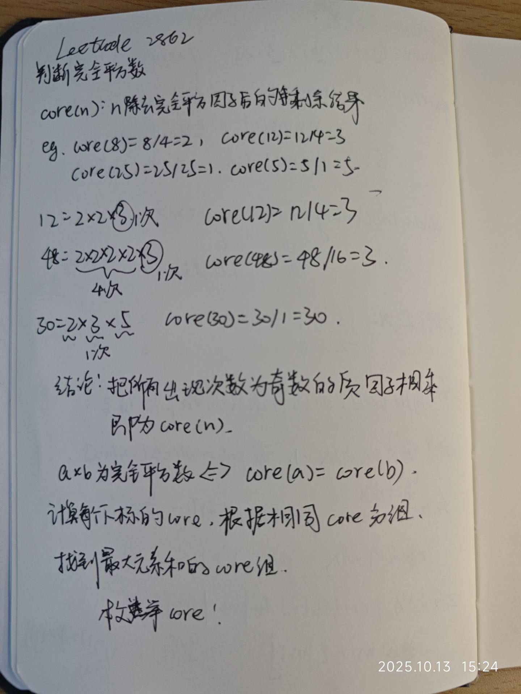

# Leetcode刷题日记 (灵神题单)

## 1. 常用数据结构

### (1). 前缀和

为什么要发明前缀和？可以在O(1)的时间查找某个下标l到r的子数组的和

前缀和模板：[303. 区域和检索 - 数组不可变](https://leetcode.cn/problems/range-sum-query-immutable/)

```c#
public class NumArray {
    // 前缀和数组
    // 下标从0到n pre[i]表示nums[0]到nums[i-1]的和
    // 为什么要pre[0]? 可以把任意子数组和sum(nums[l...r])表示为 pre[r+1] - pre[l]
    // 如果没有pre[0] 子数组下标从0开始就要单独分类讨论
    private int[] pre;

    public NumArray(int[] nums) {
        int n = nums.Length;
        pre = new int[n+1];
        for(int i=1; i<=n; i++){
            pre[i] = pre[i-1] + nums[i-1];
        }
    }
    
    public int SumRange(int left, int right) {
        return pre[right+1] - pre[left];
    }
}
```


#### **前缀和+哈希**

用于解决给定数组arr 找到满足和/差为k/奇数/偶数 等条件的**子数组数目**的问题

为什么用前缀和？因为涉及到子数组的运算

为什么要哈希？因为涉及到统计/重复计数问题

模板 [930. 和相同的二元子数组](https://leetcode.cn/problems/binary-subarrays-with-sum/)

```c#
// 25.10.3
public class Solution {
    public int NumSubarraysWithSum(int[] nums, int goal) {
        int n = nums.Length, left = 0, ans = 0;
        int[] pre = new int[n+1];
        for(int i=1; i<=n; i++){
            pre[i] = pre[i-1] + nums[i-1];
        }

        Dictionary<int, int> dict = new();
        // s = p2 - p1
        // p2 s已知 找到大小为p1 = p2 - s的出现次数 并加到答案

        for(int i=0; i<=n; i++){
            int s = pre[i];
            if(dict.ContainsKey(s - goal)){
                ans += dict[s - goal];
            }
            dict[s] = dict.GetValueOrDefault(s, 0) + 1;
        }

        return ans;
    }
}
```


### (2). 栈

#### 单调栈

维持栈内元素有序 模板：[42. 接雨水](https://leetcode.cn/problems/trapping-rain-water/)

```c#
// 25.10.3
public class Solution {
    public int Trap(int[] height) {
        // 单调栈
        // 栈内元素从大到小 保持有序
        // 想象一个碗 出现比栈顶大的元素为碗的右边
        // 栈顶元素为碗的中间
        // 出栈后 栈顶元素为碗的左边
        // 这次可以接的水为长x宽 长:min{右边，左边}-中间 宽:右边下标-左边下标-1
        Stack<int> s = new Stack<int>();

        int ans = 0;
        int n = height.Length;
        int l, m;

        for(int r=0; r<n; r++){
            int h = height[r];
            while(s.Count > 0 && h > height[s.Peek()]){
                m = s.Pop();
                if(s.Count == 0) break;         // 没有左边界，接不了水
                l = s.Peek();
                ans += (Math.Min(h, height[l]) - height[m]) * (r - l - 1);
            }

            s.Push(r);
        }

        return ans;
    }
}
```


## 2. 滑动窗口 
### (1). 定长滑窗

**模板** [1456. 定长子串中元音的最大数目](https://leetcode.cn/problems/maximum-number-of-vowels-in-a-substring-of-given-length/solutions/2809359/tao-lu-jiao-ni-jie-jue-ding-chang-hua-ch-fzfo/)

窗口右端点在 i 时，由于窗口长度为 k，所以窗口左端点为 i−k+1。

*三步：入->更新->出。*

**入**：下标为 i 的元素进入窗口，更新相关统计量。如果窗口左端点 i−k+1<0，则尚未形成第一个窗口，重复第一步。
**更新**：更新答案。一般是更新最大值/最小值。
**出**：下标为 i−k+1 的元素离开窗口，更新相关统计量，为下一个循环做准备。
以上三步适用于所有定长滑窗题目。

```c#
// 25.9.29
public class Solution {
    public int MaxVowels(string s, int k) {
        HashSet<char> vowels = new HashSet<char>();
        vowels.Add('a');
        vowels.Add('e');
        vowels.Add('i');
        vowels.Add('o');
        vowels.Add('u');

        int n = s.Length;

        // 滑动窗口: 入->更新->出
        int ans = 0;
        int cnt = 0;
        for(int i=0; i<n; i++){ // i是右端点
            // 1.右端点进入
            if(vowels.Contains(s[i])) cnt++;

            int left = i - k + 1;   // 左端点
            if(left < 0) continue;  // 窗口大小不足k
       
            // 2.更新答案
            ans = Math.Max(ans, cnt);
            if(ans == k) return ans;

            // 3.左端点离开
            if(vowels.Contains(s[left])) cnt--;
        }

        return ans;
    }
}
```

### (2). 不定长滑窗

**模板** [[3. 无重复字符的最长子串]](https://leetcode.cn/problems/longest-substring-without-repeating-characters/)

*三步：入->出->更新*

```c#
// 25.9.29
public class Solution {
    public int LengthOfLongestSubstring(string s) {
        int maxLen = 0;
        Dictionary<char, int> map = new Dictionary<char, int>();
        int n = s.Length;

        int left = 0, cur = 0;
        for(int i=0; i<n; i++){
            // 入
            char c = s[i];
            map[c] = map.GetValueOrDefault(c, 0) + 1;
            
            // 出 (更新左端点)
            while(map[c] > 1){
                if(map[s[left]] > 1){
                    map[s[left]]--;
                }else{
                    map.Remove(s[left]);
                }
                left++;
            }

            // 更新
            cur = i - left + 1;
            maxLen = Math.Max(maxLen, cur);
        }

        return maxLen;
    }
}
```


## 3. 二分

二分模板 半开半闭写法 [35. 搜索插入位置](https://leetcode.cn/problems/search-insert-position/)

```c#
public class Solution {
    public int SearchInsert(int[] nums, int target) {
        int n = nums.Length, l = 0, r = n - 1;
        while(l < r){
            int m = (l + r) / 2;
            if(target > nums[m]){
                l = m + 1;  // [mid+1, r]
            }else{
                r = m;      // [l, mid]
            }
        }

        return l;
    }
}
```


### (1). 找到第一个大于等于target

[1385. 两个数组间的距离值](https://leetcode.cn/problems/find-the-distance-value-between-two-arrays/)

```c#
// 25.10.12
public class Solution {
    public int FindTheDistanceValue(int[] arr1, int[] arr2, int d) {
        Array.Sort(arr2);
        int ans = 0;

        foreach(int x in arr1){
            int left = BinarySearch(arr2, x - d);
            if(left < arr2.Length && arr2[left] <= x + d){
                continue;
            }else{
                ans++;
            }
        }

        return ans;
    }

    // 找到第一个arr2[j] 满足arr2[j] >= arr1[i] - d
    public int BinarySearch(int[] nums, int target){
        int l = 0, r = nums.Length - 1;
        while(l < r){
            int mid = l + (r - l) / 2;
            if(nums[mid] < target){
                // 在右边
                l = mid + 1;
            }else{
                r = mid;
            }
        }

        if (l < nums.Length && nums[l] >= target) {
            return l;
        } else {
            return nums.Length; // 所有元素均小于 target
        }
    }
}
```

技巧：nums升序排序，想找到最后一个nums[i] < target，等价于二分找到第一个nums[i] >= target，结果让i-1即可

[2070. 每一个查询的最大美丽值](https://leetcode.cn/problems/most-beautiful-item-for-each-query/)

[1146. 快照数组](https://leetcode.cn/problems/snapshot-array/) 备份原理？


### (2). 二分 区间查询（可以用线段树做）

[2080. 区间内查询数字的频率](https://leetcode.cn/problems/range-frequency-queries/)

```c#
// 25.10.12
public class RangeFreqQuery {
    // (值, 出现下标)
    private Dictionary<int, List<int>> dict;

    public RangeFreqQuery(int[] arr) {
        dict = new Dictionary<int, List<int>>();

        for(int i=0; i<arr.Length; i++){
            dict[arr[i]] = dict.GetValueOrDefault(arr[i], new List<int>());
            // 从0到n Add 保证升序
            dict[arr[i]].Add(i);
        }
    }
    
    public int Query(int left, int right, int value) {
        // 查找对应的出现下标数组，不存在则为空
        // if (!dict.TryGetValue(value, out var pos)) {
        //     pos = new List<int>();
        // }

        // 不要ToArray() O(n)会TLE
        // int[] pos = dict.GetValueOrDefault(value, new List<int>()).ToArray();
        var pos = dict.GetValueOrDefault(value, new List<int>());
    
        // start: 第一个>=left的元素下标 (lowerbound)
        // end: 第一个>right的元素下标 (upperbound)
        int start = LowerBound(pos, left);
        int end = UpperBound(pos, right);

        return end - start;
    }

    // 第一大
    public int UpperBound(List<int> nums, int target){
        int l = 0, r = nums.Count - 1;
        while(l < r){
            int mid = l + (r - l) / 2;
            if(nums[mid] <= target){
                // 在右边
                l = mid + 1;
            }else{
                r = mid;
            }
        }

        return l < nums.Count && nums[l] > target ? l : nums.Count;
    }

    // 第一小 或者说第一个>=target
    // nums = [1,2,2,2,3] target = 2
    // lowerbound = 1
    // upperbound = 4
    public int LowerBound(List<int> nums, int target){
        int l = 0, r = nums.Count - 1;
        while(l < r){
            int mid = l + (r - l) / 2;
            if(nums[mid] < target){
                // 在右边
                l = mid + 1;
            }else{
                r = mid;
            }
        }

        return l < nums.Count && nums[l] >= target ? l : nums.Count;
        
    }
}
```

[3488. 距离最小相等元素查询](https://leetcode.cn/problems/closest-equal-element-queries/)
题解：[c# 二分+(值, 下标集合)类哈希](https://leetcode.cn/problems/closest-equal-element-queries/)


### (3). 二分猜答案

难点：确定l和r的上下界，以及check函数的写法

比如 [2187. 完成旅途的最少时间](https://leetcode.cn/problems/minimum-time-to-complete-trips/) ，我们要找最小的t（时间），满足curTime >= totalTime

二分找答案，那么l就是nums.Min()，r就是最快的车完成totalTrips的时间，即nums.Min() * totalTrips

```c#
// 25.10.13
public class Solution {
    public long MinimumTime(int[] time, int totalTrips) {
        long n = time.Length, l = time.Min(), r = (long)time.Min() * totalTrips;
        while(l < r){
            long mid = l + (r - l) / 2;
            long cur = 0;
            for(int i=0; i<n; i++){
                cur += mid / time[i];
            }
            if(cur < totalTrips){
                l = mid + 1;
            }else{
                r = mid;
            }
        }

        return r;
    }
}
```

[1011. 在 D 天内送达包裹的能力](https://leetcode.cn/problems/capacity-to-ship-packages-within-d-days/)
题解：[c# 二分猜答案](https://leetcode.cn/problems/capacity-to-ship-packages-within-d-days/solutions/3805129/c-er-fen-cai-da-an-by-jiang-ai-ni-yu-wan-orgi/)

[875. 爱吃香蕉的珂珂](https://leetcode.cn/problems/koko-eating-bananas/)
题解：[最大胃袋的一集](https://leetcode.cn/problems/koko-eating-bananas/solutions/3805140/zui-da-wei-dai-de-yi-ji-by-jiang-ai-ni-y-7tzn/)


## 4. 分治


## 5. 动态规划

### (1). 背包 01背包 完全背包

> 选 选几个 亦或不选？ 

#### **#1 01背包**

例题 [【模板】01背包](https://ac.nowcoder.com/acm/problem/226514)

dp\[i][j]：表示从nums[0...i-1]（***背包***）选择子集 满足运算结果为j的方案数（**int\[][]**） / 能不能？（**bool\[][]**）

从i开始外层循环 dp\[i][j]需要dp\[i-1][j]的状态 能否对空间进行优化？

- 使用滚动数组：创建一个辅助数组tmp 每次外层循环开始重置tmp 结束把tmp的值赋给dp
- 只用一个数组：外层循环foreach枚举nums 内层循环倒序遍历

```c#
using System;
using System.Linq;
using System.Text.RegularExpressions;

// 25.9.30
public class Solution{
    public static void Main(){
        var nv = Console.ReadLine().Split();
        int n = int.Parse(nv[0]);
        int v = int.Parse(nv[1]);
        
        int[][] items = new int[n][];
        for(int i=0; i<n; i++){
            items[i] = new int[2];
            var s = Regex.Replace(Console.ReadLine(), @"\s{2,}", " ").Split();
            items[i][0] = int.Parse(s[0]);
            items[i][1] = int.Parse(s[1]);
        }
        
        // dp[j] 表示物品总体积为j时的最大总价值
        int[] dp = new int[v+1];
        Array.Fill(dp, int.MinValue);
        dp[0] = 0;
        
        for(int i=0; i<n; i++){
            int x = items[i][0];    // 体积
            int y = items[i][1];    // 价值
            for(int j=v; j>=x; j--){
                // 选x/不选x
                if(dp[j-x] != int.MinValue){
                    dp[j] = Math.Max(dp[j-x] + y, dp[j]);
                } 
            }
        }
        
        Console.WriteLine(dp.Max());
        Console.WriteLine(dp[v] == int.MinValue ? 0 : dp[v]);
    }
}
```


#### **#2 完全背包**

模板 [518. 零钱兑换 II](https://leetcode.cn/problems/coin-change-ii/)

dp[i]：把nums中的元素取出 元素和为i的方案数

1. 外层循环枚举物品，内层循环枚举体积，正序遍历（推荐）
2. 外层循环枚举体积，内层循环枚举物品

```c#
// 25.9.30
public class Solution {
    public int Change(int amount, int[] coins) {
        // dp[i]: 可以凑成金额i的方案数
        int[] dp = new int[amount + 1];
        dp[0] = 1;

        // 外层枚举背包
        foreach(int coin in coins){
            // 内层枚举体积 正序遍历
            // 为什么从coin开始枚举? 这样就不用讨论不选coin的情况（i<coin时 只能不选 因为i-coin<0）
            for(int i=coin; i<=amount; i++){
                // 尝试选择
                dp[i] += dp[i-coin];
            }
        }

        return dp[amount];
    }
}
```


### (2). 线性DP

#### #1 最长公共子序列 LCS


### (3). 数位DP

模板 [2376. 统计特殊整数](https://leetcode.cn/problems/count-special-integers/)

**前置知识：位运算与集合论**
集合可以用二进制表示，二进制从低到高第 i 位为 1 表示 i 在集合中，为 0 表示 i 不在集合中。例如集合 {0,2,3} 对应的二进制数为 1101 

设集合对应的二进制数为 x。本题需要用到两个位运算操作：

**判断元素 d 是否在集合中**：`x >> d & 1` 可以取出 x 的第 d 个比特位，如果是 1 就说明 d 在集合中。
**把元素 d 添加到集合中**：将 x 更新为 `x | (1 << d)`。


#### **#1 模板v1 v2（无前导零）**

```c#
	// 25.10.7
	// 无前导零版本
    // 模板 v1.0
    public int dfs(int i, bool isLimit, string s, int[] memo){
        if(i == s.Length) return 1;
        if(!isLimit && memo[i] != -1) return memo[i];

        int upper = isLimit ? s[i] - '0' : 9;

        int res = 0;
        for(int d = 0; d <= upper; d++){
            res += dfs(i + 1, isLimit && d == upper, s, memo);
        }

        if(!isLimit) memo[i] = res;
        return res;
    }

    // 模板 v2.0(上下界)
    public int dfs(int i, bool limit_low, bool limit_high, string low, string high, int[] memo){
        if(i == s.Length) return 1;
        if(!limit_low && !limit_high && memo[i] != -1) return memo[i];

        int lower = limit_low ? low[i] - '0' : 0;
        int upper = limit_high ? high[i] - '0' : 9;

        int res = 0;
        for(int d = lower; d <= upper; d++){
            res += dfs(i + 1, limit_low && d == lower, limit_high && d == upper, low, high, memo);
        }

        if(!limit_low && !limit_high) memo[i] = res;
        return res;
    }

```


#### **#2 模板v1.0（考虑前导零）** 

[902. 最大为 N 的数字组合](https://leetcode.cn/problems/numbers-at-most-n-given-digit-set/)

```c#
    // 25.10.7
	// 模板 v1.0(考虑前导零)
    // isNum: 前面的数位是否填了数字
    public int dfs(int i, bool isLimit, bool isNum, string s, int[] memo){
        if(i == s.Length) return isNum ? 1 : 0;
        if(!isLimit && isNum && memo[i] != -1) return memo[i];

        int res = 0;
        if(!isNum){ // 前面不填数字，那么可以跳过当前数位，也不填数字
            res = dfs(i + 1, false, false, s, memo);
        }

        int upper = isLimit ? s[i] - '0' : 9;

        for(int d = isNum ? 0 : 1; d <= upper; d++){
            if(check[d] == 1){
                res += dfs(i + 1, isLimit && d == upper, true, s, memo);
            }
        }

        if(!isLimit && isNum) memo[i] = res;
        return res;
    }

```


#### **#3 模板v2.0（考虑前导零） **

[2827. 范围中美丽整数的数目](https://leetcode.cn/problems/number-of-beautiful-integers-in-the-range/)

```c#
// 25.10.8
public class Solution {
    public int NumberOfBeautifulIntegers(int low, int high, int k) {
        string sl = low.ToString();
        string sh = high.ToString();
        int m = sh.Length;
        sl = sl.PadLeft(m, '0');
        int len = m * 2 + 1;

        int[][][] memo = new int[m][][];
        for(int i=0; i<m; i++){
            memo[i] = new int[k][];
            for(int j=0; j<k; j++){
                memo[i][j] = new int[len];
                Array.Fill(memo[i][j], -1);
            }
        }

        return dfs(0, k, 0, m, true, true, false, sl, sh, memo);
    }

    // 模板 v2.0(上下界)
    // k: 模数
    // v: 模k后的商
    // diff: 奇数-偶数的数量
    public int dfs(int i, int k, int v, int diff, bool limit_low, bool limit_high, bool isNum, string low, string high, int[][][] memo){
        if(i == high.Length) return (isNum && diff == high.Length && v == 0) ? 1 : 0;

        if(!limit_low && !limit_high && isNum && memo[i][v][diff] != -1) return memo[i][v][diff];

        int res = 0;
        if(!isNum && low[i] == '0') res = dfs(i+1, k, v, diff, true, false, false, low, high, memo);
        
        int lower = limit_low ? low[i] - '0' : 0;
        int upper = limit_high ? high[i] - '0' : 9;

        // int d = isNum ? 0 : 1;
        // d = Math.Max(d, lower);
        for(int d = Math.Max(isNum ? 0 : 1, lower); d <= upper; d++){
            // (v * 10 + d) % k: 新的余数
            // diff + d % 2 * 2 - 1: 新的奇偶数位差
            res += dfs(i + 1, k, (v * 10 + d) % k, diff + d % 2 * 2 - 1, limit_low && d == lower, limit_high && d == upper, true, low, high, memo);
        }

        if(!limit_low && !limit_high && isNum) memo[i][v][diff] = res;
        return res;
    }
}
```


#### **#4 上下界 + 十进制转任意进制**

[3519. 统计逐位非递减的整数](https://leetcode.cn/problems/count-numbers-with-non-decreasing-digits/)

```c#
// 25.10.8
public class Solution {
    private const int MOD = 1_000_000_007;

    public int CountNumbers(string l, string r, int b) {
        // 进制转换: 十进制转b进制
        // c#内置ToString() 不支持三进制 五进制等转换 所以进制转换要自己写
        // string low = Convert.ToString(int.Parse(l), b);
        // string high = Convert.ToString(int.Parse(r), b);

        // 整串转十进制大数
        BigInteger start = BigInteger.Parse(l);
        BigInteger end   = BigInteger.Parse(r);

        // 十进制 → b 进制（大数除法）
        string low  = ToBase(start, b);
        string high = ToBase(end, b);
        
        int m = high.Length;
        // low补前导零 和high对齐
        low = low.PadLeft(m, '0');

        int[][] memo = new int[m][];
        for(int i=0; i<m; i++){
            memo[i] = new int[b];
            Array.Fill(memo[i], -1);
        }

        return dfs(0, 0, b, true, true, low, high, memo) % MOD;
    }

    // pre: 上一个数位的数字
    // b: 进制
    // 有上下界 使用模板v2.0
    public int dfs(int i, int pre, int b, bool limit_low, bool limit_high, string low, string high, int[][] memo){
        if(i == high.Length) return 1;
        if(!limit_low && !limit_high && memo[i][pre] != -1) return memo[i][pre];

        int lower = limit_low ? low[i] - '0' : 0;
        int upper = limit_high ? high[i] - '0' : b - 1;
        int res = 0;
        for(int d = lower; d <= upper; d++){
            if(d >= pre){
                res = (res + dfs(i+1, d, b, limit_low && d == lower, limit_high && d == upper, low, high, memo)) % MOD;
            }
        }

        if(!limit_low && !limit_high) memo[i][pre] = res;
        return res;
    }

    // eg.125转三进制 -> 11122
    // 可以自己在纸上模拟 先余3再除3 把所有商拼一起
    public string ToBase(BigInteger dec, int b)
    {
        if (dec.IsZero) return "0";
        BigInteger num = dec;
        var sb = new StringBuilder();
        while (num > 0)
        {
            sb.Append((char)('0' + (int)(num % b)));
            num /= b;
        }
        return new string(sb.ToString().Reverse().ToArray());
    }
}
```


## 6. 图论


## 7. 字符串算法

### (1). KMP


## 8. 位运算

### (1). 基本运算

| 运算       | 符号  | 示例                         |      |      |
| ---------- | ----- | ---------------------------- | ---- | ---- |
| 与         | `&`   | `a & b`                      |      |      |
| 或         | \`    | \`                           | \`a  | b\`  |
| 异或       | `^`   | `a ^ b`                      |      |      |
| 取反       | `~`   | `~a`                         |      |      |
| 左移       | `<<`  | `a << 3`                     |      |      |
| 右移       | `>>`  | `a >> 2`（算术右移）         |      |      |
| 无符号右移 | `>>>` | `a >>> 2`（.NET 6+，仅整数） |      |      |


### (2.). 常用静态工具（System.Numerics.BitOperations）

**命名空间**：`using System.Numerics;`
**平台**：.NET Core 3.0+ / .NET 5+ / .NET 6+
**特点**：**JIT 内联成单条 CPU 指令**（POPCNT、LZCNT、TZCNT 等）

| 方法                                 | 说明            | 对应 CPU 指令 |
| ------------------------------------ | --------------- | ------------- |
| `BitOperations.PopCount(x)`          | 1 的个数        | POPCNT        |
| `BitOperations.LeadingZeroCount(x)`  | 前导 0 个数     | LZCNT         |
| `BitOperations.TrailingZeroCount(x)` | 尾部 0 个数     | TZCNT         |
| `BitOperations.RotateLeft(x, r)`     | 循环左移        | ROL           |
| `BitOperations.RotateRight(x, r)`    | 循环右移        | ROR           |
| `BitOperations.IsPow2(x)`            | 是否为 2 的幂   | 组合          |
| `BitOperations.RoundUpToPowerOf2(x)` | 向上对齐 2 的幂 | 组合          |

**基础运算符够用**，**性能敏感用 `BitOperations`**


### (3). 进制转换

```c#
Convert.ToString(number, base)
    
int decimalNumber = 10;
string binaryString = Convert.ToString(decimalNumber, 2); // 二进制字符串 "1010"
string hexString = Convert.ToString(decimalNumber, 16);   // 十六进制字符串 "a"
```


### (4). 位运算哈希 代替HashMap

用位运算表示集合，两个数的 AND 就代表集合的交集，交集的大小就是二进制中 1 的个数。

例题 [2657. 找到两个数组的前缀公共数组](https://leetcode.cn/problems/find-the-prefix-common-array-of-two-arrays/)

正常思路：用HashSet判断数字是否重复出现

```c#
// 25.10.3
public class Solution {
    public int[] FindThePrefixCommonArray(int[] A, int[] B) {
        int n = A.Length;
        int[] ans = new int[n];

        HashSet<int> map = new();

        for(int i=0; i<n; i++){
            if(map.Contains(A[i])) ans[i]++;
            else map.Add(A[i]);
            if(map.Contains(B[i])) ans[i]++;
            else map.Add(B[i]);
            if(i < n-1) ans[i+1] = ans[i];
        }

        return ans;
    }
}
```

位运算加速：

```c#
public class Solution {
    public int[] FindThePrefixCommonArray(int[] A, int[] B) {
        int n = A.Length;
        int[] ans = new int[n];
        ulong maskA = 0, maskB = 0;

        for (int i = 0; i < n; i++) {
            // 把值映射到 bit 位
            maskA |= 1UL << A[i];
            maskB |= 1UL << B[i];

            // 公共元素 = 交集 PopCount
            ulong common = maskA & maskB;
            ans[i] = (int)BitOperations.PopCount(common);
        }
        return ans;
    }
}
```


### (5). 位运算 判断回文序列

[1457. 二叉树中的伪回文路径](https://leetcode.cn/problems/pseudo-palindromic-paths-in-a-binary-tree/)
题解：[c# 位运算 判断回文序列](https://leetcode.cn/problems/pseudo-palindromic-paths-in-a-binary-tree/solutions/3805633/c-wei-yun-suan-pan-duan-hui-wen-xu-lie-b-izsm/)

比如有这么三个序列：119，11122，11147，我需要知道他们的排列是否能形成一个回文序列？

对于119：191是一个回文序列
1122：1221，2112都是回文序列
11147：无论怎么排列，11147都不可能是一个回文序列

**规律？**如果序列出现次数为奇数数字的种数 > 1，那么就不可能形成回文

191：9出现1次
1221：没有出现奇数次的数字
11147：1,4,7都出现奇数次

如何判断出现次数为奇数还是偶数？XOR异或

给定mask = 1 << 10：1 0000 0000 00，从低到高第i位为0表示i出现偶数次，为1表示出现奇数次
对序列的所有数x进行遍历，分别左移x位后和mask异或，以119为例：

mask ^ (1 << 1) ：
	1 0000 0000 00
^	 0000 0000 10
=      1 0000 0000 10
mask ^ (1 << 1) ：
^	 0000 0000 10
=      1 0000 0000 00
mask ^ (1 << 9) ：
^	 1000 0000 00
=      1 1000 0000 00

mask = 1 1000 0000 00，除去最高位的1，剩余位数的1只有1个，显然<=1，满足条件

其他情况大家可以自己验证一下，直接上代码：

```c#
// 25.10.14
public class Solution {
    private int path = 0;
    public int PseudoPalindromicPaths (TreeNode root) {
        // 回文路径: 二进制mask的1数量<=1
        dfs(root, 1 << 10);
        return path;
    }

    public void dfs(TreeNode root, int mask){
        if(root == null) return;
        // mask的最高位是1 所以从2开始判断
        mask ^= (1 << root.val);
        if(root.left == root.right && BitOperations.PopCount((uint)mask) <= 2){
            path++;
        }
        dfs(root.left, mask);
        dfs(root.right, mask);
    }
}
```


## 9. 链表 二叉树 回溯

### (1). 链表

#### #1 遍历

技巧：增加节点时 先new再next 不要先next再new

[725. 分隔链表](https://leetcode.cn/problems/split-linked-list-in-parts/)

```c#
// 25.10.8
public class Solution {
    public ListNode[] SplitListToParts(ListNode head, int k) {
        // 先得到链表长度
        ListNode ptr = head;
        int n = 0;
        while(ptr != null){
            ptr = ptr.next;
            n++;
        }
        ptr = head;

        // 分组 分成k组 每组长度为n/k 前n%k组长度+1
        int len = n / k;
        int extra = n % k;
        ListNode[] ans = new ListNode[k];
        for(int i=0; i<k; i++){
            ListNode node = new ListNode();
            ListNode p = node;
            for(int j=0; j< (i<extra ? len+1 : len); j++){
                // 先new再next
                p.next = new ListNode(ptr.val);
                p = p.next;
                ptr = ptr.next;

                // 不能先next再new
                // p = p.next;
                // p = new ListNode(ptr.val);
                // ptr = ptr.next;

            }

            ans[i] = node.next;
        }

        return ans;
    }
}
```


#### #2 删除

技巧：如果会删除头节点，可以在前面插一个 dummy node，这样不用特判删除头节点的情况。

[82. 删除排序链表中的重复元素 II](https://leetcode.cn/problems/remove-duplicates-from-sorted-list-ii/)

```c#
// 25.10.8
public class Solution {
    public ListNode DeleteDuplicates(ListNode head) {
        ListNode dummyHead = new ListNode();
        dummyHead.next = head;
        ListNode ptr = dummyHead;

        while(ptr.next != null){
            int v = ptr.next.val;
            if(ptr.next.next != null && ptr.next.next.val == v){
                // 删除所有重复节点
                while(ptr.next != null && ptr.next.val == v){
                    ptr.next = ptr.next.next;
                }
            }else{
                ptr = ptr.next;
            }
        }

        return dummyHead.next;
    }
}
```


#### #3 插入

技巧：（1）newNode.next = ptr.next（2）ptr.next = newNode 两步走
		对于不同插入位置的要求 记得分清情况讨论

[LCR 029. 循环有序列表的插入](https://leetcode.cn/problems/4ueAj6/)

```c#
// 25.10.9
public class Solution {
    public Node Insert(Node head, int insertVal) {
        // 四种情况
        // case1: 0个节点(head == null)
        // case2: 1个节点(head.next == head)
        // case3: 升序(ptr.val <= ptr.next.val)
        // case4: 拐点(ptr.val > ptr.next.val)

        Node newNode = new Node(insertVal);
        // case1
        if(head == null){
            newNode.next = newNode;
            return newNode;
        }

        // case2
        if(head.next == head){
            head.next = newNode;
            newNode.next = head;
            return head;
        }

        Node ptr = head;
        while(ptr.next != head){
            // case3
            if(ptr.val <= ptr.next.val && insertVal >= ptr.val && insertVal <= ptr.next.val){
                break;
            }
            // case4
            if(ptr.val > ptr.next.val && (insertVal > ptr.val || insertVal < ptr.next.val)){
                break;
            }
            ptr = ptr.next;
        }

        newNode.next = ptr.next;
        ptr.next = newNode;

        return head;
    }
}
```


#### #4 反转

尾插法（递归）：还不会
头插法（迭代）：创建一个空节点pre 不断迭代把pre加到原节点后 达到反转的效果

[92. 反转链表 II](https://leetcode.cn/problems/reverse-linked-list-ii/)

```c#
// 25.10.9 头插法
public class Solution {
    public ListNode ReverseBetween(ListNode head, int left, int right) {
        // 思路: 先让ptr指向被反转的链表 然后反转(left, right)
        // 反转以后 把ptr和被反转的链表pre拼接起来 再让ptr指向最后一个节点 和剩下的节点cur拼接起来

        int cnt = 1;
        ListNode dummyHead = new ListNode(0, head);
        ListNode ptr = dummyHead;
        // ListNode pre = head
        while(cnt < left){
            ptr = ptr.next;             // ptr: 1
            cnt++;
        }

        // 头插法
        ListNode cur = ptr.next;        // 2 -> 3 -> 4 -> 5
        ListNode pre = null;
        while(cnt <= right){
            ListNode tmp = cur.next;    // 3 -> 4 -> 5
            cur.next = pre;             // 2 -> null
            pre = cur;                  // 2 -> null
            cur = tmp;                  // 3 -> 4 -> 5
            cnt++;
        }

        ptr.next = pre;
        while(ptr.next != null){
            ptr = ptr.next;
        }
        ptr.next = cur;

        return dummyHead.next;
    }
}
```


#### #5 前后指针

**意图：**在不知道链表长度的前提下，设计一个算法，在「到达链表末尾的瞬间」就能知道倒数第 *n* 个节点（只遍历一次）

> 如果使用单指针 先计算出链表长度 再找到倒数第n个元素 需要遍历两次

[19. 删除链表的倒数第 N 个结点](https://leetcode.cn/problems/remove-nth-node-from-end-of-list/)

```c#
// 25.10.9
public class Solution {
    public ListNode RemoveNthFromEnd(ListNode head, int n) {
        // 删除 用dummyHead
        ListNode dummyHead = new ListNode(0, head);
        ListNode p1 = head;
        ListNode p2 = dummyHead;

        // 前后指针 让p1先跑n步 p1比p2快n+1步 (中间有n个节点)
        // 然后让p2和p1同时跑 等p1==null时 p2.next恰好是倒数第n个节点

        for(int i=0; i<n; i++){
            p1 = p1.next;
        }

        while(p1 != null){
            p1 = p1.next;
            p2 = p2.next;
        }

        // 删除
        p2.next = p2.next.next;

        return dummyHead.next;
    }
}
```


#### #6 快慢指针

**意图：**通过两个快慢指针 每次步长前指针为后指针的两倍 可以快速找到链表的中间节点

[876. 链表的中间结点](https://leetcode.cn/problems/middle-of-the-linked-list/)

```c#
// 25.10.9
public class Solution {
    public ListNode MiddleNode(ListNode head) {
        // 快慢指针 p1每次走两步 p2每次走一步
        ListNode p1 = head;
        ListNode p2 = head;
        
        while(p1 != null && p1.next != null){
            p1 = p1.next.next;
            p2 = p2.next;
        }

        return p2;
    }
}
```


***思考1：在什么情况下，要用到哨兵节点（dummy node）？***

需要对头节点进行操作，比如删除头节点，或者在头节点之前插入时，我们需要dummyHead

***思考2：在什么情况下，循环条件要写 while (node != null)？什么情况下要写 while (node.next != null)？***

while (node != null)：从头节点开始遍历
while (node.next != null)：从哨兵节点开始遍历 或者不考虑头节点（比如明确说明头节点不可访问）


### (2). 二叉树

#### #1 遍历

先序遍历：根 -> 左 -> 右

```c#
// 25.10.10
public class Solution {
    public IList<int> PreorderTraversal(TreeNode root) {
        List<int> ans = new List<int>();
        if(root == null) return ans;

        Stack<TreeNode> st = new Stack<TreeNode>();

        // 根 左 右
        st.Push(root);
        TreeNode cur = null;
        while(st.Count > 0){
            cur = st.Pop();
            ans.Add(cur.val);
            if(cur.right != null) st.Push(cur.right);
            if(cur.left != null) st.Push(cur.left);
        }

        return ans;
    }
}
```


中序遍历：左 -> 根 -> 右

```c#
// 25.10.10
public class Solution {
    public IList<int> InorderTraversal(TreeNode root) {
        List<int> ans = new List<int>();
        if(root == null) return ans;

        // 左 根 右
        Stack<TreeNode> st = new Stack<TreeNode>();

        TreeNode cur = root;

        while(cur != null || st.Count > 0){
            // 根节点不断入栈 cur一直移向左节点
            while(cur != null){
                st.Push(cur);
                cur = cur.left;
            }

            // 到底了 根节点出栈
            cur = st.Pop();
            ans.Add(cur.val);
            
            // 右节点
            cur = cur.right;
        }

        return ans;
    }
}
```


后序遍历：左 -> 右 -> 根

```c#
// 25.10.10
public class Solution {
    public IList<int> PostorderTraversal(TreeNode root) {
        IList<int> ans = new List<int>();
        Stack<TreeNode> st = new Stack<TreeNode>();
        TreeNode cur = root, prev = null;
        while (st.Count > 0 || cur != null) {
            while (cur != null) {
                st.Push(cur);
                cur = cur.left;
            }
            cur = st.Peek();
            if (cur.right != null && cur.right != prev) {
                cur = cur.right;
            } else {
                st.Pop();
                ans.Add(cur.val);
                prev = cur;
                cur = null;
            }
        }
        return ans;
    }
}
```


## 10. 数论

### (1). 质因数分解

#### #1 判断完全平方数



[2862. 完全子集的最大元素和](https://leetcode.cn/problems/maximum-element-sum-of-a-complete-subset-of-indices/)

```c#
// 25.10.13
public class Solution {
    public long MaximumSum(IList<int> nums) {
        int n = nums.Count;
        // long[] cores = new long[n];
        long ans = 0;

        // 从1开始枚举core
        for(int i=1; i<=n; i++){
            long sum = 0;
            for(int j=1; i*j*j<=n; j++){
                int x = nums[i*j*j-1];
                // cores[i-1] += x;
                sum += x;
            }
            ans = Math.Max(ans, sum);
        }

        // return cores.Max();
        return ans;
    }
}
```


# 一些思考技巧

## 1. 正难则反 逆向思维

[1658. 将 x 减到 0 的最小操作数](https://leetcode.cn/problems/minimum-operations-to-reduce-x-to-zero/)

[2364. 统计坏数对的数目](https://leetcode.cn/problems/count-number-of-bad-pairs/)


## 2. 循环数组

可以一分为二 或者首尾相接 长度变成原来的2倍

[1652. 拆炸弹](https://leetcode.cn/problems/defuse-the-bomb/)

[3488. 距离最小相等元素查询](https://leetcode.cn/problems/closest-equal-element-queries/) 二分+哈希（值，下标集合）


## 3. 区间有无交集

$$
对于区间[x1, y1]以及[x2, y2]，它们没有交集当且仅当x1 > y2  ||  x2 > y1
$$

[2779. 数组的最大美丽值](https://leetcode.cn/problems/maximum-beauty-of-an-array-after-applying-operation/)

[1744. 你能在你最喜欢的那天吃到你最喜欢的糖果吗？](https://leetcode.cn/problems/can-you-eat-your-favorite-candy-on-your-favorite-day/) 交集存在性


# (附) c#一些处理IO的技巧

## 1. 字符串去除空格

* 去除首尾空格：String.Trim()

* 去除所有空格：String.Replace(" ", "")

* 去除中间连续空格(数量>1)：

  ```c#
  using System.Text.RegularExpressions;
  
  string s = "  hello  world  ";
  // 只替换中间连续空格为单个空格（可选）
  string result = Regex.Replace(s, @"\s{2,}", " ");
  // 如果要去掉所有中间空格
  string noMiddle = Regex.Replace(s, @"\B\s+\B", "");
  ```

> - `\B` 表示 **非单词边界**，即**不在开头或结尾**的位置。
> - 上述正则 **不会触碰首尾空格**。

**example:** 输入一行数字 把该行数字转换成int数组 每个数字由空格隔开（可能有多个**连续空格**！！！）

输入样例: 2 13 6         19 15  13 17 9 19 13

如果直接split: Invalid Input报错

立体防御: 

```c#
int[] a = Regex.Replace(Console.ReadLine(), @"\s{2,}", " ").Split().Select(int.Parse).ToArray();
```


## 2. 字符串拼接

迭代器类型(IEnumerator<T>) : String.Join(' ', 迭代器名称)

两个字符串s1, s2: s1 += s2

或者StringBuilder类: 

```c#
StringBuilder sb = new StringBuilder();

sb.Append(s1);

sb.Append(s2);

return sb.ToString();
```


## 3. 字典序

**什么是字典序？**

对于相同长度的两个字符串 `a` 和 `b` ，如果在 `a` 和 `b` 出现不同的第一个位置上，`a` 中该位置上的字符严格大于 `b` 中的对应字符，则认为字符串 `a` 字典序 **大于** 字符串 `b` 。

- 例如，`"abcd"` 的字典序大于 `"abcc"` ，因为两个字符串出现不同的第一个位置对应第四个字符，而 `d` 大于 `c` 。

### 字符串

在C# 中比较字典序主要使用字符串的 `Compare` 方法或 `string.CompareTo` 方法

[2904. 最短且字典序最小的美丽子字符串](https://leetcode.cn/problems/shortest-and-lexicographically-smallest-beautiful-string/) 滑动窗口+比较字典序

举例：

```c#
    string str1 = "apple";
    string str2 = "banana";
    int result = string.Compare(str1, str2); // result 会是负值
    Console.WriteLine(result);

    int result = str1.CompareTo(str2); // result 会是负值
    Console.WriteLine(result);
```

### 字典

**如何把字典按键（升key / 降key）转换成有序列表？**

使用Linq的OrderBy、ThenBy...

举例：把字典升key排序 / 按value排序，如果相同则按key排序

```c#
    Dictionary<string, int> myDict = new Dictionary<string, int>()
    {
        { "banana", 2 },
        { "apple", 1 },
        { "orange", 3 }
    };

    // 1. 按键的字典序排序
    var sortedList = myDict.OrderBy(kv => kv.Key).ToList();

	// 2. 先按value, 再按key
	var sortedList = myDict.OrderBy(kv => kv.value).ThenBy(kv => kv.Key).ToList();

    foreach (var kvp in sortedList)
    {
        Console.WriteLine($"{kvp.Key}: {kvp.Value}");
    }
    // 输出: apple: 1
    //       banana: 2
    //       orange: 3
```


## 4. 其他

### (1). 反转字符串

```c#
// 1. 链式调用 LINQ 写法慢且分配多
string reversed = new string(s.Reverse().ToArray());

// 2. 日常写法
public string Reverse(string s)
{
    char[] c = s.ToCharArray();
    Array.Reverse(c);
    return new string(c);
}

// 使用
string rev = "abcd".Reverse(); // "dcba"
```


### (2). 反转整数(正负数都可以)

eg. `rev(123) = 321` ， `rev(120) = 21`

```c#
public int rev(int x) {
    long ans = 0;                   // 用 long 防越界
    while (x != 0) {
        ans = ans * 10 + x % 10;    // 数学反转
        x /= 10;
    }
    return ans > int.MaxValue || ans < int.MinValue ? 0 : (int)ans;
}
```


### (3). 判断数字/英文字符 大小写转换

[125. 验证回文串](https://leetcode.cn/problems/valid-palindrome/)

```c# 
// 25.10.7
public class Solution {
    public bool IsPalindrome(string s) {
        StringBuilder sb = new StringBuilder();
        foreach (char c in s) {
            if (char.IsLetterOrDigit(c))
                sb.Append(char.ToLowerInvariant(c));   // 更语义化
        }

        int left = 0, right = sb.Length - 1;
        while (left < right) {
            if (sb[left++] != sb[right--]) return false;
        }
        return true;
    }
}
```

### (4). 数组复制

```c#
// Copies a range of elements from the source array to the destination array.
Array.Copy(Array sourceArray, Array destinationArray, int length);

// Copies a range of elements from the source array to the destination array,
// starting at specified indices.
Array.Copy(Array sourceArray, int sourceIndex, Array destinationArray, int destinationIndex, int length);
```

### (5). gcd

[2807. 在链表中插入最大公约数](https://leetcode.cn/problems/insert-greatest-common-divisors-in-linked-list/)

```c#
// 25.10.9
public int gcd(int a, int b){
    if(a % b == 0) return b;
    int r = a % b;
    return gcd(b, r);
}
```


# 分类题单

[如何科学刷题？](https://leetcode.cn/discuss/post/RvFUtj/)

1. [滑动窗口与双指针（定长/不定长/单序列/双序列/三指针/分组循环）](https://leetcode.cn/discuss/post/0viNMK/)
2. [二分算法（二分答案/最小化最大值/最大化最小值/第K小）](https://leetcode.cn/discuss/post/3579164/ti-dan-er-fen-suan-fa-er-fen-da-an-zui-x-3rqn/)
3. [单调栈（基础/矩形面积/贡献法/最小字典序）](https://leetcode.cn/discuss/post/3579480/ti-dan-dan-diao-zhan-ju-xing-xi-lie-zi-d-u4hk/)
4. [网格图（DFS/BFS/综合应用）](https://leetcode.cn/discuss/post/3580195/fen-xiang-gun-ti-dan-wang-ge-tu-dfsbfszo-l3pa/)
5. [位运算（基础/性质/拆位/试填/恒等式/思维）](https://leetcode.cn/discuss/post/3580371/fen-xiang-gun-ti-dan-wei-yun-suan-ji-chu-nth4/)
6. [图论算法（DFS/BFS/拓扑排序/基环树/最短路/最小生成树/网络流）](https://leetcode.cn/discuss/post/01LUak/)
7. [动态规划（入门/背包/划分/状态机/区间/状压/数位/数据结构优化/树形/博弈/概率期望）](https://leetcode.cn/discuss/post/3581838/fen-xiang-gun-ti-dan-dong-tai-gui-hua-ru-007o/)
8. [常用数据结构（前缀和/差分/栈/队列/堆/字典树/并查集/树状数组/线段树）](https://leetcode.cn/discuss/post/3583665/fen-xiang-gun-ti-dan-chang-yong-shu-ju-j-bvmv/)
9. [数学算法（数论/组合/概率期望/博弈/计算几何/随机算法）](https://leetcode.cn/discuss/post/3584388/fen-xiang-gun-ti-dan-shu-xue-suan-fa-shu-gcai/)
10. [贪心与思维（基本贪心策略/反悔/区间/字典序/数学/思维/脑筋急转弯/构造）](https://leetcode.cn/discuss/post/3091107/fen-xiang-gun-ti-dan-tan-xin-ji-ben-tan-k58yb/)
11. [链表、二叉树与回溯（前后指针/快慢指针/DFS/BFS/直径/LCA/一般树）](https://leetcode.cn/discuss/post/K0n2gO/)
12. [字符串（KMP/Z函数/Manacher/字符串哈希/AC自动机/后缀数组/子序列自动机）](https://leetcode.cn/discuss/post/SJFwQI/)

我的题解精选（已分类）

作者：灵茶山艾府
链接：https://leetcode.cn/u/endlesscheng/
来源：力扣（LeetCode）
著作权归作者所有。商业转载请联系作者获得授权，非商业转载请注明出处。


# 实战总结

> 及时总结 发现问题 避免自己再一次地重蹈覆辙

## 25.9.28 游戏客户端开发 雷火笔试

一共4道题 没有考并查集 树状数组等高级数据结构 难度总体来说适中

acm模式 不是leetcode那种直接在方法里补充 要自己去模拟输入输出 在这方面自己没怎么练 所以栽跟头了

复盘一下4道题的类型 以及接下来的目标

1. 滑动窗口 ac16.67% （思路不太对）
2. 完全背包（当时复习的是01背包 没怎么看这个）
3. 模拟 大量输入输出（不熟悉acm模式 栽跟头了）
4. bfs+二分 ac34% （没优化 TLE了）
