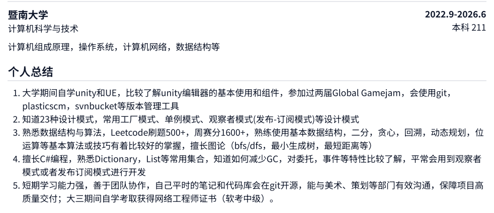
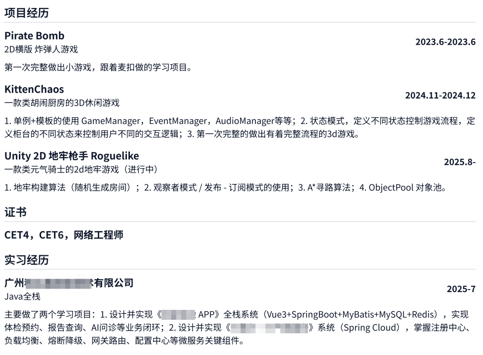

# 11.1 校招经验分享

1. 我的心情

2. 经验分享

   1. 了解行情，横向对比（大一到大四）

      - 无目标 或者摇摆不定：

        - 多去尝试，做的一切都是有意义的

        - 不要和别人比！不要受别人影响！尽管这很难，但我还是希望你能听从自己的内心

   2. 选定目标，查漏补缺，如何学习

      - 有目标：很好，一开始就想清楚了自己要做什么

   3. 简历注意事项

      - 换位思考，如果你是hr，你希望得到一份什么样的简历

   4. 如何投递简历？

      - 冲大厂：最好之前有实习经历，或者基础非常好，不然不建议先投（自己是反面素材）
      - 中小厂：海投

   5. 笔试面试经验

3. 总结寄语

   - 我的不足之处
   - 展望祝福
   - 打广告

## 1. 我的心情

hello大家好，这里是小落嗷，消失了两个月，其实一直在规划自己人生的下一阶段，正如标题所说，期间一直在沉淀准备校招，直到昨天终于尘埃落定，成功拿下了望月的offer~

我的心情是无比激动的，从确定offer以后就一直在和家人以及好朋友分享这份喜悦，昨晚在床上也是睡不着，一直在看游戏行业相关的帖子，直到5点多才睡。今天起床以后又心血来潮，想做一期视频纪念一下，而我为何这么激动？

- 第一是一直以来我都不忘初心，坚定信念，半只脚踏上了自己高中以来曾经梦想的航船，入职游戏行业，找到了属于自己的平台和起点，在自己的兴趣上可以发光发热；
- 第二是带来的成就感，目前就业形势确实不容乐观，都在说秋招难春招难，但是我确实抓住机遇，沉淀两个月杀了出来，谈的待遇我也比较满意，已经相当幸运了，自己的付出有了回报，这两个月我几乎没有任何社交，每天基本睡醒就是去图书馆，一泡就是一整天，不断提升自己的技能（等会会讲），经受起了时间的检验；
  PS：这里要感谢我的三个脑残室友，让我坚定地认为宿舍只是用来睡觉的地方~ 顺带再骂一遍大学的脑残宿舍匹配机制^_^
- 第三是带来的忐忑感，从学生到职场人的转变，我有很多未知的事务要去接触和学习，不断迎接新的挑战，当然我也有信心我有能去一一解决这些问题，并且不断打磨自己的能力
- 最后是带来的爽感，我身边的绝大多数人都在考研，还要奋战一个多月，或者不知道自己要做什么，每天学一会就不知道自己为什么学，然后就在焦虑的玩，而我从现在开始到明年4月，除了毕设（已经选过题了）和一些零碎的课程（可以忽略不计），我有5个月的时间没有任何顾虑，可以做自己喜欢的事情，我会在下赛季也是深渊赛季重新冲人榜，冲击深渊，正如去年生日所言，我也希望有机会可以站在深渊的舞台上，实现自己曾经的电竞梦想，毕竟高中那会我是真的幻想过打职业，不过我比较现实，还是在大学习得自己的一技之长哈哈哈
  PS：打个广告，有想冲8强的队伍可以dd我，39赛季113星人榜82，真的没人看看嘛

## 2. 经验分享

### (1). 了解行情，横向对比

在你高考结束，填志愿选完专业的那一刻，你就应该为自己的未来开始规划路线了

首先，你应该去主动了解，自己的专业未来的就业趋势如何，自己对什么领域会有兴趣，毕竟兴趣是最好的老师，如果能够在自己热爱的领域上深耕，我相信这是一件很幸福的事情

那么应该如何了解？首先目前互联网非常发达，你应该从大一就开始锻炼自己的信息检索能力，因为不是所有事情都会在通知群告诉你，一定要打破大学信息差的屏障。你可以多搜搜有哪些岗位，具体岗位对应的薪资待遇，以及有哪些技能需要学习。比如像我们计算机，就有非常多的领域，深度学习，人工智能，算法工程师，测试工程师，运维，前后端，java全栈，游戏开发等等。可以多看看前人的经验，无论是自己的直系学长或者知乎大神，但是也要保持辩证，有着自己的独立思考，举个例子，某某说某行业非常好，推荐你入坑，又比如某某说你这个专业不行，得转专业或者考研深造啥的，但是不要和别人比！也不要受别人影响！尽管这很难，但我还是希望你能听从自己的内心的选择

如果你没有确定自己要选哪个方向，也不要太着急，大学给你的容错率没有想象中那么低，一定一定要勇于尝试，多去学习，比如我自己也确实走了弯路，
大一大二的寒暑假去打临时工，网管保安我其实都做过，见识了世间百态；
大二下那会我想挣快钱，满足自己的一些物质需求，跑到深圳去辅导机构带了三个月的课（高中数学），中间还要兼顾学校的课程不能挂科；
再比如大三上学期我去尝试UE，学了三个月发现自己并不喜欢虚幻这种比较重的引擎以及c++，
大三下一整个学期玩心很重，在学校外面租房直播游戏，但也不想显得自己一事无成，中间花了两周考了网工证书，7月学校要求实习一个月，自己找或者集中实习，因为我想边实习边直播，所以选了学校的java全栈开发实习，然后7月底回家接着直播冲了一个半月人榜，直到9月2号回学校开启大四

你看，这些和我现在的游戏开发有什么关系？真的没有作用吗？其实不然，这几段打工的经历告诉我赚钱不易，要好好把握住可以抓住的机会；花了一个学期搞直播，让我认识了很多的观众和朋友，而且因为冲榜，也认识了很多大神玩家；考取网工证书，可以检验自己的短期学习能力；干了一个月自己不喜欢的java，让我坚定了不走这条路的决心，而且也学到了很多面向对象通用的思想

所以大胆尝试吧，直到真正确定了自己要努力的方向，然后就可以静下心来了

### (2). 选定目标，查漏补缺

如果你有了明确的目标，知道自己要往什么方向努力，那么什么时候觉醒都不算晚

假如你下定决心要考研，那就早点准备，选好自己的目标院校和专业

如果你和我一样，自始至终没有产生过一丁点任何考研的想法，那就准备你期望的岗位所需的技能，这里分享一下自己学习的方法

虽然说大学教的东西都很shit，但是你一定要保证自己能正常毕业，必修课尽量不挂，如果挂了及时重修或者补考，选修课或者很容易过的水课乐呵就行，我就经常翘课做自己的事情，然后绝大多数课都靠着期末突击过了，当然专业课还是要上点心，你可以不听老师讲，但一定要自己好好学。拿计算机为例，计算机组成原理，数据结构与算法，算法设计与分析，操作系统，数据库，计算机网络这些，我的建议是一定要好好学，笔试和面试是能用上的。如果你是大一的新生，一定要去自己掌握一门编程语言，python，c，c++，c#，java这些都可以，而且要自己动手多敲代码

就我而言，我一直有在关注，企业招unity客户端的话，比较看重哪些技能？看了不少博客以及包括米哈游在内的招聘会，我总结了以下几点：

0. ~~学历~~
1. 编程能力
2. 计算机基础
3. 项目能力

我自己也总结了以下几点方法：

0. ~~听天由命~~
1. 编程能力对于我们开发岗来说是最最重要的能力，所以一定不能掉以轻心，我的建议是有规律地长期进行刷题，保持手感，两个月来我自己的Leetcode已经刷了500+，加上每次周赛和双周赛的实战模拟，让我对算法和数据结构有了很多新的认识和思考
2. 扪心自问，大学的这些专业课好好学了吗？没有就趁现在赶紧补，背一些面试喜欢问的问题，说白了就是八股文
   我自己找了个面试真题网站，重点看操作系统，c#特性（协程，反射，委托，事件，GC等等），c#底层（比如hashmap的底层原理），设计模式以及git等知识
3. 没有实习过，基本=0，但是对我来说就是大一到现在，自己跟着课程学几个unity学习项目，熟悉unity编辑器和组件，以及c#怎么用在开发上。当然，项目是锦上添花的东西，项目或者实习对于校招生来说都是加分项，都是可以让面试官眼前一亮的东西，但是一定要弄清主次，如果数据结构和算法以及那几门计算机基础课实在不太行，项目可以先放一放

不止计算机专业，其他专业也是通用的，根据自己的实际情况去灵活制定相应的计划

### (3). 雕琢简历

站在hr的角度想，他是不是一定希望求职者的能力和岗位能够匹配？所以我想总结一下，其实就两点：

1. 避免假大空
2. 扬长避短，突出亮点

什么是假大空？以我技术岗为例，
第一除了比赛获奖，而且必须和专业相关，不要写任何学校活动相关的东西！我相信没有hr想知道你在学校参加了什么社团，什么学生会，或者军训标兵，校园合唱比赛，甚至高考分数等等乱七八糟的玩意

那你可能想问，你在学校的这四年难道就一文不值吗，那也不完全是，所以什么可以写？
比如你参加的项目等等，但是一定要和岗位对口，而且要写你负责的部分，或者有哪些收获（可以不写，因为面试一般会问），项目经历最好是真的，而且你确实有参与，如果没有项目经历也可以去偷一段变成你自己的，但是一定要熟悉具体细节，不然很容易露馅
再比如你在学校考的证书，CET4，CET6，或者一些专业证书，或者奖学金等等，这种写一行罗列出来就可以了，如果写太多介绍反而不好，会让hr觉得难道这些就让你感到很骄傲了吗

说到扬长避短，如果你在学校的成绩很好，可以把绩点和排名写上去，也是有一定的竞争力
如果像我一样喜欢翘课，挂过科，以及喜欢考前冲刺，绩点不行的，那你就不要写，可以一行带过你学了哪些专业基础课，所谓避短不过如此
扬长的话就要注意了，把你会的东西在个人总结里分点罗列，再补充相关证据，简单来说就是技能+实践
拿我为例，可以看一下我写了什么

接着就是相关项目经历和实习，也是分点罗列，写了你做了什么，学了什么，这部分可以写的详细一点，可以让你占据面试的主动权，这样面试官会多问项目细节，被你引导到你熟悉的领域，不然他没东西问了，就只能对你进行八股文的拷打了~
还有一个小细节，重要的写前面，不重要的写后面尽量一笔带过或者不写，比如证书和学习经历，实习一定要写岗位相关，或者专业相关的，不然不要写，显得自己摇摆不定

### (4). 投简历的艺术

看需求，如果你想冲大厂，而且基础扎实，有实习经历，那就大胆冲
但是如果基础和实习经历缺少，慎投，我自己就是个反例，基础不扎实的情况下先投的4399和网易雷火的笔试，不出意外的都挂了，而且秋招投过了不能再投，只能等春招了，可以参考下一条先练练手，积累经验

如果你想找中小厂，一定要海投，你可以去相关公司官网的校招通道投递，或者在某些招聘软件上投递简历，但是一定要擦亮眼睛谨防招聘骗局，具体怎么防你可以搜一下前人的避雷视频
只要你不想卷大厂，我不相信这么多工作和岗位，没有一样是不适合你的，所以多投多观察，让你对自己逐渐有比较清晰的认知

### (5). 笔试面试经验

这一块我只能提供unity客户端岗位的相关经验，当然一些开发岗位也类似，大家可以辩证看待这一部分

首先是笔试，当你的简历通过筛选以后，就会对你发出笔试邀请，我自己也是大大小小做了十几场笔试，包括被网易和米哈游狠狠拷打。其实笔试做得多了你会发现会有很强的规律性，那些很难的笔试都是大厂，或者不想招人的中小厂，只是给你做题意思下
而那些大部分中小厂的笔试题难度都会稍微简单一点，毕竟要求会降低，或者急招人，当然也并不意味者你可以掉以轻心，把每场笔试都认真看待，当成你此生仅有的机会
每次做完笔试题以后，你都可以做笔记总结一下题型，考了哪些东西，自己还有什么不会的可以加强训练，查漏补缺
PS：我自己做了很多的总结，放在了个人的github上，感兴趣可以在我主页看看~

对于面试，你可以把他看成一场表演，大方地展示自己，问到你擅长的内容你可以扩展发散，问到不会的也不要不懂装懂

项目，算法和八股文同时准备，机会总是留给有准备的人，好运！

## 3. 总结寄语

对于我自己来说，大学这4年也走了不少弯路，但是对于我做的每一个决定，自始至终我都未曾后悔，因为我知道每个决定都是自己做的，没有任何外在因素来干扰我的人生

总的来说，有遗憾也有收获，但是我相信这几年的经历对我来说，迈出的每一步，每一次尝试，都是有意义的

如果你也一样和我在准备校招，希望这个视频可以给你带来启发~

如果你是大一到大三的学弟学妹，希望这个视频能给你指明方向，少走弯路

如果你在考研，那你就划出这个视频，爬去专心备考，都决定要考研了，那就坚定在这条路上走下去

ok，视频到这里差不多就结束了，希望大家能多多三连+关注+转发，这对我很有帮助！我自己就要开始回归排位了，也是爽5个月，那么下期视频开始正式回归游戏，我们不见不散~