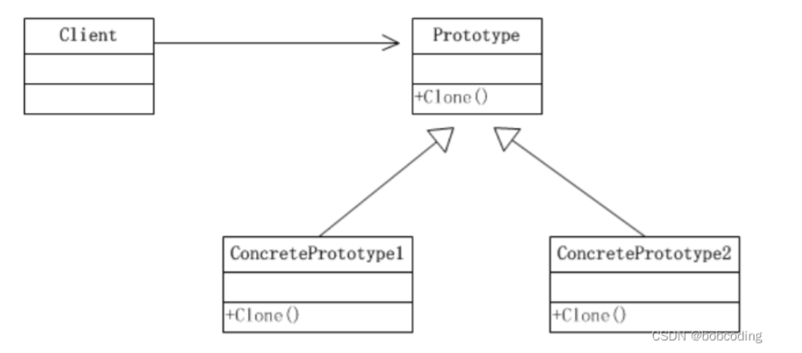

# 零、设计模式七大原则

## **1. 单一职责原则（Single Responsibility Principle）**

单一职责原则表示一个模块的组成元素之间的功能相关性。从软件变化的角度来看，就一个类而言，应该仅有一个让它变化的原因；通俗地说，即一个类只负责一项职责。


## **2. 开放-关闭原则（Open-Closed Principle）**

开放-关闭原则表示软件实体 (类、模块、函数等等) 应该是可以被扩展的，但是不可被修改。(Open for extension, close for modification)

如果一个软件能够满足 OCP 原则，那么它将有两项优点：

1. 能够扩展已存在的系统，能够提供新的功能满足新的需求，因此该软件有着很强的适应性和灵活性。
2. 已存在的模块，特别是那些重要的抽象模块，不需要被修改，那么该软件就有很强的稳定性和持久性。


## **3. 里氏替换原则（Liskov Substitution Principle）**

在编程中常常会遇到这样的问题：有一功能 P1, 由类 A 完成，现需要将功能 P1 进行扩展，扩展后的功能为 P，其中P由原有功能P1与新功能P2组成。新功能P由类A的子类B来完成，则子类B在完成新功能P2的同时，有可能会导致原有功能P1发生故障。

里氏替换原则告诉我们，当使用继承时候，类 B 继承类 A 时，除添加新的方法完成新增功能 P2，尽量不要修改父类方法预期的行为。

> **里氏替换原则的重点在不影响原功能，而不是不覆盖原方法。**

里氏替换原则通俗的来讲就是：子类可以扩展父类的功能，但不能改变父类原有的功能。


## **4. 依赖倒转原则（Dependence Inversion Principle）**

定义：高层模块不应该依赖低层模块，二者都应该于抽象。进一步说，抽象不应该依赖于细节，细节应该依赖于抽象。

举个例子, 某天产品经理需要添加新的功能，该功能需要操作数据库，一般负责封装数据库操作的和处理业务逻辑分别由不同的程序员编写。

封装数据库操作可认为低层模块，而处理业务逻辑可认为高层模块，那么如果处理业务逻辑需要等到封装数据库操作的代码写完的话才能添加的话讲会严重拖垮项目的进度。

正确的做法应该是处理业务逻辑的程序员提供一个封装好数据库操作的抽象接口，交给低层模块的程序员去编写，这样双方可以单独编写而互不影响。

> **依赖倒转原则的核心思想就是面向接口编程**


## **5. 接口隔离原则（Interface Segregation Principle）**

接口隔离原则，其 "隔离" 并不是准备的翻译，真正的意图是 “分离” 接口(的功能)

接口隔离原则强调：**客户端不应该依赖它不需要的接口；一个类对另一个类的依赖应该建立在最小的接口上。**

1. 接口隔离原则的思想在于建立单一接口，尽可能地去细化接口，接口中的方法尽可能少
2. 但是凡事都要有个度，如果接口设计过小，则会造成接口数量过多，使设计复杂化。所以一定要适度。


## **6. 迪米特法则（Law Of Demeter）**

迪米特法则又称为 最少知道原则，它表示一个对象应该对其它对象保持最少的了解。通俗来说就是，只与直接的朋友通信。

首先来解释一下什么是直接的朋友：每个对象都会与其他对象有耦合关系，只要两个对象之间有耦合关系，我们就说这两个对象之间是朋友关系。耦合的方式很多，依赖、关联、组合、聚合等。其中，我们称出现成员变量、方法参数、方法返回值中的类为直接的朋友，而出现在局部变量中的类则不是直接的朋友。也就是说，陌生的类最好不要作为局部变量的形式出现在类的内部。

对于被依赖的类来说，无论逻辑多么复杂，都尽量的将逻辑封装在类的内部，对外提供 public 方法，不对泄漏任何信息。


## **7. 组合/聚合复用原则（Composite/Aggregate Reuse Principle）**

组合/聚合复用原则就是在一个新的对象里面使用一些已有的对象，使之成为新对象的一部分; 新的对象通过向这些对象的委派达到复用已有功能的目的。

在面向对象的设计中，如果直接继承基类，会破坏封装，因为继承将基类的实现细节暴露给子类；如果基类的实现发生了改变，则子类的实现也不得不改变；从基类继承而来的实现是静态的，不可能在运行时发生改变，没有足够的灵活性。于是就提出了组合/聚合复用原则，也就是在实际开发设计中，尽量使用组合/聚合，不要使用类继承。

1. 总体说来，组合/聚合复用原则告诉我们：组合或者聚合好过于继承。
2. 聚合组合是一种 “黑箱” 复用，因为细节对象的内容对客户端来说是不可见的。


# 一、创建型模式

## [1. 单例模式（Singleton Pattern）](https://blog.csdn.net/sinat_40003796/article/details/125594207)

**意图：**

保证一个类仅有一个实例，并提供一个访问它的全局访问点。

**“一个类只能生一个对象，全局随时伸手拿。”**
常用于：资源管理器、音频管理器、网络客户端、事件总线……**整个程序生命周期唯一**。

核心思想

1. **私有化构造函数** → 外部 `new` 不到
2. **类内部持有一个静态实例**
3. **对外暴露静态访问点**（`Instance` 属性 / 方法）

**Unity 生命周期版（推荐）**

**需求**：

- 想挂在场景里（享受 `MonoBehaviour` 生命周期）
- 切换场景时不被销毁
- 全局唯一

```c#
public class GameManager : MonoBehaviour
{
    private static GameManager _instance;

    public static GameManager Instance
    {
        get
        {
            if (_instance == null)
                _instance = FindObjectOfType<GameManager>();
            if (_instance == null)
            {
                var go = new GameObject(nameof(GameManager));
                _instance = go.AddComponent<GameManager>();
            }
            return _instance;
        }
    }

    private void Awake()
    {
        if (_instance != null && _instance != this)
        {
            Destroy(gameObject);
            return;
        }
        _instance = this;
        DontDestroyOnLoad(gameObject);   // 切场景不销毁
    }

    public int PlayerLevel { get; set; }
}
```

使用：

```c#
GameManager.Instance.PlayerLevel = 5;
```

**通用单例工具基类（直接继承）**

```c#
using UnityEngine;

public class Singleton<T> : MonoBehaviour where T : Component
{
    private static T _instance;
    public static T Instance
    {
        get
        {
            if (_instance == null)
            {
                _instance = FindObjectOfType<T>();
                if (_instance == null)
                {
                    var go = new GameObject(typeof(T).Name);
                    _instance = go.AddComponent<T>();
                }
            }
            return _instance;
        }
    }

    protected virtual void Awake()
    {
        if (_instance == null)
        {
            _instance = this as T;
            DontDestroyOnLoad(gameObject);
        }
        else
        {
            Destroy(gameObject);
        }
    }
}
```

其他类继承：

```c#
public class AudioManager : Singleton<AudioManager> { }
```

------

25.10.16更新

单例模式和静态类的区别？

静态类的访问效率会比单例模式高一点，如果仅仅是提供一些全局方法的工具类，使用静态类会更合适。
单例模式可以和面向对象的特性挂钩，并且想要使用的时候才会去实例化类，静态类是一开始就存在的，所以单例模式会比静态类更节约。单例模式对象可以允许被释放，静态类对象不行。如果一个类是单例类，那么我们可以显而易见地识别这个类是一个模块类（程序框架设计中的一个建议），如果一个类是静态类，那么我们可能还要花点时间去思考这个静态类是模块类，工具类还是常量类。

------


## [2-0.简单工厂模式](https://blog.csdn.net/sinat_40003796/article/details/125558524)

建议读者带着思考去看以下三篇文章：**简单工厂 工厂模式 抽象工厂**的区别？使用时机分别是什么？

**学完以后，关于三种不同工厂，推荐回头阅读一下 [简单工厂模式、工厂模式和抽象工厂模式的区别](https://blog.csdn.net/qq_37366618/article/details/128796728)**


简单工厂模式是一个具体工厂生成不同的产品，产品都继承同一个父类，适合**需求变化不大**的场景，就是定义一个创建对象的接口。
缺点是违法[开闭原则](https://so.csdn.net/so/search?q=开闭原则&spm=1001.2101.3001.7020)（即对修改不封闭），增加新产品需要去修改工厂。

简单工厂**并不是一种设计模式**，它只是对实例化逻辑进行了一层简单包裹而已，客户端依然是要告诉工厂我要的是哪个产品，虽然没有出现对产品实例化的关键字new，但这依然无疑是另一种形式的耦合。

**Unity 实战：子弹创建**

```c#
public enum BulletType { Standard, Explosive, Laser }

public static class BulletSimpleFactory
{
    public static GameObject Create(BulletType type)
    {
        return type switch
        {
            BulletType.Standard => Resources.Load<GameObject>("Bullets/Standard"),
            BulletType.Explosive=> Resources.Load<GameObject>("Bullets/Explosive"),
            BulletType.Laser    => Resources.Load<GameObject>("Bullets/Laser"),
            _ => throw new System.ArgumentOutOfRangeException()
        };
    }
}
```

使用

```c#
GameObject bullet = BulletSimpleFactory.Create(BulletType.Explosive);
```

> 缺点：加新品要**改工厂源码** → 违反 **OCP**（开闭原则）


## [2. 工厂方法模式（Factory Method）](https://blog.csdn.net/sinat_40003796/article/details/125848004)


**意图：**

定义一个用于创建对象的接口，让子类决定实例化哪一个类。Factory Method 使一个类的实例化延迟到其子类。

一个产品由一个工厂来负责生产（或者说一个工厂只生产一个产品），所以会出现很多个工厂（与产品数量相对应），工厂都继承相同的父类。
所以新增产品就只要新增一个具体工厂，不需要改动原来的工厂。**缺点**是新增一个产品就要新增一个工厂，会出现很多的类。

**Unity 实战：子弹创建**

```c#
// 产品接口
public abstract class BulletBase : MonoBehaviour { }

// 具体产品
public class StandardBullet : BulletBase { }
public class ExplosiveBullet : BulletBase { }

// 工厂接口
public abstract class BulletFactory : ScriptableObject
{
    public abstract BulletBase Create();
}

// 具体工厂（可 ScriptableObject 配置）
[CreateAssetMenu(menuName = "Factory/StandardBulletFactory")]
public class StandardBulletFactory : BulletFactory
{
    [SerializeField] private StandardBullet prefab;
    public override BulletBase Create() => Instantiate(prefab);
}
```

使用

```c#
[SerializeField] private BulletFactory bulletFactory; // Inspector拖任意工厂
BulletBase bullet = bulletFactory.Create();
```

每创建一种新子弹，就创建一种新工厂，调用新的工厂方法

简单来说，就是把工厂和产品分别抽象（面对抽象编程），工厂要生产什么产品让子类去实现


## [3. 抽象工厂模式（Abstract Factory）](https://blog.csdn.net/sinat_40003796/article/details/125599352)


**意图：**

提供一个创建一系列相关或相互依赖对象的接口，而无需指定它们具体的类。

抽象工厂模式支持生产不同的产品族（即继承不同父类的产品），上述的简单工厂模式和工厂模式，都是生产单一产品族，这是最显著的不同。
抽象工厂模式，一个工厂可以生产继承自不同父类的产品，而工厂都继承自相同的父类，因此在父类工厂里就需要提供好各个产品族的接口。
看着像是工厂模式的拓展，即为基类工厂提供了更多产品族接口，适合创建的产品对象具有相关性的场景。**缺点**是如果要新增产品族，就要对工厂基类和具体实现类都要进行修改。

**Unity 实战**

需求：

> 生成**一整套 UI 皮肤**（按钮 + 文本 + 滑动条），且**暗黑/科幻**两套风格互不混用。

```c#
// 产品族接口
public interface IUIButton { void Render(); }
public interface UIText   { void Render(); }

// 暗黑具体产品
public class DarkButton : IUIButton { }
public class DarkText   : UIText   { }

// 科幻具体产品
public class ScifiButton : IUIButton { }
public class ScifiText   : UIText   { }

// 抽象工厂
public interface IUIFactory
{
    IUIButton CreateButton();
    UIText    CreateText();
}

// 暗黑工厂
public class DarkUIFactory : IUIFactory
{
    public IUIButton CreateButton() => new DarkButton();
    public UIText    CreateText()   => new DarkText();
}

// 客户端——只依赖抽象
public class UIAssembler : MonoBehaviour
{
    [SerializeField] private IUIFactory factory; // Inspector 选风格

    void Start()
    {
        IUIButton btn = factory.CreateButton();
        UIText    txt = factory.CreateText();
        btn.Render(); txt.Render();
    }
}
```

换皮肤？**换一套工厂 ScriptableObject**即可，**客户端代码不动**。

最后，比较一下工厂三兄弟：

| 模式         | 一句话                                        | 适用             |
| ------------ | --------------------------------------------- | ---------------- |
| **简单工厂** | 一个工厂类里 `switch-case` 造对象             | 产品少、变化不大 |
| **工厂方法** | 每个产品对应**一个工厂子类**                  | 产品经常扩展     |
| **抽象工厂** | 一次创建**一整套产品族**（UI 皮肤、武器套装） | 多系列相互配套   |

想象一下，比如生产汽车，不同品牌的汽车的配件不同，生产汽车A需要方向盘A，引擎A，导航A，生产汽车B需要方向盘B，引擎B，导航B。。。

用大白话说，就是

1. **简单工厂**：在工厂内部切换要生产的产品，每增加一种产品就要修改工厂

	> 生产所有产品，方向盘、引擎、导航都在这里生产（switch-case控制）

2. **工厂方法**：把产品和工厂抽象，每生产一种产品就创建一个新的工厂

	> 方向盘、引擎、导航对应三种厂，增加一种方向盘就增加一种方向盘工厂，增加一种引擎就增加一种引擎工厂，以此类推

3. **抽象工厂**：让每个工厂能生产不同类型的产品（成套生产）

	> 抽象工厂生产一种汽车（配件组成固定），但是内部却生产不同类型的配件，再组成汽车
	> 如果增加一种汽车，即增加一种不同类型零件的排列方式，那就增加一种新的工厂
	
	

***思考：抽象工厂模式是桥接模式吗？***


## [4. 建造者模式（Builder）](https://blog.csdn.net/sinat_40003796/article/details/125597300)


**意图：**

将一个复杂对象的构建与它的表示分离，使得同样的构建过程可以创建不同的表示。

**“分步骤、按顺序组装复杂对象”**，把**构造过程**与**表示**解耦，同样的构建流程可以**产出不同风格/配置**的最终产品。

| 角色                | 说明                           | 例子                             |
| ------------------- | ------------------------------ | -------------------------------- |
| **Product**         | 最终要造的复杂对象             | `Car`                            |
| **Builder**         | 抽象建造接口                   | `ICarBuilder`                    |
| **ConcreteBuilder** | 具体建造者，实现每步细节       | `SportsCarBuilder`、`SuvBuilder` |
| **Director**        | 导演类，**固定构建步骤顺序**   | `CarDirector`                    |
| **Client**          | 只和 Director + Builder 打交道 | 任何脚本                         |

**Unity 实战：组装一把枪械**

需求：

> 枪械 = **枪管 + 弹夹 + 瞄准镜 + 枪托**，顺序固定；
> 但**每步具体配件**可以换，最后得到**狙击枪**或**冲锋枪**。

（1）产品类

```c#
public class Gun
{
    public string barrel;   // 枪管
    public string magazine; // 弹夹
    public string sight;    // 瞄准镜
    public string stock;    // 枪托

    public override string ToString()
        => $"Gun[{barrel}|{magazine}|{sight}|{stock}]";
}
```

（2）抽象建造者

```c#
public abstract class GunBuilder
{
    protected Gun gun = new Gun();
    public Gun GetResult() => gun;

    public abstract void BuildBarrel();
    public abstract void BuildMagazine();
    public abstract void BuildSight();
    public abstract void BuildStock();
}
```

（3）具体建造者

```c#
public class SniperBuilder : GunBuilder
{
    public override void BuildBarrel()  => gun.barrel  = "Heavy Sniper Barrel";
    public override void BuildMagazine()=> gun.magazine= "10-Round Mag";
    public override void BuildSight()   => gun.sight   = "8x Scope";
    public override void BuildStock()   => gun.stock   = "Solid Stock";
}

public class SmgBuilder : GunBuilder
{
    public override void BuildBarrel()  => gun.barrel  = "Short SMG Barrel";
    public override void BuildMagazine()=> gun.magazine= "30-Round Mag";
    public override void BuildSight()   => gun.sight   = "Red Dot";
    public override void BuildStock()   => gun.stock   = "Foldable Stock";
}
```

（4）导演类（固定顺序）

```c#
public class GunDirector
{
    public Gun Construct(GunBuilder builder)
    {
        builder.BuildBarrel();   // ①
        builder.BuildMagazine(); // ②
        builder.BuildSight();    // ③
        builder.BuildStock();    // ④
        return builder.GetResult();
    }
}
```

（5）客户端——任意组合

```c#
var director = new GunDirector();

Gun sniper = director.Construct(new SniperBuilder());
Debug.Log(sniper); // Gun[Heavy Sniper Barrel|10-Round Mag|8x Scope|Solid Stock]

Gun smg  = director.Construct(new SmgBuilder());
Debug.Log(smg);    // Gun[Short SMG Barrel|30-Round Mag|Red Dot|Foldable Stock]
```

总而言之，客户需要什么产品，就可以请不同Director，或者让Director换不同Builder（**建造者模式的灵活点**）

1. **客户** → **选 Director**（决定**装配顺序/流程**）
2. **客户** → **选 Builder**（决定**每步具体配件/风格**）
3. **Director 只负责按表喊号**，传谁就用谁，**完全不关心具体配件是什么品牌**。


***思考：可以有多个Director吗？什么时候需要多个Director？***

- **Director 不是“单例”也不是“唯一流程”**，它只是**“一段可复用的装配顺序”**。
- 只要**装配顺序不同**，就可以另写一个 Director；甚至**同一套 Builder 接口**可以被**多个 Director 复用**，产出**不同风格或不同级别**的产品。

**代码示例：两个 Director 共用同一套 Builder**

```c#
// 标准流程 Director
public class StandardGunDirector : IGunDirector{
    public Gun Construct(GunBuilder b){
        b.BuildBarrel();
        b.BuildMagazine();
        b.BuildSight();
        b.BuildStock();
        return b.GetResult();
    }
}

// 快速拼装 Director（省略瞄准镜，低配枪）
public class QuickGunDirector : IGunDirector{
    public Gun Construct(GunBuilder b){
        b.BuildBarrel();
        b.BuildMagazine();
        // 跳过 Sight & Stock
        return b.GetResult();
    }
}
```


***思考：建造者和工厂三兄弟的区别？***

| 模式                       | 关注         | 是否分步              | 是否固定顺序     |
| -------------------------- | ------------ | --------------------- | ---------------- |
| **简单/工厂方法/抽象工厂** | **创建什么** | 一步 `Create()`       | 无               |
| **建造者**                 | **如何组装** | **多步** `BuildXxx()` | **导演固定顺序** |

***思考：建造者是模板方法吗？是外观模式吗？***

| 维度             | 建造者 Builder                               | 模板方法 Template Method                   |
| ---------------- | -------------------------------------------- | ------------------------------------------ |
| **核心目的**     | **“如何一步步组装出不同产品”**               | **“子类只能填空，不能改流程顺序”**         |
| **谁控制顺序**   | **Director（可换）**                         | **基类模板方法（ sealed/final ）**         |
| **是否继承**     | **无继承**，Director 组合不同 Builder        | **必须继承**，子类 override 空位           |
| **是否复用流程** | **流程本身**（Director）可复用，**也可新写** | **流程骨架**被基类**钉死**，子类**不准改** |
| **扩展点**       | **新建一个 Builder** 即可                    | **新建一个子类** 填空                      |

**模板方法** = **“流程钉死，子类填空”**（纵向继承）
**建造者** = **“流程可复用，也可新写，靠不同 Builder 换零件”**（横向组合）

| 维度               | 建造者 Builder                           | 外观 Facade                        |
| ------------------ | ---------------------------------------- | ---------------------------------- |
| **核心目的**       | **“分步构造复杂对象”**                   | **“简化一群子系统的调用入口”**     |
| **是否产出新对象** | ✅ **一定会产出一个 Product**             | ❌ **不产出新对象**，只**打包调用** |
| **是否固定顺序**   | **Director 内固定**，但**可换 Director** | **无顺序约束**，只求**入口简单**   |
| **客户端用法**     | `director.Construct(builder)` 得最终产品 | `facade.DoSomething()` 一键完事    |

**外观** = **“一键搞定，不管背后多乱”**
**建造者** = **“一步步拼乐高，最后得到一个成品”**


## [5. 原型模式（Prototype）](https://blog.csdn.net/sinat_40003796/article/details/125622374)



**意图：**

用原型实例指定创建对象的种类，并且通过拷贝这些原型创建新的对象。

**“先克隆一个样板，再微调成新对象”**——**不 new、不继承**，用**复制**代替构造，尤其适合**创建成本高、状态复杂**的对象。

| 角色                  | 说明                 | 例子                          |
| --------------------- | -------------------- | ----------------------------- |
| **Prototype**         | 克隆接口             | `ICloneable` / `IPrototype`   |
| **ConcretePrototype** | 具体样板             | `EnemyConfig`、`BulletParams` |
| **Client**            | 拿原型 → 克隆 → 微调 | 任何脚本                      |

**Unity 实战：敌人配置深拷贝**

需求：

> 从 ScriptableObject **模板**生成**运行时副本**，防止改状态污染原版

（1）克隆接口（通用）

```c#
public interface IDeepCloneable<T>
{
    T DeepClone();
}
```

（2）具体原型（配置数据）

```c#
[CreateAssetMenu(menuName = "Prototype/EnemyConfig")]
public class EnemyConfig : ScriptableObject, IDeepCloneable<EnemyConfig>
{
    public string enemyName;
    public float  maxHp;
    public List<string> skills = new List<string>();

    // 深拷贝实现
    public EnemyConfig DeepClone()
    {
        var clone = ScriptableObject.CreateInstance<EnemyConfig>();
        clone.enemyName = enemyName;
        clone.maxHp     = maxHp;
        clone.skills    = new List<string>(skills); // 深复制列表
        return clone;
    }
}
```

（3）客户端——复制 + 微调

```c#
public class EnemySpawner : MonoBehaviour
{
    [SerializeField] private EnemyConfig prototype; // 拖模板

    public void Spawn()
    {
        EnemyConfig runtimeConfig = prototype.DeepClone(); // 克隆
        runtimeConfig.maxHp *= PlayerLevel.Value;          // 微调
        SpawnEnemy(runtimeConfig);
    }
}
```

**复制 ≠ 不 new**
**值类型复制：永远不用 new**
**引用类型复制：**
**浅拷贝 → 外壳地址复制（不 new），子对象共享**
**深拷贝 → 外壳+子对象都要 new，完全独立**

> “**Ctrl+C → Ctrl+V → 改两行**” 的代码级实现。


# 二、结构型模式

## [6. 适配器模式（Adapter Pattern）](https://blog.csdn.net/sinat_40003796/article/details/125635861)

> 顾名思义，适配器，得适应当前的不同配置，解决兼容性问题

**意图：**

将一个类的接口转换成客户希望的另外一个接口。Adapter 模式使得原本由于接口不兼容而不能一起工作的那些类可以一起工作。

```
Client ──► Target
              ▲
              │
          Adapter ──► Adaptee
```

eg. 翻译官 光猫 USB转type-c...... 总之 起到一个转换器的作用

举个例子 我的电脑充电器是三孔式 但是我居住的城市比较奇怪 无论你去到哪里 都只有两孔的电源

那我需要换一台电脑吗？

完全不需要 我可以买一个电源转接器 或者买一个两孔的充电器 完美解决

**如何在实际项目中应用**？

解决跨平台问题

举个例子 第五人格可以在pc上或者手机上运行

我们角色在移动的时候 PC：WASD 手机：拖动摇杆 如果不使用适配器模式就会这样：

```c#
void Update()
{
    Vector2 axis;
    bool jump;

#if UNITY_STANDALONE
    // 如果使用适配器模式
    // axis = InputManager.GetInputService.GetAxis
    // 完全不需要判断平台 因为已经在InputManager帮你选好适配器了
    axis = new Vector2(Input.GetAxis("Horizontal"), Input.GetAxis("Vertical"));
    jump = Input.GetKeyDown(KeyCode.Space);
#elif UNITY_ANDROID || UNITY_IOS
    axis = joystick.Horizontal, joystick.Vertical;
    jump = btnJump.IsPressed();
#endif

    Move(axis);
    if (jump) Jump();
}
```

| 需求                     | 无适配器时的代价                                           |
| ------------------------ | ---------------------------------------------------------- |
| 支持手柄                 | 再加一坨 `#if UNITY_INPUT_SYSTEM` → 宏套宏，**三层嵌套**。 |
| 支持编辑器里「模拟手机」 | 继续 `#if UNITY_EDITOR` **第四层嵌套**。                   |
| 换第三方输入插件         | **全项目搜索替换** joystick 变量名，**改 100+ 文件**。     |

而适配器模式可以分别获取pc和手机的输入

（1）统一接口

```c#
// IInputService.cs
using UnityEngine;

public interface IInputService
{
    Vector2 GetMoveAxis();   // 水平/垂直
    bool    GetJumpDown();   // 按下跳跃
    bool    GetFireDown();   // 按下开火/交互
}
```

（2）PC 输入**适配器**（Adaptee 是 UnityEngine.Input）

```c#
// PCInputAdapter.cs
using UnityEngine;

public class PCInputAdapter : MonoBehaviour, IInputService
{
    public Vector2 GetMoveAxis() =>
        new Vector2(Input.GetAxis("Horizontal"), Input.GetAxis("Vertical"));

    public bool GetJumpDown() => Input.GetKeyDown(KeyCode.Space);
    public bool GetFireDown() => Input.GetMouseButtonDown(0);
}
```

（3）手机输入**适配器**（Adaptee 是屏幕 UI）

```c#
// MobileInputAdapter.cs
using UnityEngine;
using UnityEngine.UI;   // 需要引用 UI 模块

public class MobileInputAdapter : MonoBehaviour, IInputService
{
    [Header("拖 UI 控件进来")]
    [SerializeField] private Joystick joystick;      // 项目里常用 Joystick Pack 免费资源
    [SerializeField] private Button   btnJump;
    [SerializeField] private Button   btnFire;

    private bool jumpDown;
    private bool fireDown;

    void Awake()
    {
        btnJump.onClick.AddListener(() => jumpDown = true);
        btnFire.onClick.AddListener(() => fireDown = true);
    }

    void Update()
    {
        // 只在当前帧触发一次
        if (jumpDown) jumpDown = false;
        if (fireDown) fireDown = false;
    }

    public Vector2 GetMoveAxis() => new Vector2(joystick.Horizontal, joystick.Vertical);
    public bool GetJumpDown()    => jumpDown;
    public bool GetFireDown()    => fireDown;
}
```

（4）运行时工厂（自动挂适配器）

```c#
// InputManager.cs
using UnityEngine;

public class InputManager : MonoBehaviour
{
    [SerializeField] private GameObject mobileUIPrefab;   // 拖 MobileUI 预制体

    public static IInputService Service { get; private set; }

    void Awake()
    {
        // 根据平台自动选择适配器
        if (Application.isMobilePlatform)
        {
            gameObject.AddComponent<MobileInputAdapter>();
            Service = GetComponent<MobileInputAdapter>();
            // 实例化手机 UI
            if (mobileUIPrefab != null)
                Instantiate(mobileUIPrefab);
        }
        else
        {
            gameObject.AddComponent<PCInputAdapter>();
            Service = GetComponent<PCInputAdapter>();
        }

        DontDestroyOnLoad(gameObject);   // 全局单例
    }
}
```

扩展性很强 如果我又要支持手柄输入 只需增加新的**适配器** 以及在InputManager增加一条else if即可


## [7. 桥接模式（Bridge Pattern）](https://blog.csdn.net/sinat_40003796/article/details/125640595)

**意图：**

将抽象部分与它的实现部分分离，使它们都可以独立地变化。

> **“不要一层层继承，要分两条线：功能一条线，平台一条线，中间用桥接拼起来。”**

假如我写一个武器系统，不同武器有着不同的渲染方式，用继承写就是

```
              Weapon
         ┌──────┴──────┐
     Rifle         Sniper
    ┌─┴─┐          ┌─┴─┐
DXRifle OpenRifle DXSniper OpenSniper …
```

比较容易发现一个问题，我每增加一种武器，就要重新写所有渲染方法，或者我每增加一种渲染方法，就要对所有武器进行修改。。。
**类数量 = 武器数 × 平台数**，加 1 种武器、加 1 个平台都**爆炸式增长**。

桥接模式把“**武器功能**”与“**渲染实现**”拆成两条独立树，用**组合**代替继承，想加新武器就写武器，想加新平台就写平台，**零交叉**。

        Weapon (Abstraction)  ──────► IRenderer (Implementor)
           ┌┴┐                          ┌┴┐
        Rifle Sniper              DXRenderer GLRenderer


| 角色                    | 说明                                  |
| ----------------------- | ------------------------------------- |
| **Abstraction**         | 高层功能接口（Weapon）                |
| **RefinedAbstraction**  | 具体功能（Rifle / Sniper）            |
| **Implementor**         | 底层实现接口（IRenderer）             |
| **ConcreteImplementor** | 具体平台（DXRenderer / GLRenderer …） |

unity示例代码：

（1）实现层接口（Implementor）

```c#
// IRenderer.cs
public interface IRenderer
{
    void DrawMesh(Mesh mesh, Vector3 pos);
}
```

（2）具体实现层

```c#
// DXRenderer.cs
public class DXRenderer : IRenderer
{
    public void DrawMesh(Mesh mesh, Vector3 pos)
        => Debug.Log($"[DirectX] 绘制 {mesh.name} 在 {pos}");
}

// GLRenderer.cs
public class GLRenderer : IRenderer
{
    public void DrawMesh(Mesh mesh, Vector3 pos)
        => Debug.Log($"[OpenGL ] 绘制 {mesh.name} 在 {pos}");
}
```

（3）抽象层（Abstraction）

```c#
// Weapon.cs  ——  持有一条“桥”
public abstract class Weapon
{
    protected IRenderer renderer;          // 桥接点
    protected Weapon(IRenderer r) => renderer = r;

    public abstract void Fire();
}
```

（4）扩展抽象层

```c#
// Rifle.cs
public class Rifle : Weapon
{
    private Mesh bulletMesh;   // 假设已赋值
    public Rifle(IRenderer r) : base(r) {}

    public override void Fire()
    {
        Debug.Log("步枪射击");
        renderer.DrawMesh(bulletMesh, Vector3.forward);
    }
}

// Sniper.cs
public class Sniper : Weapon
{
    private Mesh bulletMesh;
    public Sniper(IRenderer r) : base(r) {}

    public override void Fire()
    {
        Debug.Log("*** 狙击射击 ***");
        renderer.DrawMesh(bulletMesh, Vector3.forward * 10f);
    }
}
```

（5）客户端——任意组合

```c#
// GameStarter.cs
IRenderer dx = new DXRenderer();
IRenderer gl = new GLRenderer();

Weapon rifleDX = new Rifle(dx);
Weapon rifleGL = new Rifle(gl);
Weapon snipGL  = new Sniper(gl);

rifleDX.Fire();   // 输出：步枪射击  [DirectX] 绘制 ...
rifleGL.Fire();   // 输出：步枪射击  [OpenGL ] 绘制 ...
snipGL.Fire();    // 输出：*** 狙击射击 ***  [OpenGL ] 绘制 ...
```

想加**火箭筒**？只写 `RocketLauncher : Weapon`，**不用碰任何渲染代码**。
想加**Vulkan**？只写 `VkRenderer : IRenderer`，**不用碰任何武器代码**。
仔细想想，如果我有8种武器和4中渲染方式，使用桥接模式就是8+4=12个类，却有8*4=32种组合方式
如果使用最上面那种继承方式，那就是8\*4=32个类。。。


## [8. 装饰模式（Decorator Pattern）](https://blog.csdn.net/sinat_40003796/article/details/125714980)

**意图：**

动态地给一个对象添加一些额外的职责。就增加功能来说，Decorator 模式相比生成子类更为灵活。

人靠衣装马靠鞍，显而易见，女友每天出门之前进行的那场洗礼是多么的神圣，多么的不可或缺。诚然，化妆的过程对于男人来说充满了神秘色彩，但对于女人来说更像是一场洗礼，怀揣着信仰与敬畏感进行的一场仪式，最终会像魔法一般把自己的脸变得完美无瑕，更有甚者浓妆艳抹地连毛孔都看不到。
`涂口红(打粉底(女孩的脸庞))`

**不动原始类、不继承，动态地给对象“穿外套”**——想加功能就套一层，想脱就卸一层，**运行时随意组合，编译时零侵入**。

> “**给咖啡加糖加奶，不用改咖啡豆本身。**”

```
        ICoffee (Component)
           ┌┴┐
    Espresso  CoffeeDecorator (Decorator)
                   ┌┴┐
             Milk  Sugar  Whip (ConcreteDecorator)
```

| 角色                  | 说明                         | 例子                    |
| --------------------- | ---------------------------- | ----------------------- |
| **Component**         | 统一接口                     | `ICoffee`               |
| **ConcreteComponent** | 原始对象                     | `Espresso`              |
| **Decorator**         | 装饰基类（也实现 Component） | `CoffeeDecorator`       |
| **ConcreteDecorator** | 实际加料                     | `Milk`、`Sugar`、`Whip` |

- 装饰器**持有**一个 `ICoffee` 引用（即被装饰对象）。
- 装饰器**自己也实现** `ICoffee`，所以**能被再次装饰** → 无限套娃。


**Unity实战：武器附加 Buff**

需求：

> 给武器**运行时**加**消音器、红点镜、扩容弹夹**，且可以**任意叠加**，**不能改原始 Weapon 代码**。

（1）统一接口
```csharp
// IWeapon.cs
public interface IWeapon
{
    string Description();   // 名字/描述
    int    Damage();        // 伤害
    float  Accuracy();      // 精准度
}
```

（2）原始组件
```csharp
// BaseWeapon.cs
public class BaseWeapon : IWeapon
{
    public string Description() => "AK47";
    public int    Damage()      => 30;
    public float  Accuracy()    => 0.85f;
}
```

（3）装饰基类
```csharp
// WeaponDecorator.cs
public abstract class WeaponDecorator : IWeapon
{
    protected IWeapon wrapped;           // 被装饰对象
    public WeaponDecorator(IWeapon w) => wrapped = w;

    // 默认实现：直接转发，子类需要再 override
    public virtual string Description() => wrapped.Description();
    public virtual int    Damage()      => wrapped.Damage();
    public virtual float  Accuracy()    => wrapped.Accuracy();
}
```

（4）具体装饰品
```csharp
// Silencer.cs
public class Silencer : WeaponDecorator
{
    public Silencer(IWeapon w) : base(w) { }
    public override string Description() => wrapped.Description() + " +消音器";
    public override float Accuracy()     => wrapped.Accuracy() + 0.05f;
}

// RedDot.cs
public class RedDot : WeaponDecorator
{
    public RedDot(IWeapon w) : base(w) { }
    public override string Description() => wrapped.Description() + " +红点镜";
    public override float Accuracy()     => wrapped.Accuracy() + 0.1f;
}

// ExtendedMag.cs
public class ExtendedMag : WeaponDecorator
{
    public ExtendedMag(IWeapon w) : base(w) { }
    public override string Description() => wrapped.Description() + " +扩容弹夹";
    public override int Damage()         => wrapped.Damage() + 5;
}
```

（5）客户端——运行时随意穿脱
```csharp
// Inventory.cs
using UnityEngine;

public class Inventory : MonoBehaviour
{
    private IWeapon current;

    void Start()
    {
        // 裸枪
        current = new BaseWeapon();

        // 捡到配件，动态装饰
        current = new Silencer(current);
        current = new RedDot(current);
        current = new ExtendedMag(current);

        Print();          // AK47 +消音器 +红点镜 +扩容弹夹  伤害35 精准1.0
    }

    void Print()
    {
        Debug.Log($"{current.Description()}  伤害{current.Damage()} 精准{current.Accuracy():F2}");
    }

    // 卸掉消音器——重新构建一条链即可
    public void RemoveSilencer()
    {
        // 这里演示：直接重建，实际可写拆链逻辑
        current = new BaseWeapon();
        current = new RedDot(current);
        current = new ExtendedMag(current);
        Print();
    }
}
```

运行结果：
```
AK47 +消音器 +红点镜 +扩容弹夹  伤害35 精准1.00
AK47 +红点镜 +扩容弹夹          伤害35 精准0.95
```

装饰模式其实就是俄罗斯套娃 递归套递归 扩展新装饰不影响旧装饰


## [9. 组合模式（Composite Pattern）](https://blog.csdn.net/sinat_40003796/article/details/125723161)

**意图：**

将对象组合成树形结构以表示“部分-整体”的层次结构。Composite 使得用户对单个对象和组合对象的使用具有一致性。


**把“单个对象”和“对象集合”统一成同一种接口**，让客户代码**无需关心**自己面对的是**一个东西**还是**一群东西**——**递归树形结构的杀手锏**。
想象一下文件系统，从根目录开始分支，下面可以包含文件夹或者文件，文件夹下面可以继续存放子文件夹或文件

```
        IFileSystem (Component)
             ┌┴┐
         File(Leaf)  Folder(Composite) ──► 拥有 List<IFileSystem>
```

| 角色          | 说明                 | 例子          |
| ------------- | -------------------- | ------------- |
| **Component** | 统一接口             | `IFileSystem` |
| **Leaf**      | 叶子（不能再包含）   | `File`        |
| **Composite** | 容器（可再放子组件） | `Folder`      |

Folder 自己也是 `IFileSystem`，所以可以**无限嵌套**。

**Unity实战：场景节点系统**

需求：

> 做一个**动态场景节点**，既能**单独旋转一个物体**，也能**一键旋转整个分支**（包括子节点、孙节点）。

（1）统一组件接口

```c#
// ISceneNode.cs
public interface ISceneNode
{
    void Rotate(float angle);
    string Name { get; }
}
```

（2）叶子 —— 单个 GameObject

```c#
// LeafNode.cs
using UnityEngine;

public class LeafNode : ISceneNode
{
    private Transform transform;
    public string Name => transform.name;

    public LeafNode(Transform tf) => transform = tf;

    public void Rotate(float angle)
    {
        transform.Rotate(Vector3.up, angle, Space.Self);
        Debug.Log($"{Name} 旋转 {angle}°");
    }
}
```

（3）组合 —— 包含子节点

```c#
// CompositeNode.cs
using System.Collections.Generic;
using UnityEngine;

public class CompositeNode : ISceneNode
{
    private List<ISceneNode> children = new List<ISceneNode>();
    private Transform transform;
    public string Name => transform.name;

    public CompositeNode(Transform tf) => transform = tf;

    // 增删子节点
    public void Add(ISceneNode node) => children.Add(node);
    public void Remove(ISceneNode node) => children.Remove(node);

    // 递归旋转
    public void Rotate(float angle)
    {
        transform.Rotate(Vector3.up, angle, Space.Self);
        Debug.Log($"{Name} 旋转 {angle}°");
        foreach (var c in children) c.Rotate(angle);   // 递下去
    }
}
```

（4）工具类 —— 一键把 Hierarchy 分支转成组合树

```c#
// SceneNodeBuilder.cs
using UnityEngine;

public static class SceneNodeBuilder
{
    public static ISceneNode BuildTree(Transform root)
    {
        // 叶子节点：没有子物体
        if (root.childCount == 0) return new LeafNode(root);

        // 组合节点：先把自己建出来，再递归把孩子加进去
        var composite = new CompositeNode(root);
        foreach (Transform child in root)
            composite.Add(BuildTree(child));   // 递归
        return composite;
    }
}
```

（5）客户端 —— 完全透明

```c#
// TestComposite.cs
using UnityEngine;

public class TestComposite : MonoBehaviour
{
    [Header("拖场景里的任意根节点")]
    [SerializeField] private Transform root;

    private ISceneNode nodeTree;

    void Start() => nodeTree = SceneNodeBuilder.BuildTree(root);

    void Update()
    {
        if (Input.GetKeyDown(KeyCode.Space))
            nodeTree.Rotate(30f);   // 不管多大树，一键转
    }
}
```

就像齿轮的传动，大齿轮带动小齿轮，一直转下去~


## [10. 外观模式（Facade Pattern）](https://blog.csdn.net/sinat_40003796/article/details/125725068)

**意图：**

为子系统中的一组接口提供一个一致的界面，Facade模式定义了一个高层接口，这个接口使得这一子系统更加容易使用。

想象一下，你每天都要吃饭，假如你要在上班的同时，还要买菜，洗菜，烧饭，吃饭，刷锅。。。。。。
那你可不乐意了，你会想，怎么能让国家的栋梁之材，把宝贵的时间浪费在这些琐碎之事上
恰好，你家楼下开了一家餐馆，餐馆提供了**点餐**功能，而内部的实现细节（买菜，洗菜，烧饭，刷锅。。。）等等，则不是你要去考虑的
如果周末或者节假日放假，你在家躺着不想出去，甚至可以打开手机**点外卖**，而商家出餐，骑手送餐等细节，也不是你要考虑的

**“一键开关”**——给**一群复杂的子系统**做一个**简洁的统一入口**，让外界**只认得你**，**不用了解内部百八十个小接口**。

> “家庭影院一键观影：遥控器按下后，幕布降、投影开、音响调、灯关……你不必逐个操作。”

```
Client  →  HomeTheaterFacade
              ├─> Projector.On()
              ├─> Screen.Down()
              ├─> Light.Dim()
              └─> Sound.SetVolume()
```

| 角色          | 说明                         | 例子                                      |
| ------------- | ---------------------------- | ----------------------------------------- |
| **Facade**    | 外观类，对外提供**极简接口** | `HomeTheaterFacade`                       |
| **SubSystem** | 已有的一系列复杂类           | `Projector`、`Screen`、`Light`、`Sound` … |
| **Client**    | 只跟 Facade 打交道           | 你按下 `WatchMovie()`                     |

**Unity 实战：新手引导一键播放**

需求：

> 新手引导要**同时**做：
>
> 1. 高亮目标按钮
> 2. 播放语音
> 3. 显示文本对话
> 4. 禁用其他 UI
> 5. 等待点击后继续

若无外观，业务代码需：

```c#
Highlighter.On(target);
AudioManager.PlaySound("guide1");
DialogBox.Show("请点击商城");
UIManager.SetInteractable(false);
await ClickReceiver.Wait();
```

**到处复制 5 行** → 维护地狱。

（1）子系统（已存在，不改）

```c#
// Highlighter.cs
public class Highlighter : MonoBehaviour
{
    public void On(GameObject target)  { /* 高亮逻辑 */ }
    public void Off() { /* 关闭高亮 */ }
}

// AudioManager.cs
public class AudioManager : MonoBehaviour
{
    public void PlaySound(string name) { /* 播放 */ }
}

// DialogBox.cs
public class DialogBox : MonoBehaviour
{
    public void Show(string text) { /* 显示对话 */ }
    public void Hide() { /* 隐藏 */ }
}

// UIManager.cs
public class UIManager : MonoBehaviour
{
    public void SetInteractable(bool v) { /* 禁用/启用其他 UI */ }
}

// ClickReceiver.cs
public class ClickReceiver : MonoBehaviour
{
    public Task WaitClickOn(GameObject target) { /* 返回点击 Task */ }
}
```

（2）外观 —— 只暴露 1 个方法

```c#
// GuideFacade.cs
using Cysharp.Threading.Tasks;   // UniTask 语法糖
using UnityEngine;

public class GuideFacade : MonoBehaviour
{
    [SerializeField] Highlighter highlighter;
    [SerializeField] AudioManager audioMgr;
    [SerializeField] DialogBox dialogBox;
    [SerializeField] UIManager uiMgr;
    [SerializeField] ClickReceiver clickReceiver;

    // 一键执行完整引导流程
    public async UniTask PlayGuide(GameObject target, string sound, string words)
    {
        uiMgr.SetInteractable(false);
        highlighter.On(target);
        audioMgr.PlaySound(sound);
        dialogBox.Show(words);
        await clickReceiver.WaitClickOn(target);
        // 清理
        highlighter.Off();
        dialogBox.Hide();
        uiMgr.SetInteractable(true);
    }
}
```

（3）客户端 —— 一行搞定

```c#
// 任意脚本
await guideFacade.PlayGuide(shopButton, "shop_guide", "请点击商城");
```

后续**调整引导流程**只需改 `GuideFacade` 内部，**所有调用点 0 改动**。

**Unity常见外观例子**

| 场景     | 外观接口                     | 内部子系统                           |
| -------- | ---------------------------- | ------------------------------------ |
| 新手引导 | `GuideFacade.PlayGuide()`    | 高亮、音频、UI、输入等待             |
| 场景加载 | `SceneLoader.LoadLevel()`    | 异步加载、进度条、淡黑、音频停、GC   |
| 商店购买 | `ShopFacade.Buy(itemID)`     | 网络请求、库存、动画、音效、钻石扣除 |
| 音效播放 | `AudioFacade.PlayOnce(name)` | 对象池、音量混合、3D 设置、静音判断  |


## [11. 享元模式（Flyweight Pattern）](https://blog.csdn.net/sinat_40003796/article/details/125735655)

参考 [Unity设计模式——享元模式（附代码）_unity 享元模式-CSDN博客](https://blog.csdn.net/nick1992111/article/details/128787394)

**意图：**

运用共享技术有效地支持大量细粒度的对象。

> **享元模式**是一种结构型设计模式， 它摒弃了在每个对象中保存所有数据的方式， 通过共享多个对象所共有的相同状态， 让你能在有限的内存容量中载入更多对象。

举个例子，游戏在初始化地图时，地图中有大量不同的对象，比如山峦，河流，树，草，等等
这些对象里，有着大量重复的数据，比如每棵树的贴图纹理都一样，而自己的position，scale等数据则不同，需要自己保存
那我们new每一个对象的时候，需要把每一个贴图都new出来吗？
想象一下，如果有10000株草，我每创建一个草对象开销0.5秒，那么new10000株草就要new10000次贴图，很显然没有必要重复new出来这些贴图，内存的大量浪费会造成加载地图时卡顿，玩家也不愿意看到这种情况

事实上，我们并不需要new这么多次，对象不同的地方在于其坐标的不同，再就是材质的不同，也就是图的不同了，能不能从这些对象里抽取出来一些共同点呢？首先每个图的坐标都不一样，是没办法共享的，但是材质图是重复出现的，是可以共享的，同样的材质图会在不同的坐标位置上重复出现，那么这个材质图是可以做成**共享元**的

**核心概念**

| 名词                             | 说明                   | 例子                        |
| :------------------------------- | :--------------------- | :-------------------------- |
| **Intrinsic State（内部/共享）** | 与场景无关、可复用     | 网格、贴图、材质、音效      |
| **Extrinsic State（外部/独有）** | 随位置、姿势、玩家变化 | 坐标、旋转、血量、颜色 tint |

**把 Intrinsic 抽出来共享，Extrinsic 只在用时“传递”进去。**

------

**标准角色**

| 角色                  | 职责                                          |
| :-------------------- | :-------------------------------------------- |
| **Flyweight**         | 共享接口或抽象类                              |
| **ConcreteFlyweight** | 真正的共享对象（只读）                        |
| **FlyweightFactory**  | 工厂：池子，保证“同 key 同对象”               |
| **Client**            | 计算 extrinsic 状态，调用 flyweight 渲染/播放 |

------

**Unity 实战：同屏 10 万棵草的森林**

需求：

> 相机飞过无垠草地，**不能真 new 10 万个 GameObject**，否则 16G 内存也炸。

（1）共享数据（Intrinsic）

```csharp
[CreateAssetMenu(menuName = "Flyweight/GrassData")]
public class GrassAsset : ScriptableObject
{
    // ---------- 共享数据 -----------
    public Mesh mesh;
    public Material material;
    public Vector2 uvScale;
}
```

（2）享元接口 & 实体

```csharp
public interface IGrassFlyweight
{
    void Draw(Matrix4x4 matrix);   // 只接受外部状态
}

public class GrassFlyweight : IGrassFlyweight
{
    private Mesh mesh;
    private Material mat;
    public GrassFlyweight(Mesh m, Material mt)
    {
        mesh = m; mat = mt;
    }
    public void Draw(Matrix4x4 matrix)
    {
        // GPU Instancing 一次提交
        Graphics.DrawMesh(mesh, matrix, mat, 0);
    }
}
```

（3）工厂（池）

```csharp
public class GrassFlyweightFactory : MonoBehaviour
{
    [SerializeField] private GrassAsset asset;

    private readonly Dictionary<int, IGrassFlyweight> pool = new();

    public IGrassFlyweight Get(Vector2 uvScale)   // key = uvScale
    {
        int key = uvScale.GetHashCode();
        if (!pool.ContainsKey(key))
            pool[key] = new GrassFlyweight(asset.mesh, asset.material);
        return pool[key];
    }
}
```

（4）外部状态（Extrinsic）

```csharp
[System.Serializable]
public class GrassInstance
{
    public Vector3 position;
    public float   rotation;
    public float   scale;
    public Vector2 uvScale;          // 用来选共享材质
}
```

（5）管理器——每帧只提交矩阵数组

```csharp
public class GrassManager : MonoBehaviour
{
    [SerializeField] private GrassFlyweightFactory factory;
    [SerializeField] private List<GrassInstance> instances;

    private readonly List<Matrix4x4[]> batches = new();

    void Update()
    {
        const int BATCH = 1023;   // Graphics.DrawMeshInstanced 上限
        Matrix4x4[] batch = new Matrix4x4[BATCH];
        int count = 0;

        for (int i = 0; i < instances.Count; i++)
        {
            var g = instances[i];
            batch[count++] = Matrix4x4.TRS(g.position, Quaternion.Euler(0, g.rotation, 0), Vector3.one * g.scale);

            if (count == BATCH)
            {
                DrawBatch(batch, count, g.uvScale);
                count = 0;
            }
        }
        if (count > 0) DrawBatch(batch, count, instances[^1].uvScale);
    }

    private void DrawBatch(Matrix4x4[] mats, int cnt, Vector2 uv)
    {
        var fw = factory.Get(uv);          // 拿到共享享元
        for (int i = 0; i < cnt; ++i)
            fw.Draw(mats[i]);              // 把外部状态传进去
    }
}
```

- **内存里只有 1~2 个 `GrassFlyweight`**（不同 UV 缩放）。

- **场景里 10 万株草 = 10 万个轻量结构体 `GrassInstance`**（不含 Mesh/Material）。

  > 避免了在内存大量创建Mesh/Material

- **渲染用 `Graphics.DrawMesh` + GPU Instancing**，一次 DrawCall 1023 株。

> “**一个森林只种一棵树，靠坐标和颜色假装成一片林。**”

***思考：享元模式和原型模式有什么区别？***


## [12. 代理模式（Proxy Pattern）](https://blog.csdn.net/sinat_40003796/article/details/125742301)

**意图：**

为其他对象提供一种代理以控制对这个对象的访问。

举个例子，小时候我们拿电脑上网，有个**学生模式**，或者叫做学生机，是什么意思？
网络作为当代人和社会沟通以及获取信息的工具，自然是不可或缺，但也有很多人沉迷其中，玩游戏，刷视频，看小说。。。
爸爸妈妈怕我们沉溺网络，但也不想让我们信息封闭，于是想了一个好办法
现在的家庭基本都是光纤到户，猫（modem）可以数模转换，而想上网只需要把网线接到猫上就可以
但是这样子的信息没有被过滤，我们还是可以正常访问各种网站
于是路由器应运而生，爸爸妈妈在路由器上进行路由信息的过滤，禁止源路由为游戏，小说等不良网站的信息进来，而学习等相关网站可以正常通行
OK 配置完路由以后，爸爸妈妈就可以放心的把手机电脑给我们了~

像这里的路由器，就是代理模式里的Proxy，预先处理掉一些信息，把其余没被处理的再交给我们

**“替身演员”**——代理对象**代替真实对象**对外服务，**客户端以为在跟本尊打交道，其实所有调用都先经过代理**。
代理可以在**转发前后**加任意逻辑：延迟创建、权限校验、缓存、网络同步、日志、引用计数……而**不改真实对象的代码**。

```
Client  →  ISubject
              ▲
          ┌───┴───┐
     Proxy        RealSubject
（先拦截/增强）  （最后干活）
```

| 角色            | 说明                      | 例子                                              |
| --------------- | ------------------------- | ------------------------------------------------- |
| **ISubject**    | 公共接口                  | `IImageLoader`                                    |
| **RealSubject** | 真正的业务类              | `BigImageLoader`（加载 4K 纹理）                  |
| **Proxy**       | 代理类（也实现 ISubject） | `ImageProxy`（先返回缩略图，真正需要时再加载 4K） |
| **Client**      | 只认接口                  | 任何脚本                                          |


> “**明星（RealSubject）拍戏，经纪人（Proxy）先谈档期、再让明星出场。**”

***思考：代理模式和装饰模式有什么区别？***


# 三、行为型模式

## [13. 模板方法模式（Template Method Pattern）](https://blog.csdn.net/sinat_40003796/article/details/125756389)

**意图：**

定义一个操作中的算法的骨架，而将一些步骤延迟到子类中。TemplateMethod 使得子类可以不改变一个算法的结构即可重定义该算法的某些特定步骤。

软件工程（Software Engineering）中的瀑布开发模式，阶段按照一次性的顺序推进：需求→设计→开发→测试→交付
顺序是固定的，但是每一阶段具体如何实现就非常灵活
这就是模板模式，为一个项目提前规划好流程，我们要做的就是做好每一道填空题

**“把算法骨架钉死，把可变步骤留给子类填空。”**
在基类中定义**固定流程**，把**易变/可选**的步骤声明为**虚方法**或**抽象方法**，子类**只重写这些空位**，就能**复用整套算法**而不改结构。

> “**把大象装进冰箱**永远分 3 步，至于‘怎么开门’、‘怎么塞’由具体大象决定。**顺序不能乱，细节随便换。**”

```
        AbstractClass
        ┌─────────────┐
        │  Template() │← sealed 骨架
        │  +Step1()    │← virtual/abstract
        │  +Step2()    │← hook
        └─────┬────────┘
              │
        ┌─────┴─────┐
   Coffee          Tea
```

| 角色                         | 说明                              | 例子                        |
| ---------------------------- | --------------------------------- | --------------------------- |
| **AbstractClass**            | 模板类，固化算法骨架              | `MakeBeverage`              |
| **Template Method**          | 骨架方法（通常 `final`/`sealed`） | `Make()` 定义流程           |
| **Primitive/Hook Operation** | 抽象/虚方法，留给子类填           | `Brew()`、`AddCondiments()` |
| **ConcreteClass**            | 具体子类，只重写可变步骤          | `Coffee`、`Tea`             |

**Unity 实战：新手引导流程**

需求：

> **所有引导都遵循“高亮 → 对话 → 等待点击 → 奖励 → 结束”**，但
>
> - 高亮目标不同
> - 对话文本不同
> - 奖励不同

用模板模式固化顺序，**禁止任何子类乱改流程**。

（1）模板基类（骨架 sealed）

```c#
public abstract class GuideBase : MonoBehaviour
{
    // ========== 模板方法（骨架，子类不准动） ==========
    public async UniTask Execute(CancellationToken token = default)
    {
        await OnHighlight();     // ① 高亮
        await OnDialog();        // ② 对话
        await OnWaitClick(token); // ③ 等待点击
        await OnReward();        // ④ 发奖
        OnFinish();              // ⑤ 清理
    }

    // ========== 可变步骤（子类填空） ==========
    protected abstract UniTask OnHighlight();
    protected abstract UniTask OnDialog();
    protected abstract UniTask OnWaitClick(CancellationToken token);
    protected abstract UniTask OnReward();

    // ========== 钩子（可选重写） ==========
    protected virtual void OnFinish() => Debug.Log("引导完成");
}
```

（2）具体引导——只填空格

```c#
public class ShopGuide : GuideBase
{
    [SerializeField] private GameObject shopBtn;
    [SerializeField] private string text = "请点击商城";

    protected override async UniTask OnHighlight()
    {
        Highlighter.On(shopBtn);
        await UniTask.Delay(300);
    }

    protected override async UniTask OnDialog()
    {
        DialogBox.Show(text);
        await UniTask.Delay(1500);
    }

    protected override async UniTask OnWaitClick(CancellationToken token)
    {
        await clickReceiver.WaitClickOn(shopBtn, token);
    }

    protected override async UniTask OnReward()
    {
        Reward.GiveDiamonds(100);
        await UniTask.Yield();
    }
}
```

（3）客户端——一行执行

```c#
await GetComponent<ShopGuide>().Execute(cancellationToken);
```

**子类无法更改“高亮→对话→等待→奖励→结束”顺序**，只能填空。

***思考：模板和外观的区别？***

> **模板** = **“做菜步骤不能乱，只让你换调料”**
> **外观** = **“按一键就吃饭，不用管厨房有多乱”**

二者常一起出现：
**先用外观把一堆子系统包起来，再用模板把这套组合的调用流程钉死**，既简单又规范！


## [14. 命令模式（Command Pattern）](https://blog.csdn.net/sinat_40003796/article/details/125760071)


**意图：**

将一个请求封装为一个对象，从而使你可用不同的请求对客户进行参数化；对请求排队或记录请求日志，以及支持可撤消的操作。

发送方-----执行方：我们为了开灯，直接把电线接到灯泡上

发送方-----命令本身-----执行方：我们打开开关，让开关去接通电线，然后灯泡亮起

命令模式实现了发送方和执行方的解耦，“**遥控器按钮**不知道也不关心**‘打开电视’具体怎么干’**，它只发出一个**命令对象**，由命令对象自己去调用电视的真正功能。”

| 角色                | 说明                         | 例子                                |
| ------------------- | ---------------------------- | ----------------------------------- |
| **Command**         | 命令抽象接口                 | `ICommand` → `Execute()` / `Undo()` |
| **ConcreteCommand** | 具体命令，**持有接收者引用** | `TurnOnTvCommand`                   |
| **Receiver**        | **真正干活的对象**           | `Tv`                                |
| **Invoker**         | **调用命令的人/界面**        | `RemoteControl`                     |
| **Client**          | 组装命令与接收者             | `Program`                           |

**示例代码 遥控器**

**（1）命令接口**

```c#
public interface ICommand
{
    void Execute();   // 正干
    void Undo();      // 撤销
}
```

**（2）接收者（电视）**

```c#
public class Tv
{
    public bool IsOn { get; private set; }
    public void TurnOn()  { IsOn = true;  Debug.Log("TV ON");  }
    public void TurnOff() { IsOn = false; Debug.Log("TV OFF"); }
}
```

**（3）具体命令**

```c#
public class TurnOnTvCommand : ICommand
{
    private Tv tv;
    public TurnOnTvCommand(Tv t) => tv = t;

    public void Execute() => tv.TurnOn();
    public void Undo()    => tv.TurnOff();
}

public class TurnOffTvCommand : ICommand
{
    private Tv tv;
    public TurnOffTvCommand(Tv t) => tv = t;

    public void Execute() => tv.TurnOff();
    public void Undo()    => tv.TurnOn();
}
```

**（4）调用者（遥控器）**

```c#
public class RemoteControl : MonoBehaviour
{
    private ICommand currentCmd;   // 当前按钮绑定的命令

    public void SetCommand(ICommand cmd) => currentCmd = cmd;

    public void PressButton() => currentCmd?.Execute();

    public void PressUndo()   => currentCmd?.Undo();
}
```

**（5）客户端（装配）**

```c#
var tv   = new Tv();
var onCmd = new TurnOnTvCommand(tv);
var offCmd= new TurnOffTvCommand(tv);

var remote = GetComponent<RemoteControl>();
remote.SetCommand(onCmd);   // 按钮=开电视
remote.PressButton();       // TV ON
remote.PressUndo();         // TV OFF（撤销）
```


## [15. 迭代器模式（Iterator Pattern）](https://star-302.blog.csdn.net/article/details/125762129)


**意图：**

提供一种方法顺序访问一个聚合对象中各个元素, 而又不需暴露该对象的内部表示。

**“把遍历数据这件事，从数据本身里抽出来”**——
不管背后是数组、链表、树还是哈希表，**客户端都用同一套接口**：`MoveNext()` / `Current` / `Reset()`，**顺次取元素**，而**不用关心底层结构**。

对于c#，大家应该使用过各种数据结构，List\<T>，Stack\<T>，Queue\<T>，HashSet\<T>，Dictionary\<T key, T value>，SortedSet\<T>，PriorityQueue\<T Element, T Prior>，StringBuilder......等等
这些常用容器，如果你仔细想想，一定用过 ***foreach*** 遍历操作
它们**各自实现了 `IEnumerable<T>`（或泛型枚举接口）**，
对外提供**统一的 `foreach` 语法糖**，内部却**隐藏了完全不同的遍历逻辑**。

| 类型                                 | 迭代器典型形态                  | 内部遍历逻辑差异                         |
| ------------------------------------ | ------------------------------- | ---------------------------------------- |
| `List<T>`                            | `List<T>.Enumerator`            | 数组下标 `index++`                       |
| `Stack<T>`                           | `Stack<T>.Enumerator`           | **从顶到底**弹出顺序（**不 Pop**）       |
| `Queue<T>`                           | `Queue<T>.Enumerator`           | **从头到尾**出队顺序                     |
| `HashSet<T>`                         | `HashSet<T>.Enumerator`         | 哈希桶跳跃（**跳过空桶**）               |
| `Dictionary<TK,TV>`                  | `Dictionary<TK,TV>.Enumerator`  | 同时遍历**KeyValuePair**                 |
| `SortedSet<T>`                       | `SortedSet<T>.Enumerator`       | 中序遍历**红黑树**                       |
| `PriorityQueue<TElement, TPriority>` | `PriorityQueue<T,T>.Enumerator` | **堆数组**线性扫描（**不保证优先顺序**） |
| `StringBuilder`                      | `StringBuilder.ChunkEnumerator` | **分块（Chunk）链表**顺序读取            |

迭代器模式是一种常用的行为型设计模式，用于顺序访问集合元素而不暴露其底层结构。在C#中，通过实现 ***IEnumerable*** 和***IEnumerator*** 接口，可轻松构建可迭代的自定义集合类。

详情: [C#设计模式之迭代器模式详解与实战示例](https://blog.csdn.net/weixin_42097508/article/details/151862331?utm_medium=distribute.pc_relevant.none-task-blog-2~default~baidujs_baidulandingword~default-1-151862331-blog-125762129.235^v43^pc_blog_bottom_relevance_base8&spm=1001.2101.3001.4242.2&utm_relevant_index=3)

| 角色                     | 说明                                       | 例子                       |
| ------------------------ | ------------------------------------------ | -------------------------- |
| **Iterator**             | 迭代器接口                                 | `IEnumerator<T>`           |
| **ConcreteIterator**     | 具体迭代器，**保存遍历状态**（下标、指针） | `List<T>.Enumerator`       |
| **Iterable / Aggregate** | 可迭代集合接口                             | `IEnumerable<T>`           |
| **ConcreteAggregate**    | 具体集合                                   | `List<T>`、`Dictionary<T>` |

**迭代器常见使用时机：**

```c#
// 数组
foreach (Transform t in transform) { }        // 数组迭代器

// Dictionary
foreach (var kv in dict) { }                  // Dictionary迭代器

// 协程 yield return
IEnumerator WaitAndPrint(){
    yield return new WaitForSeconds(1);       // **迭代器状态机**
    Debug.Log("Done");
}
```


## [16. 观察者模式（Observer Pattern）](https://blog.csdn.net/sinat_40003796/article/details/125778359)


**意图：**

定义对象间的一种一对多的依赖关系,当一个对象的状态发生改变时, 所有依赖于它的对象都得到通知并被自动更新。

**“一呼百应”**——当**被观察者（Subject）**状态改变时，**自动通知所有已注册的观察者（Observer）**，**无需显式挨个调用**，实现**松耦合**的**一对多**广播。

> “**微博大 V 发一条动态**，**所有粉丝（观察者）瞬间收到推送**——大 V **不知道也不关心**具体是谁在看。”

| 角色                 | 说明                                 | 例子                    |
| -------------------- | ------------------------------------ | ----------------------- |
| **Subject**          | **被观察者**接口，**维护观察者列表** | `INewsFeed`             |
| **ConcreteSubject**  | 具体被观察者，**状态变化时广播**     | `NewsFeed`              |
| **Observer**         | **观察者**接口，**接收通知**         | `IFollower`             |
| **ConcreteObserver** | 具体观察者，**实现响应逻辑**         | `Fan`, `Media`, `Robot` |

**（1）接口定义**

```csharp
// 观察者
public interface IObserver{
    void OnNotify(string news);
}

// 被观察者
public interface ISubject{
    void AddObserver(IObserver o);
    void RemoveObserver(IObserver o);
    void Notify(string news);
}
```

**（2）具体被观察者（新闻台）**

```csharp
public class NewsFeed : ISubject
{
    private List<IObserver> observers = new List<IObserver>();

    public void AddObserver(IObserver o)    => observers.Add(o);
    public void RemoveObserver(IObserver o) => observers.Remove(o);
    public void Notify(string news){
        foreach (var o in observers) o.OnNotify(news);
    }

    // 业务：发新闻
    public void PostNews(string content){
        Debug.Log($"[新闻台] {content}");
        Notify(content);
    }
}
```

**（3）具体观察者（粉丝）**

```csharp
public class Fan : IObserver
{
    private string name;
    public Fan(string n) => name = n;

    public void OnNotify(string news){
        Debug.Log($"[{name}] 收到推送：{news}");
    }
}
```

**（4）客户端（任意脚本）**

```csharp
var feed = new NewsFeed();
var alice = new Fan("Alice");
var bob   = new Fan("Bob");

feed.AddObserver(alice);
feed.AddObserver(bob);

feed.PostNews("Unity 6 发布了！");
// 输出：
// [新闻台] Unity 6 发布了！
// [Alice] 收到推送：Unity 6 发布了！
// [Bob] 收到推送：Unity 6 发布了！
```

**Unity 高频场景**

| 场景         | 观察者               | 被观察者                       |
| ------------ | -------------------- | ------------------------------ |
| **成就系统** | `AchievementManager` | `PlayerEvents`（击杀、升级）   |
| **UI 刷新**  | 各面板               | `PlayerData`（血量、金币变化） |
| **音效触发** | `AudioManager`       | `GameEvent`（爆炸、拾取）      |
| **AI 感知**  | 敌人 AI              | `NoiseEmitter`（玩家脚步声）   |


***思考：观察者模式和发布-订阅模式的区别？*** [观察者模式（结合C#，Unity)](https://blog.csdn.net/qq_46044366/article/details/122677111)

对于**发布-订阅**模式：
1）一共有3个组成部分：发布者，订阅者，调度中心
2）发布者和订阅者完全不存在耦合。
对于**观察者**模式：
1）一共有2个组成部分：被观察者，观察者
2）被观察者和观察者是直接关联的，但它们是松耦合。这个是指被观察者状态变化时会自动触发观察者状态的变化，只是被观察者需要知道谁是观察者。


------

25.10.16更新

今天看GEN打AL，看的我是心潮澎湃，波比+岩雀的配合是真好，每次打龙团直接封路 把人锤走，最后也是一波远古龙团直接带走GEN
吃饭的时候，可真是回味无穷，不知为何突然在想，如果我来设计游戏，怎样实现击杀大龙后的一系列效果？

**观察者模式：**subject（被观察者）要知道observer（观察者）是谁，观察者的状态随被观察者的变化而变化
缺点：被观察者有观察者的引用，每次增加/减少观察者都要对被观察者进行改动，违反开闭原则，迪米特原则
**发布-订阅模式：**增加一个调度中心，由调度中心管理观察者，被观察者不需要知道观察者是谁，变化时只需要public对应的event，观察者如果想要监听，需要在调度中心注册subscribe（+=/-=，方法名）


这么说比较抽象，举个例子，我b站更新视频了，会把视频推送给所有关注我的人
如果是观察者模式，我（subject）需要知道所有订阅我的人（observer），并且一一私信告诉他们：我更新啦
但这么想会不会有点扯淡，我不但做了一坨史，还要亲力亲为，逐个告诉每一个人快来赤石，那我确实闲得蛋疼啊
于是发布-订阅模式应运而生，我只需要创造出新的史，谁想来赤我并不关心，至于怎么通知他们？我只需要一键发布，然后系统后台（调度中心，topic）就会自动帮我转发通知，所以实际上粉丝关注的是系统，由系统代我通知关注我的粉丝，这样我只需要专心创作就好啦~

解释完了什么是观察者模式，什么是发布订阅模式后，我们来思考以下几个场景：

1. 大龙被击杀时，ui显示播报，播放对应语音，以及击杀队伍获得对应buff
2. 成就系统中，我达到了完成某一成就的对应条件，ui播报+解锁对应成就徽章
3. 选关系统，我们一开始是新手，不会让你每一关都能打，必须完成前置关卡后，才会解锁下一关，ui显示+数据改变
4. 比如愤怒的小鸟，通关条件是击杀所有的猪，当完成通关条件后不会直接结算，会先计算你还剩多少鸟，再显示通关ui
   或者通关失败，触发条件是你已经没有鸟了，而且还有猪存活，一段时间后判定失败，并显示失败ui

大家可以考虑一下，如何在以上场景中应用观察者/发布-订阅模式？谈谈我的理解：

场景1：
	被观察者（大龙死亡事件）
	观察者（ui，AudioManager，击杀队伍）

场景2：
	被观察者（某达成成就事件）
	观察者（ui，成就系统）

场景3：
	被观察者（通关事件）
	观察者（ui，选关系统）

场景4：
	被观察者（通关事件，失败事件）
	观察者（ui，选关系统）


------


## [17. 解释器模式（Interpreter Pattern）](https://blog.csdn.net/sinat_40003796/article/details/125844433)

**意图：**

给定一个语言，定义它的文法的一种表示，并定义一个解释器，这个解释器使用该表示来解释语言中的句子。

**“写一个微型语言，让程序能读懂并执行它。”**
把**语法规则**映射成**类对象**，逐句解析、执行——**编译器、计算器、规则引擎、AI 行为树**都是变种。


| 角色                      | 说明                                        | 例子                                  |
| ------------------------- | ------------------------------------------- | ------------------------------------- |
| **Context**               | 解析前的**原始文本** + 解析过程中的**状态** | `"1+2*3"` + 当前读到哪                |
| **AbstractExpression**    | 表达式抽象接口                              | `IExpression` → `Interpret(Context)`  |
| **TerminalExpression**    | **终结符**（不可再分）                      | `NumberExpression`（数字）            |
| **NonTerminalExpression** | **非终结符**（可再分）                      | `AddExpression`、`MultiplyExpression` |

```
        Add(+)
       /      \
   Number(3)  Multiply(*)
             /        \
        Number(2)   Number(4)
```

**（1）上下文（存文本 + 下标）**

```csharp
public class Context{
    private string text;
    private int index;
    public Context(string t){ text = t.Replace(" ", ""); }
    public char Current => index < text.Length ? text[index] : '\0';
    public void Next() => index++;
}
```

**（2）表达式接口**

```csharp
public interface IExpression{
    int Interpret(Context ctx);
}
```

**（3）终结符——数字**

```csharp
public class NumberExpression : IExpression{
    private int value;
    public NumberExpression(Context ctx){
        while (char.IsDigit(ctx.Current)){
            value = value * 10 + (ctx.Current - '0');
            ctx.Next();
        }
    }
    public int Interpret(Context ctx) => value;
}
```

**（4）非终结符——加、乘**

```csharp
public class AddExpression : IExpression{
    private IExpression left, right;
    public AddExpression(IExpression l, IExpression r){
        left = l; right = r;
    }
    public int Interpret(Context ctx) => left.Interpret(ctx) + right.Interpret(ctx);
}

public class MultiplyExpression : IExpression{
    private IExpression left, right;
    public MultiplyExpression(IExpression l, IExpression r){
        left = l; right = r;
    }
    public int Interpret(Context ctx) => left.Interpret(ctx) * right.Interpret(ctx);
}
```

**（5）客户端——解析 + 执行**

```csharp
string formula = "1+2*3";
Context ctx = new Context(formula);
IExpression ast = ParseExpression(ctx);   // 返回语法树根
int result = ast.Interpret(ctx);
Debug.Log(result); // 7
```

------

**解析函数（递归下降，极简）**

```csharp
// 支持：加法、乘法、整数
static IExpression ParseExpression(Context ctx){
    IExpression left = ParseTerm(ctx);
    while (ctx.Current == '+'){
        ctx.Next();
        IExpression right = ParseTerm(ctx);
        left = new AddExpression(left, right);
    }
    return left;
}

static IExpression ParseTerm(Context ctx){
    IExpression left = new NumberExpression(ctx);
    while (ctx.Current == '*'){
        ctx.Next();
        IExpression right = new NumberExpression(ctx);
        left = new MultiplyExpression(left, right);
    }
    return left;
}
```


***思考：解释器模式和组合模式的区别？***


## [18. 中介者模式（Mediator Pattern）](https://blog.csdn.net/sinat_40003796/article/details/125780496)


**意图：**

用一个中介对象来封装一系列的对象交互。中介者使各对象不需要显式地相互引用，从而使其耦合松散，而且可以独立地改变它们之间的交互。

**“把网状通信变成星状通信”**——
**不再让 N 个对象互相引用、互相调方法**，而是**只和 1 个“中介”说话**，由中介**集中转发/协调**消息，**解耦、减依赖、易维护**。

中介者模式在现实生活中也有类似的例子，不论是QQ群或者是微信群，或者手提电话，它们都是充当一个中间平台，QQ用户可以登录这个中间平台与其他QQ用户进行交流，如果没有这些中间平台，我们如果想与朋友进行聊天的话，可能就需要当面才可以了。

比如：在公司管理过程中，就会涉及到各个部门之间的协调和合作，如果各个部门直接来沟通，看着好像直接高效，其实不然。各个部门之间为了完成一个工作，沟通协调就需要一个人来做这个工作，谁呢？总经理，我们这里就把总经理定义为成总的管理者，各个部门需要向他汇报和发起工作请求

MVC开发模式就是一个中介者模式的很好的实现，其中C就是Controller，也就是中文所说的控制器，控制器就是一个中介者，M和V和它打交道

| 角色                  | 说明                                           | 例子             |
| --------------------- | ---------------------------------------------- | ---------------- |
| **Mediator**          | 中介接口                                       | `IGroupChat`     |
| **ConcreteMediator**  | 具体中介，**持有所有同事引用**，**转发消息**   | `WeChatGroup`    |
| **Colleague**         | 同事抽象，**只认识中介**                       | `ChatUser`       |
| **ConcreteColleague** | 具体同事，**发消息给中介**，**收消息来自中介** | `UserA`、`UserB` |

**Unity 实战：大厅玩家匹配房间**

需求：

> 玩家、房间、匹配器、聊天、战绩**互相调方法** → **网状地狱**
> 用中介者**收拢所有通信** → **星状清爽**

**（1）中介接口**

```csharp
public interface ILobbyMediator
{
    void PlayerJoin(Player player);
    void PlayerLeave(Player player);
    void PlayerChat(Player from, string msg);
    void PlayerReady(Player player);
    List<Player> GetPlayers();
}
```

**（2）具体中介（大厅）**

```csharp
public class Lobby : ILobbyMediator
{
    private List<Player> players = new List<Player>();

    public void PlayerJoin(Player player)
    {
        players.Add(player);
        player.SetMediator(this);
        Broadcast($"【系统】{player.Name} 加入大厅");
    }

    public void PlayerChat(Player from, string msg)
    {
        Broadcast($"[{from.Name}] {msg}");
    }

    public void PlayerReady(Player player)
    {
        Broadcast($"【系统】{player.Name} 已准备");
        if (players.All(p => p.IsReady))
            StartMatch();
    }

    private void Broadcast(string msg)
    {
        foreach (var p in players) p.Receive(msg);
    }

    private void StartMatch() { /* 开始游戏逻辑 */ }
}
```

**（3）同事（玩家）**

```csharp
public class Player
{
    public string Name { get; private set; }
    public bool IsReady { get; private set; }
    private ILobbyMediator mediator;

    public Player(string name) => Name = name;

    public void SetMediator(ILobbyMediator m) => mediator = m;

    public void Chat(string msg) => mediator.PlayerChat(this, msg);
    public void Ready() { IsReady = true; mediator.PlayerReady(this); }
    public void Receive(string msg) => Debug.Log(msg);
}
```

**（4）客户端（任意 UI）**

```csharp
var lobby = new Lobby();
var alice = new Player("Alice");
var bob   = new Player("Bob");

lobby.PlayerJoin(alice);
lobby.PlayerJoin(bob);

alice.Chat("大家好！");
bob.Ready();           // 广播+自动开始匹配
```

**玩家、房间、匹配器**之间**零直接引用**，**全走 Lobby 中介**。


## [19. 职责链模式（Chain of Responsibility Pattern）](https://blog.csdn.net/sinat_40003796/article/details/125799083)


**意图：**

使多个对象都有机会处理请求，从而避免请求的发送者和接收者之间的耦合关系。将这些对象连成一条链，并沿着这条链传递该请求，直到有一个对象处理它为止。

**“谁该干这事？一排人排好队，挨个问，直到有人接活儿。”**
把**请求**沿一条**链**传递，**链上每个对象**要么**处理**，要么**推给下一个**——**发送者根本不知道谁会处理**。

想象一下，你去找导员批假的时候，根据不同类型的假，应该是有一套流程的
比如你就请个半天的假，去去就回，这种小事导员一般直接给你批了
但是如果你想去泰国旅游，中间要隔个十天半个月，这种长假导员批不了，告诉你去学院问问，于是你要跑到学院再去问问能不能批
再或者你想去闭门深造，或者长时间投身于其他事业，比如打电竞，无暇顾身于学业，那么你想去办休学，你去导员和学院那里，都不给你批，让你去找学籍科，这时候你又要马不停蹄地去学籍科......

你不乐意了，我就简简单单请个假，就要跑断腿被当成皮球踢，有很多人跟你一样对此不满，越来越多的人向学校投诉......
最终学校顶不住压力，重新制定了一套工作流程：所有部门只和自己的上下级沟通

ok，这样一来，下次你再找导员批假的时候，导员让你稍安勿躁，坐下来饮茶先，自己则是把事务报送给学院，如果需要的话学院再报送给学籍科，而你只需要等结果，不需要知道具体的审批流程，不用再像以前一样跑断腿了~

那么区别是什么？跑腿的人从你变成了审批人，大大降低了你（客户端）的负担

**职责链模式**，就是实现申请人和审批人之间的解耦，让申请人不再关注具体审批流程如何实现

| 角色                | 说明                                         | 例子                          |
| ------------------- | -------------------------------------------- | ----------------------------- |
| **Handler**         | 抽象处理者，**持有后继引用**                 | `Approver`                    |
| **ConcreteHandler** | 具体处理者，**判断能否处理**，**不能就甩锅** | `TeamLeader`、`Manager`、`HR` |
| **Client**          | 发请求的人，**只接触链头**                   | 员工                          |

**伪代码**

```c#
// 抽象处理者
abstract class Approver{
    protected Approver next;
    public void SetNext(Approver a) => next = a;
    public abstract bool Handle(LeaveRequest req);
}

// 具体节点
class Counselor : Approver{
    public override bool Handle(LeaveRequest req){
        if (req.Days <= 0.5f){          // 半天假直接批
            Debug.Log("导员：批了！");
            return true;                // 链中断
        }
        return next?.Handle(req) ?? false; // 甩给学院
    }
}

class College : Approver{ /* 学院逻辑 */ }
class AcademicOffice : Approver{ /* 学籍科逻辑 */ }

// 客户端（你）——只认链头
var chain = new Counselor();
chain.SetNext(new College()).SetNext(new AcademicOffice());
bool ok = chain.Handle(new LeaveRequest{ Days = 15, Reason = "泰国深度游" });
// 你坐等结果，不再跑断腿！
```


## [20. 备忘录模式（Memento Pattern）](https://blog.csdn.net/sinat_40003796/article/details/125841880)


**意图：**

在不破坏封装性的前提下，捕获一个对象的内部状态，并在该对象之外保存这个状态。这样以后就可将该对象恢复到原先保存的状态。

**“给对象拍快照，保存到外部，日后可完整还原”**——**不破坏封装**，也**不暴露内部细节**。

写文章的时候，假如一不小心点到了ctrl+A+delete，把一整篇文章全删了，怎么办？
看似前功尽弃，实则我们还有补救：ctrl+Z undo删除操作
对于之前的每一个状态，我们都使用快照（snapshot）保存，类似于手机里的备忘录，有需要的时候我们可以回溯到当时的状态

具体例子：ctrl+Z，浏览器前进/后退，游戏存档/读档/回放

| 角色           | 说明                             | 例子             |
| -------------- | -------------------------------- | ---------------- |
| **Originator** | **需要被快照的业务对象**         | `Player`         |
| **Memento**    | **快照本身**（只读或受限访问）   | `PlayerSaveData` |
| **Caretaker**  | **负责保管快照**，**不能改内容** | `SaveManager`    |

**Unity 实战：玩家存档**

**（1）备忘录（只读快照）**

```csharp
public class PlayerMemento
{
    public readonly Vector3 position;
    public readonly int hp;
    public readonly List<string> inventory;

    public PlayerMemento(Vector3 pos, int hp, List<string> inv)
    {
        this.position = pos;
        this.hp = hp;
        this.inventory = new List<string>(inv); // 深拷贝防外部篡改
    }
}
```

**（2）原发器（Player）**

```csharp
public class Player : MonoBehaviour
{
    [SerializeField] private int hp = 100;
    private List<string> inventory = new List<string>();

    // ① 创建快照
    public PlayerMemento CreateMemento()
        => new PlayerMemento(transform.position, hp, inventory);

    // ② 从快照还原
    public void RestoreFromMemento(PlayerMemento mem)
    {
        transform.position = mem.position;
        hp = mem.hp;
        inventory = new List<string>(mem.inventory); // 深拷贝还原
    }

    public void TakeDamage(int dmg) => hp -= dmg;
    public void PickItem(string item) => inventory.Add(item);
}
```

**（3）管理者（存档管理器）**

```csharp
public class SaveManager : MonoBehaviour
{
    private Stack<PlayerMemento> saves = new Stack<PlayerMemento>();

    public void SavePlayer(Player p) => saves.Push(p.CreateMemento());

    public void LoadPlayer(Player p)
    {
        if (saves.Count > 0)
            p.RestoreFromMemento(saves.Pop());
    }
}
```

**使用：**

```csharp
Player player = GetComponent<Player>();
SaveManager sm = GetComponent<SaveManager>();

player.PickItem("钥匙");
sm.SavePlayer(player);          // 存档①

player.TakeDamage(30);
sm.SavePlayer(player);          // 存档②

sm.LoadPlayer(player);          // 回到存档②
sm.LoadPlayer(player);          // 回到存档①
```

| 场景                | 备忘内容                 | 存储地                              |
| ------------------- | ------------------------ | ----------------------------------- |
| **关卡存档**        | 玩家位置、血量、任务状态 | `PlayerPrefs`、文件、云             |
| **编辑器撤销/重做** | 属性修改前后快照         | **Undo** 栈（Unity 内部就是备忘录） |
| **对战回放**        | 每帧世界状态快照         | 压缩后序列化到文件                  |
| **设置回退**        | 画质、音量旧值           | 内存栈                              |


## [21. 策略模式（Strategy Pattern）](https://blog.csdn.net/sinat_40003796/article/details/125797589)


**意图：**

定义一系列的算法,把它们一个个封装起来, 并且使它们可相互替换。本模式使得算法可独立于使用它的客户而变化。

**“把算法封装起来，使它们可以互换”**——定义一系列的算法，把它们一个个封装起来，并且使它们可以互换。这样，算法可以**独立于使用它的客户端变化**。

比如计算器，我们一开始规定计算器只能实现加法减法，但是突然有一天，我想要让计算器实现乘法除法，那我需要把计算机拆开，重新做硬件吗？

那太麻烦了，所以策略模式应运而生：我每次选择一个运算策略，输入相同的参数，最后却能得到不同结果

| 角色                 | 说明                         | 例子                      |
| -------------------- | ---------------------------- | ------------------------- |
| **Strategy**         | 算法接口                     | `ISortAlgorithm`          |
| **ConcreteStrategy** | 具体算法实现                 | `BubbleSort`、`QuickSort` |
| **Context**          | 使用算法的上下文             | `SortContext`             |
| **Client**           | 客户端代码，决定使用哪个算法 | `Program`                 |

**代码示例**

**（1）定义算法接口**

```csharp
public interface ISortAlgorithm
{
    void Sort(int[] array);
}
```

**（2）实现具体算法**

```csharp
public class BubbleSort : ISortAlgorithm
{
    public void Sort(int[] array)
    {
        // 实现冒泡排序算法
    }
}

public class QuickSort : ISortAlgorithm
{
    public void Sort(int[] array)
    {
        // 实现快速排序算法
    }
}
```

**（3）使用算法的上下文**

```csharp
public class SortContext
{
    private ISortAlgorithm algorithm;

    public SortContext(ISortAlgorithm algorithm)
    {
        algorithm = algorithm;
    }

    public void ExecuteSort(int[] array)
    {
        algorithm.Sort(array);
    }
}
```

**（4）客户端代码**

```csharp
class Program
{
    static void Main(string[] args)
    {
        int[] data = { 3, 1, 4, 1, 5, 9, 2, 6, 5, 3, 5 };
        
        SortContext context = new SortContext(new QuickSort());
        context.ExecuteSort(data);
        // 切换算法
        context = new SortContext(new BubbleSort());
        context.ExecuteSort(data);
    }
}
```


## [22. 访问者模式（Visitor Pattern）](https://blog.csdn.net/sinat_40003796/article/details/125840720)


**意图：**

定义一个操作中的算法的骨架，而将一些步骤延迟到子类中。TemplateMethod 使得子类可以不改变一个算法的结构即可重定义该算法的某些特定步骤。

**“把操作从对象结构中抽出来，再‘派’一个访问者去逐个执行”**——
**对象结构不变**，**新增操作 = 新增访问者类**，**无需改原类**，**彻底解耦结构与行为**。

| 角色                | 说明                                             | 例子                               |
| ------------------- | ------------------------------------------------ | ---------------------------------- |
| **Visitor**         | 访问者接口，**声明一组访问方法**（每类元素一个） | `IExhibitVisitor`                  |
| **ConcreteVisitor** | 具体访问者，**实现每种元素的操作**               | `HistoryVisitor`, `ScienceVisitor` |
| **Element**         | 元素接口，**接受访问者**                         | `IExhibit`                         |
| **ConcreteElement** | 具体元素，**实现 `Accept(Visitor)`**             | `Painting`, `Fossil`, `Model`      |
| **ObjectStructure** | 元素集合（列表/树），**遍历并让访问者处理**      | `Museum`                           |

> “**博物馆（结构）不变**，**但派不同讲解员（访问者）** → **A 讲历史，B 讲科学，C 讲建筑**——**展品无需改变**。”


## [23. 状态模式（State Pattern）](https://blog.csdn.net/sinat_40003796/article/details/125782291)


**意图：**

允许一个对象在其内部状态改变时改变它的行为。对象看起来似乎修改了它的类。

**“把状态变成对象，让上下文在状态间切换”**——
当**对象的行为随内部状态改变**时，**不再用 `if/else` 或 `switch` 硬编码**，而是**把每种状态封装成类**，**运行时动态切换**，**消除条件分支**，**扩展新状态 = 加新类**。

| 角色              | 说明                              | 例子                                 |
| ----------------- | --------------------------------- | ------------------------------------ |
| **Context**       | 持有当前状态，**委托状态行为**    | `Player`                             |
| **State**         | 状态接口，**定义行为 + 切换逻辑** | `IPlayerState`                       |
| **ConcreteState** | 具体状态，**实现行为 + 下一状态** | `IdleState`, `RunState`, `JumpState` |

**Unity 实战：玩家控制器**

**（1）状态接口**

```csharp
public interface IPlayerState
{
    void Enter(Player player);
    void Update(Player player);
    void Exit(Player player);
}
```

**（2）具体状态**

```csharp
public class IdleState : IPlayerState
{
    public void Enter(Player player)  { player.PlayAnim("Idle"); }
    public void Update(Player player)
    {
        if (Input.GetKey(KeyCode.A) || Input.GetKey(KeyCode.D))
            player.ChangeState(new RunState());
        if (Input.GetKeyDown(KeyCode.Space))
            player.ChangeState(new JumpState());
    }
    public void Exit(Player player)  { /* 空 */ }
}

public class RunState : IPlayerState
{
    public void Enter(Player player)  { player.PlayAnim("Run"); }
    public void Update(Player player)
    {
        player.MoveHorizontal();
        if (!Input.GetKey(KeyCode.A) && !Input.GetKey(KeyCode.D))
            player.ChangeState(new IdleState());
        if (Input.GetKeyDown(KeyCode.Space))
            player.ChangeState(new JumpState());
    }
    public void Exit(Player player)  { player.StopMove(); }
}

public class JumpState : IPlayerState
{
    private bool grounded;
    public void Enter(Player player)  { player.PlayAnim("Jump"); player.Jump(); }
    public void Update(Player player)
    {
        grounded = player.IsGrounded();
        if (grounded) player.ChangeState(new IdleState());
    }
    public void Exit(Player player)  { /* 空 */ }
}
```

**（3）上下文（Player）**

```csharp
public class Player : MonoBehaviour
{
    private IPlayerState currentState;

    void Start() => ChangeState(new IdleState());

    void Update() => currentState?.Update(this);

    public void ChangeState(IPlayerState newState){
        currentState?.Exit(this);
        currentState = newState;
        currentState?.Enter(this);
    }

    /* 底层方法 */
    public void PlayAnim(string name) { /* 动画机 */ }
    public void MoveHorizontal()  { /* 移动逻辑 */ }
    public void Jump()            { /* 跳跃逻辑 */ }
    public bool IsGrounded()      { return Physics.Raycast(transform.position, Vector3.down, 0.1f); }
}
```


> “**角色动画机**：站立→跑步→跳跃→落地，**每种动作是一个状态对象**，**状态自己决定下一状态**。”

状态模式：状态自己决定下一状态 无需手动切换

策略模式：客户端自己决定使用哪种策略


# refs

[设计模式之七大基本原则](https://zhuanlan.zhihu.com/p/24614363)

[【C#设计模式】总目录（共23种）【已全部完结！】](https://blog.csdn.net/sinat_40003796/article/details/125595458)

[图解23种设计模式，不信你学不会！（建议收藏）](https://zhuanlan.zhihu.com/p/443132665)